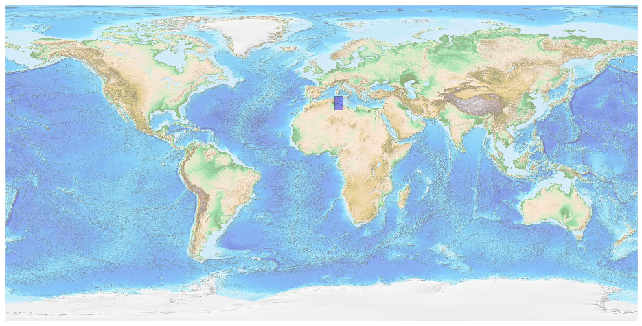
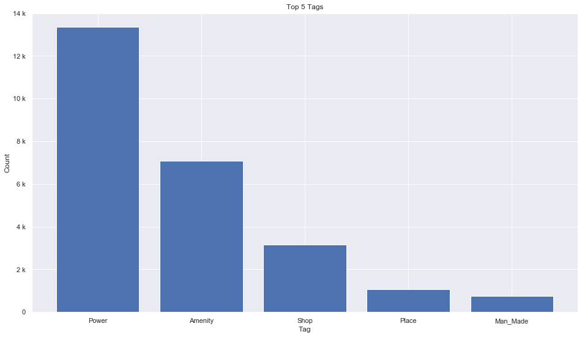
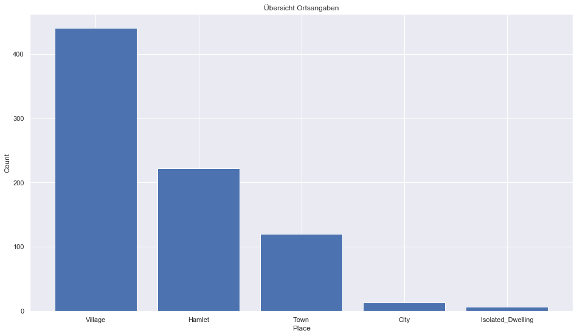
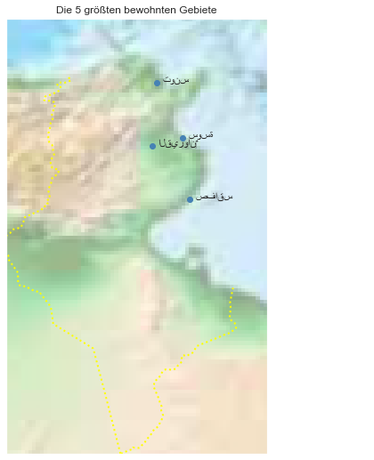

## Tunisia [&#10159;](tunisia.sqlite)

### Allgemeine Informationen

|Eigenschaft|Wert|
|-|-:|
Dateiname|[tunisia.sqlite](tunisia.sqlite)|
Zeitstempel|09.09.2019 19:17|
Dateigr&ouml;&szlig;e|1.27 Mb|
|||
Gesamtanzahl Nodes|25943|
|MinLat|30.238884|
|MaxLat|37.941381|
|MinLon|7.520699|
|MaxLon|12.127679|

### Top 5 Tags

|Tag|Count|
|-|-:|
|Power|13348|
|Amenity|7077|
|Shop|3155|
|Place|1076|
|Man_Made|759|

### &Uuml;bersicht Ortsangaben

|Place|Count|
|-|-:|
|Village|440|
|Hamlet|222|
|Town|120|
|City|13|
|Isolated_Dwelling|7|

### Die 5 gr&ouml;&szlig;ten bewohnte Gebiete

|Name|Lat|Lon|Type|Population|
|----|--:|--:|:--:|---------:|
|طرابلس|32.896672|13.1777923|City|2127000|
|تونس|36.800108|10.184794|City|728453|
|صفاقس|34.7397986|10.7600021|City|484329|
|سوسة|35.828829|10.640525|City|221530|
|القيروان‎|35.6775263|10.1006205|City|139070|
