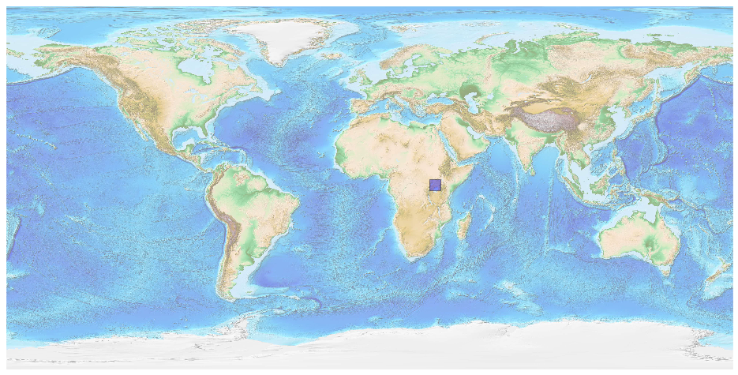
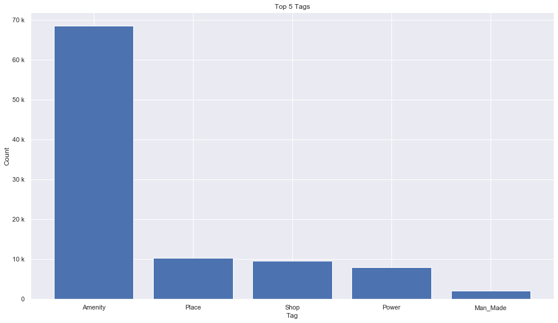
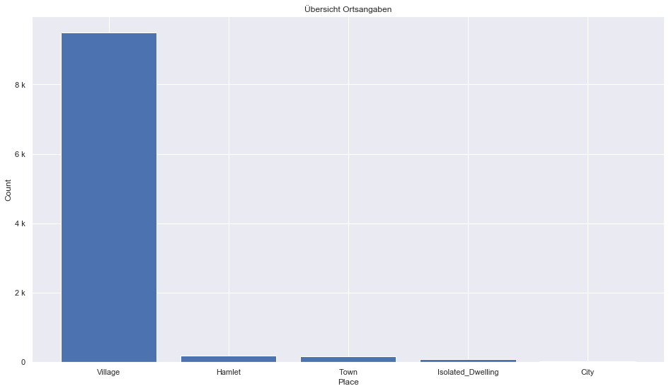
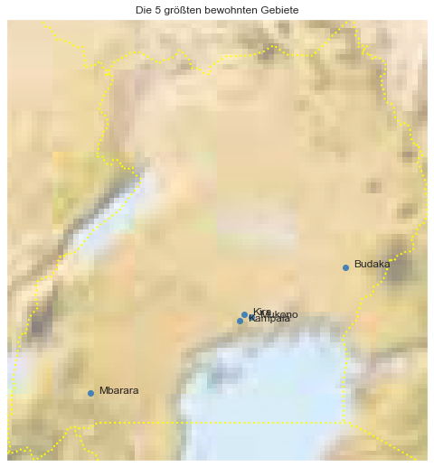

## Uganda [&#10159;](uganda.sqlite)

### Allgemeine Informationen

|Eigenschaft|Wert|
|-|-:|
Dateiname|[uganda.sqlite](uganda.sqlite)|
Zeitstempel|09.09.2019 19:24|
Dateigr&ouml;&szlig;e|5.76 Mb|
|||
Gesamtanzahl Nodes|99146|
|MinLat|-1.487315|
|MaxLat|4.2331399|
|MinLon|29.56346|
|MaxLon|35.01031|

### Top 5 Tags

|Tag|Count|
|-|-:|
|Amenity|68431|
|Place|10377|
|Shop|9588|
|Power|7957|
|Man_Made|2099|

### &Uuml;bersicht Ortsangaben

|Place|Count|
|-|-:|
|Village|9489|
|Hamlet|185|
|Town|175|
|Isolated_Dwelling|85|
|City|26|

### Die 5 gr&ouml;&szlig;ten bewohnte Gebiete

|Name|Lat|Lon|Type|Population|
|----|--:|--:|:--:|---------:|
|Kampala|0.3177137|32.5813539|City|1516210|
|Kira|0.4003408|32.6391845|City|313761|
|Mbarara|-0.6109532|30.6533047|City|195013|
|Budaka|1.0158418|33.9490661|Town|178900|
|Mukono|0.3689136|32.7348393|City|161996|
