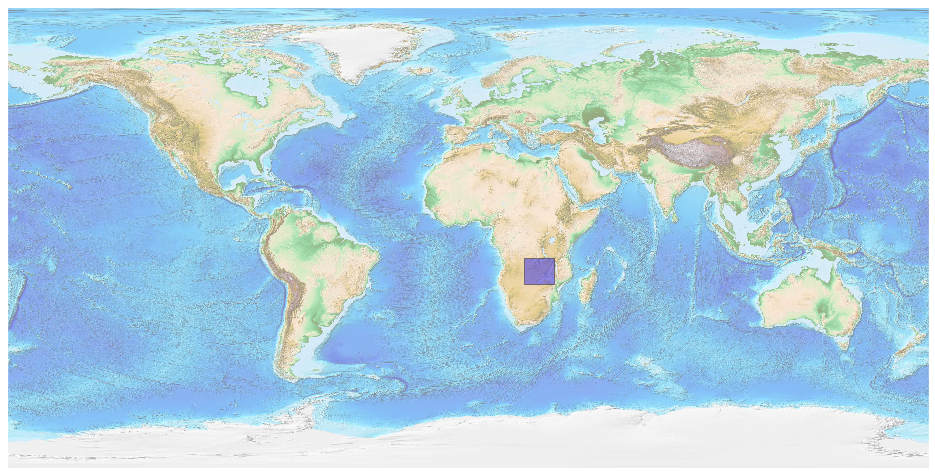
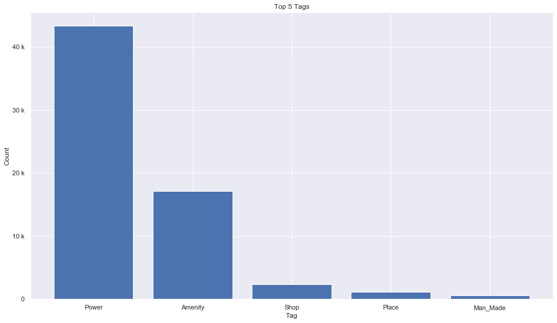
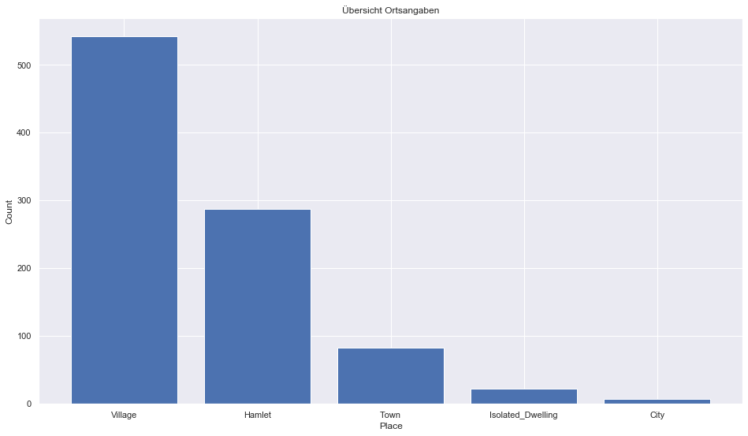
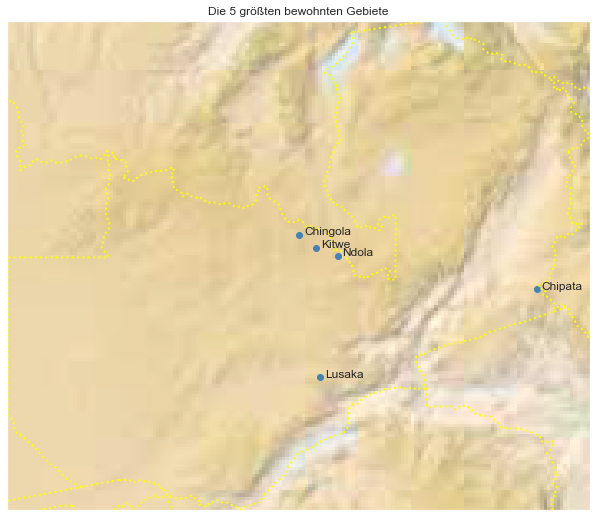

## Zambia [&#10159;](zambia.sqlite)

### Allgemeine Informationen

|Eigenschaft|Wert|
|-|-:|
Dateiname|[zambia.sqlite](zambia.sqlite)|
Zeitstempel|09.09.2019 19:28|
Dateigr&ouml;&szlig;e|2.96 Mb|
|||
Gesamtanzahl Nodes|64978|
|MinLat|-18.084936|
|MaxLat|-8.239483|
|MinLon|21.987834|
|MaxLon|33.711288|

### Top 5 Tags

|Tag|Count|
|-|-:|
|Power|43316|
|Amenity|17110|
|Shop|2313|
|Place|1100|
|Man_Made|580|

### &Uuml;bersicht Ortsangaben

|Place|Count|
|-|-:|
|Village|542|
|Hamlet|288|
|Town|83|
|Isolated_Dwelling|22|
|City|7|

### Die 5 gr&ouml;&szlig;ten bewohnte Gebiete

|Name|Lat|Lon|Type|Population|
|----|--:|--:|:--:|---------:|
|Lusaka|-15.4164488|28.2821535|City|1742979|
|Kitwe|-12.8104186|28.2068361|City|522092|
|Chipata|-13.6390687|32.6457228|City|455783|
|Ndola|-12.9693056|28.6365894|City|455194|
|Chingola|-12.5474926|27.8600422|Town|210073|
