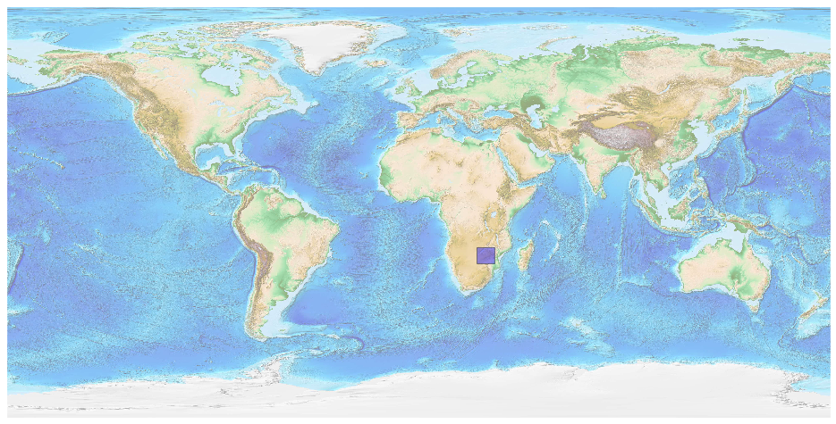
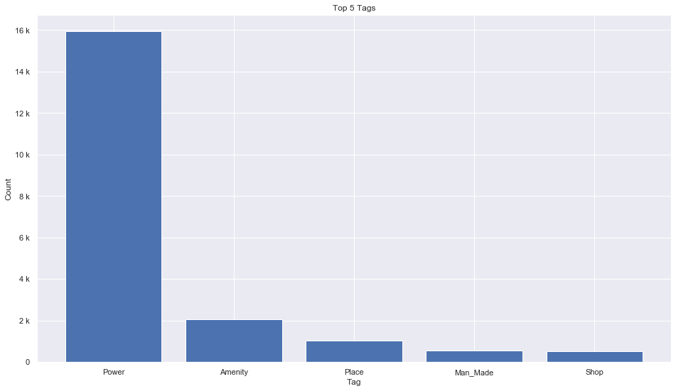
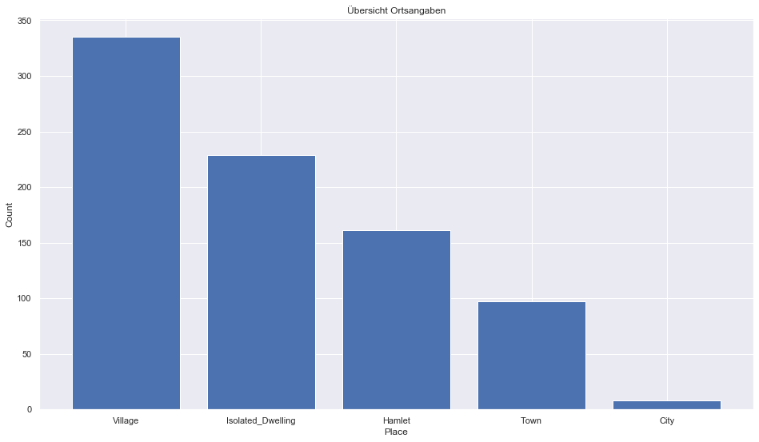
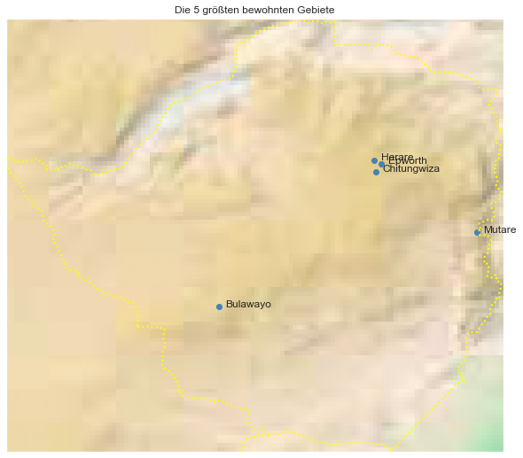

## Zimbabwe [&#10159;](zimbabwe.sqlite)

### Allgemeine Informationen

|Eigenschaft|Wert|
|-|-:|
Dateiname|[zimbabwe.sqlite](zimbabwe.sqlite)|
Zeitstempel|09.09.2019 19:29|
Dateigr&ouml;&szlig;e|960.00 Kb|
|||
Gesamtanzahl Nodes|20276|
|MinLat|-22.447246|
|MaxLat|-15.587067|
|MinLon|25.222896|
|MaxLon|33.0854149|

### Top 5 Tags

|Tag|Count|
|-|-:|
|Power|15936|
|Amenity|2060|
|Place|1022|
|Man_Made|548|
|Shop|534|

### &Uuml;bersicht Ortsangaben

|Place|Count|
|-|-:|
|Village|335|
|Isolated_Dwelling|229|
|Hamlet|161|
|Town|97|
|City|8|

### Die 5 gr&ouml;&szlig;ten bewohnte Gebiete

|Name|Lat|Lon|Type|Population|
|----|--:|--:|:--:|---------:|
|Harare|-17.831773|31.045686|City|1606000|
|Bulawayo|-20.1560599|28.5887063|City|653337|
|Chitungwiza|-18.0143462|31.0726737|City|321782|
|Mutare|-18.974656|32.670473|City|188243|
|Epworth|-17.8877361|31.156797|Town|152116|
