# Europe

---

## Albania [&#10159;](albania.sqlite)

### Allgemeine Informationen

|Eigenschaft|Wert|
|-|-:|
Dateiname|[albania.sqlite](albania.sqlite)|
Zeitstempel|04.09.2019 20:17|
Dateigr&ouml;&szlig;e|1.24 Mb|
|||
Gesamtanzahl Nodes|26278|
|MinLat|39.643636|
|MaxLat|42.663125|
|MinLon|19.08737|
|MaxLon|21.062851|

### Top 5 Tags

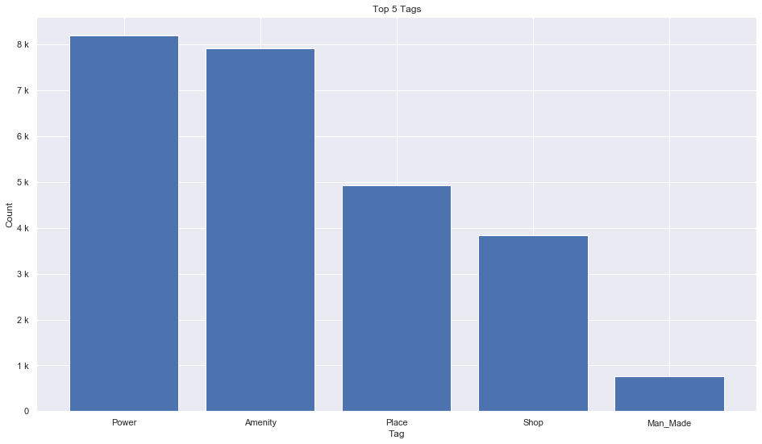

|Tag|Count|
|-|-:|
|Power|8193|
|Amenity|7918|
|Place|4922|
|Shop|3844|
|Man_Made|766|

### &Uuml;bersicht Ortsangaben

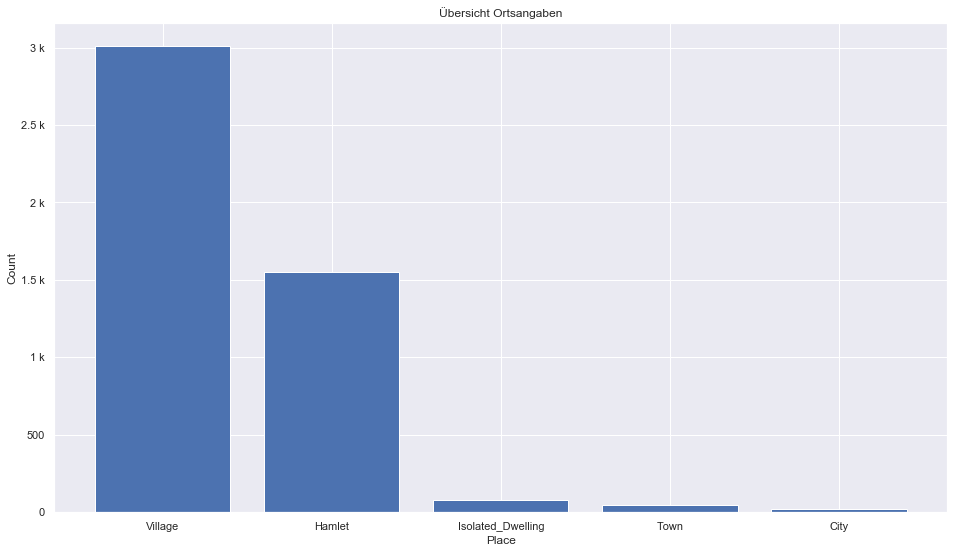

|Place|Count|
|-|-:|
|Village|3008|
|Hamlet|1552|
|Isolated_Dwelling|82|
|Town|45|
|City|21|

### Die 5 gr&ouml;&szlig;ten bewohnte Gebiete

|Name|Lat|Lon|Type|Population|
|----|--:|--:|:--:|---------:|
|Tiranë|41.3268733|19.8187913|City|557422|
|Durrës|41.313255|19.4462348|City|130566|
|Elbasan|41.1105874|20.0794072|City|130000|
|Vlorë|40.4738898|19.4933647|City|124000|
|Shkodër|42.0681371|19.5121437|City|96000|

---

## Andorra [&#10159;](andorra.sqlite)

### Allgemeine Informationen

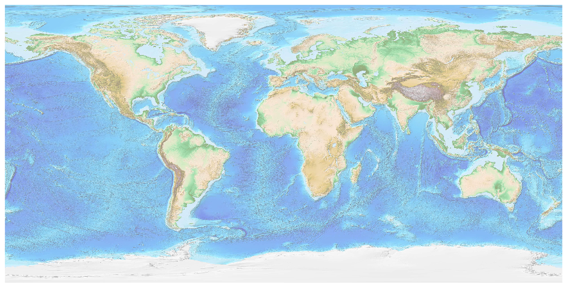

|Eigenschaft|Wert|
|-|-:|
Dateiname|[andorra.sqlite](andorra.sqlite)|
Zeitstempel|04.09.2019 20:16|
Dateigr&ouml;&szlig;e|80.00 Kb|
|||
Gesamtanzahl Nodes|1395|
|MinLat|42.4276|
|MaxLat|42.65717|
|MinLon|1.412368|
|MaxLon|1.787481|

### Top 5 Tags

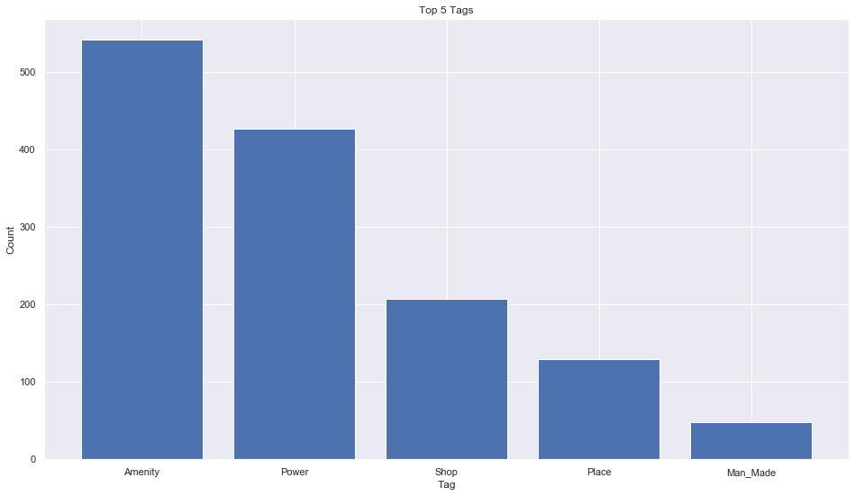

|Tag|Count|
|-|-:|
|Amenity|541|
|Power|426|
|Shop|207|
|Place|129|
|Man_Made|48|

### &Uuml;bersicht Ortsangaben

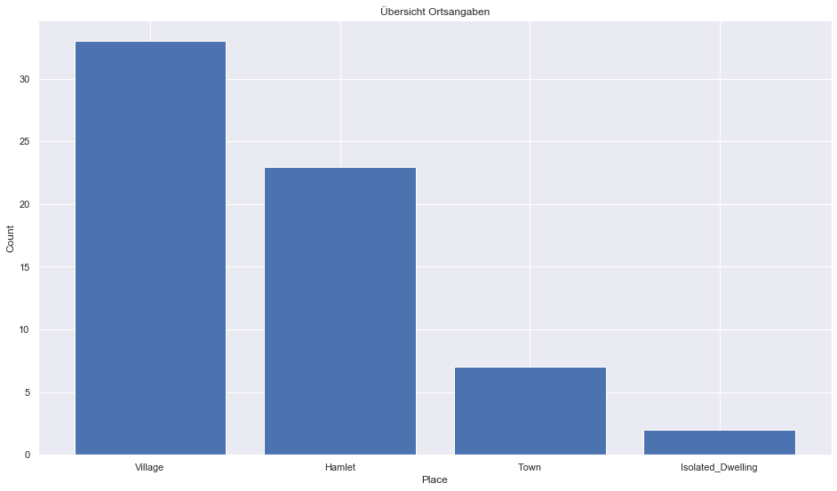

|Place|Count|
|-|-:|
|Village|33|
|Hamlet|23|
|Town|7|
|Isolated_Dwelling|2|

### Die 5 gr&ouml;&szlig;ten bewohnte Gebiete

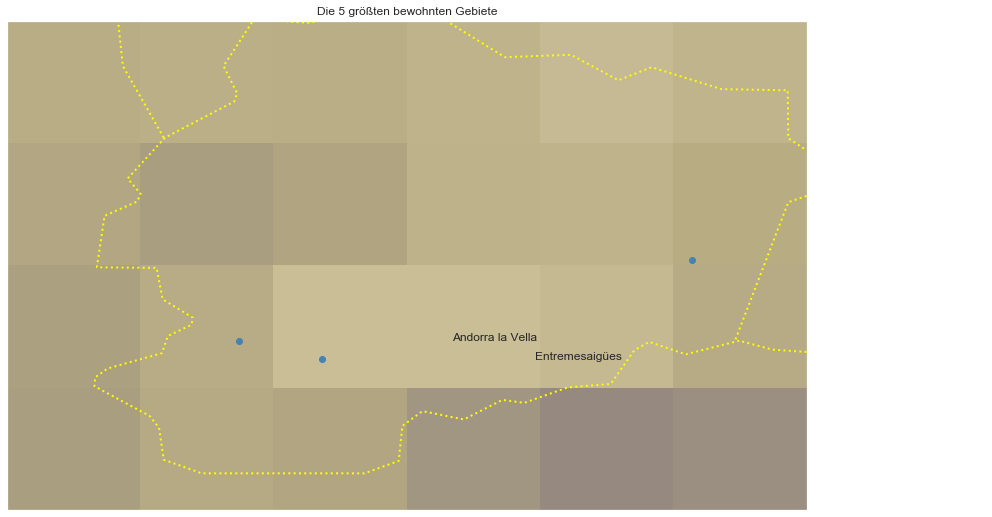

|Name|Lat|Lon|Type|Population|
|----|--:|--:|:--:|---------:|
|Andorra la Vella|42.5069391|1.5212467|Town|24678|
|Pas de la Casa|42.5447098|1.733494|Village|2996|
|Entremesaigües|42.4981805|1.5601251|Hamlet|0|

---

## Austria [&#10159;](austria.sqlite)

### Allgemeine Informationen

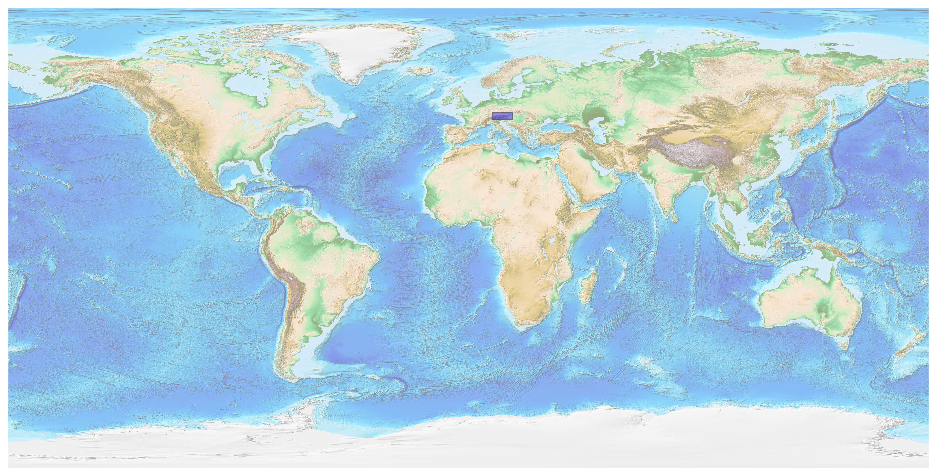

|Eigenschaft|Wert|
|-|-:|
Dateiname|[austria.sqlite](austria.sqlite)|
Zeitstempel|04.09.2019 20:52|
Dateigr&ouml;&szlig;e|24.12 Mb|
|||
Gesamtanzahl Nodes|532399|
|MinLat|46.36851|
|MaxLat|49.02403|
|MinLon|9.52678|
|MaxLon|17.16273|

### Top 5 Tags

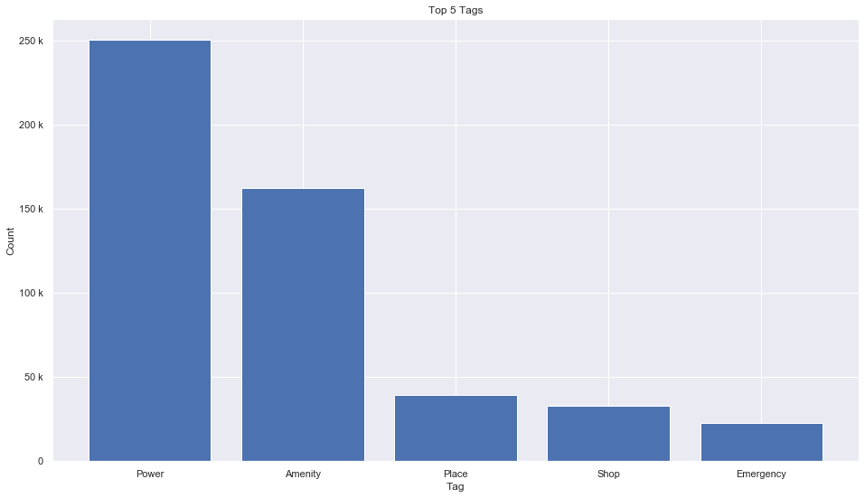

|Tag|Count|
|-|-:|
|Power|250523|
|Amenity|162550|
|Place|39489|
|Shop|33076|
|Emergency|22855|

### &Uuml;bersicht Ortsangaben

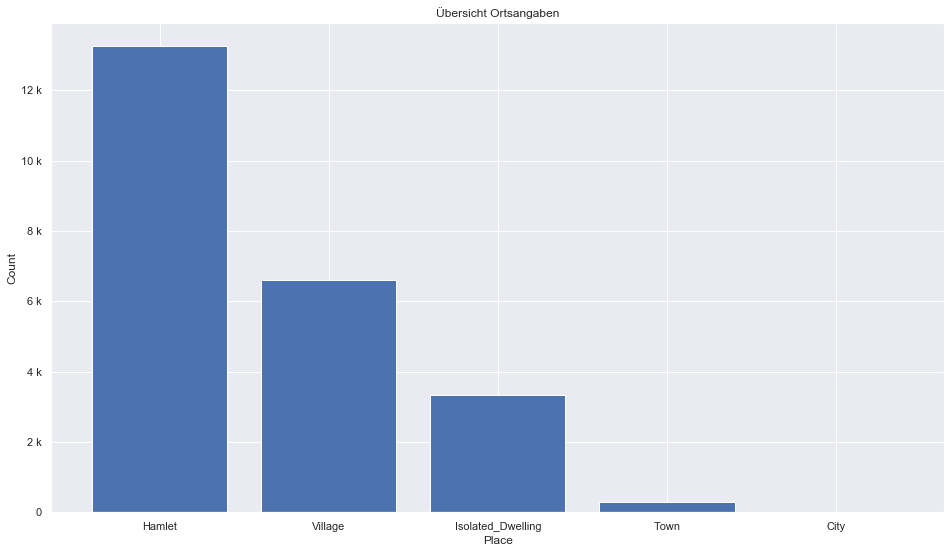

|Place|Count|
|-|-:|
|Hamlet|13254|
|Village|6598|
|Isolated_Dwelling|3325|
|Town|298|
|City|7|

### Die 5 gr&ouml;&szlig;ten bewohnte Gebiete

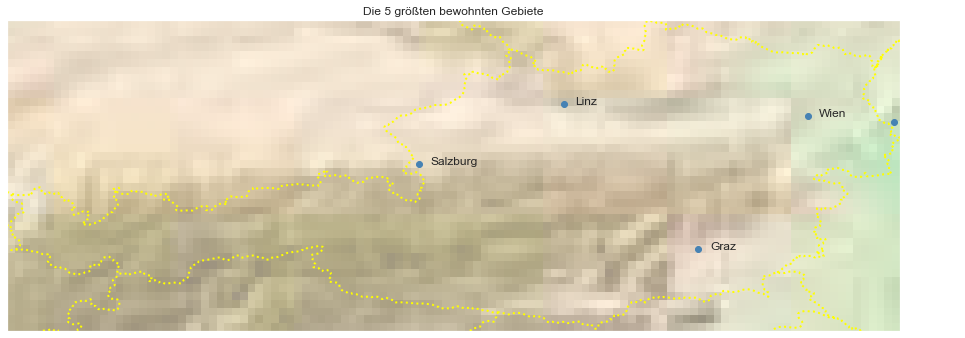

|Name|Lat|Lon|Type|Population|
|----|--:|--:|:--:|---------:|
|Wien|48.2083537|16.3725042|City|1897481|
|Bratislava|48.1516988|17.1093063|City|432801|
|Graz|47.0702563|15.4385716|City|286292|
|Linz|48.3059078|14.286198|City|197283|
|Salzburg|47.7981346|13.0464806|City|152083|

---

## Azores [&#10159;](azores.sqlite)

### Allgemeine Informationen

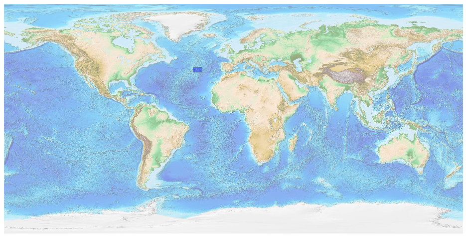

|Eigenschaft|Wert|
|-|-:|
Dateiname|[azores.sqlite](azores.sqlite)|
Zeitstempel|04.09.2019 20:16|
Dateigr&ouml;&szlig;e|296.00 Kb|
|||
Gesamtanzahl Nodes|5597|
|MinLat|36.67791|
|MaxLat|40.0757|
|MinLon|-31.57293|
|MaxLon|-24.71814|

### Top 5 Tags

|Tag|Count|
|-|-:|
|Amenity|2990|
|Man_Made|750|
|Shop|584|
|Place|572|
|Leisure|361|

### &Uuml;bersicht Ortsangaben

|Place|Count|
|-|-:|
|Hamlet|302|
|Village|132|
|Town|23|
|City|4|

### Die 5 gr&ouml;&szlig;ten bewohnte Gebiete

|Name|Lat|Lon|Type|Population|
|----|--:|--:|:--:|---------:|
|Ponta Delgada|37.7394344|-25.6683618|City|40661|
|Ribeira Grande|37.8225227|-25.5194914|City|12663|
|Angra do Heroísmo|38.6593167|-27.2195578|City|8654|
|Lagoa|37.747009|-25.578405|Town|8080|
|Praia da Vitória (Santa Cruz)|38.7291291|-27.0657557|Village|6690|

---

## Belarus [&#10159;](belarus.sqlite)

### Allgemeine Informationen

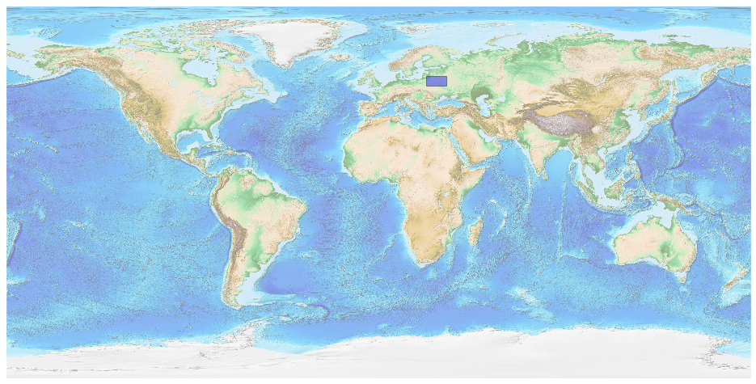

|Eigenschaft|Wert|
|-|-:|
Dateiname|[belarus.sqlite](belarus.sqlite)|
Zeitstempel|04.09.2019 20:37|
Dateigr&ouml;&szlig;e|17.76 Mb|
|||
Gesamtanzahl Nodes|399628|
|MinLat|51.23751|
|MaxLat|56.20996|
|MinLon|23.13474|
|MaxLon|32.80613|

### Top 5 Tags

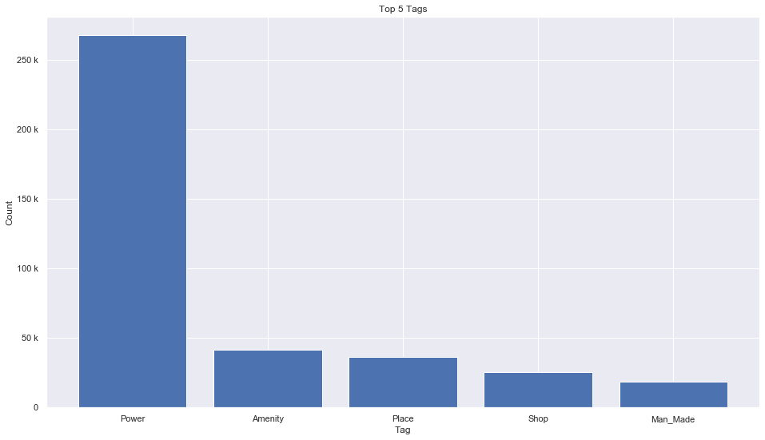

|Tag|Count|
|-|-:|
|Power|267359|
|Amenity|41240|
|Place|36548|
|Shop|25198|
|Man_Made|18577|

### &Uuml;bersicht Ortsangaben

|Place|Count|
|-|-:|
|Hamlet|19990|
|Village|3332|
|Isolated_Dwelling|834|
|Town|140|
|City|16|

### Die 5 gr&ouml;&szlig;ten bewohnte Gebiete

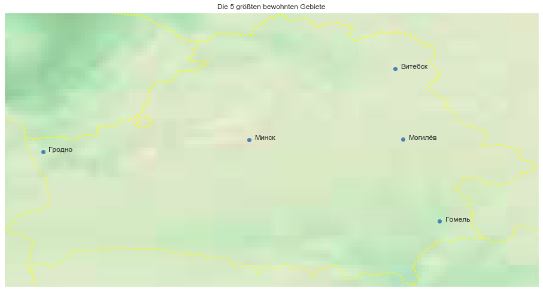

|Name|Lat|Lon|Type|Population|
|----|--:|--:|:--:|---------:|
|Минск|53.902334|27.5618791|City|1982444|
|Гомель|52.4238936|31.0131698|City|535693|
|Могилёв|53.9090245|30.3429838|City|381353|
|Гродно|53.6834599|23.8342648|City|370919|
|Витебск|55.1930197|30.2070437|City|370298|

---

## Belgium [&#10159;](belgium.sqlite)

### Allgemeine Informationen

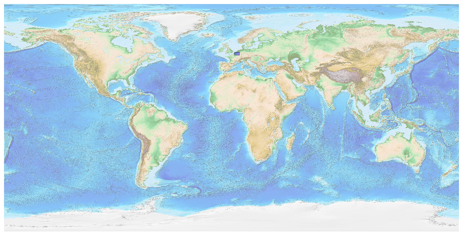

|Eigenschaft|Wert|
|-|-:|
Dateiname|[belgium.sqlite](belgium.sqlite)|
Zeitstempel|04.09.2019 20:28|
Dateigr&ouml;&szlig;e|8.85 Mb|
|||
Gesamtanzahl Nodes|185419|
|MinLat|49.49196|
|MaxLat|51.59839|
|MinLon|2.340725|
|MaxLon|6.411619|

### Top 5 Tags

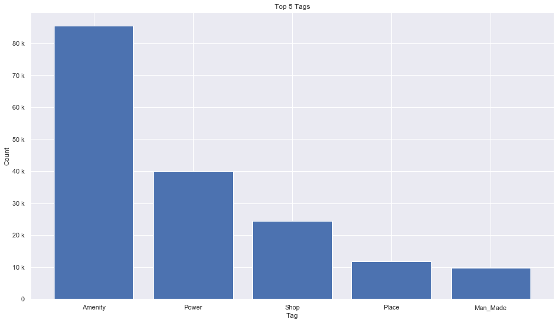

|Tag|Count|
|-|-:|
|Amenity|85406|
|Power|40064|
|Shop|24434|
|Place|11834|
|Man_Made|9690|

### &Uuml;bersicht Ortsangaben

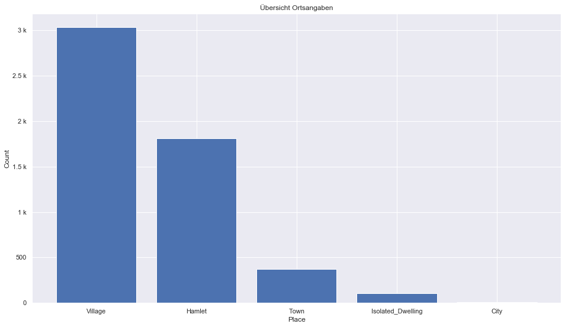

|Place|Count|
|-|-:|
|Village|3031|
|Hamlet|1813|
|Town|374|
|Isolated_Dwelling|106|
|City|10|

### Die 5 gr&ouml;&szlig;ten bewohnte Gebiete

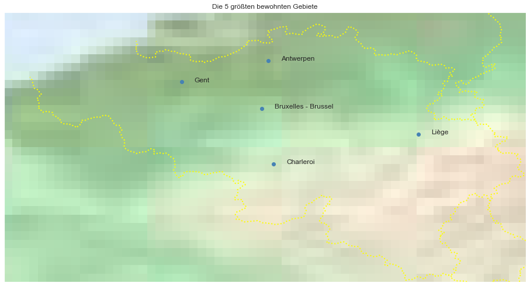

|Name|Lat|Lon|Type|Population|
|----|--:|--:|:--:|---------:|
|Antwerpen|51.2211097|4.3997081|City|506922|
|Gent|51.0538286|3.7250121|City|237000|
|Charleroi|50.4120332|4.4436244|City|202730|
|Liège|50.6451381|5.5734203|City|197013|
|Bruxelles - Brussel|50.8465573|4.351697|City|153377|

---

## Bosnia Herzegovina [&#10159;](bosnia-herzegovina.sqlite)

### Allgemeine Informationen

|Eigenschaft|Wert|
|-|-:|
Dateiname|[bosnia-herzegovina.sqlite](bosnia-herzegovina.sqlite)|
Zeitstempel|04.09.2019 20:21|
Dateigr&ouml;&szlig;e|1.84 Mb|
|||
Gesamtanzahl Nodes|39437|
|MinLat|42.56583|
|MaxLat|45.26595|
|MinLon|15.73639|
|MaxLon|19.62176|

### Top 5 Tags

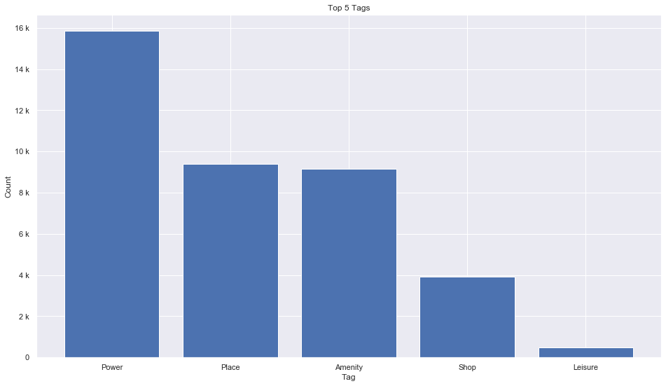

|Tag|Count|
|-|-:|
|Power|15849|
|Place|9386|
|Amenity|9155|
|Shop|3916|
|Leisure|469|

### &Uuml;bersicht Ortsangaben

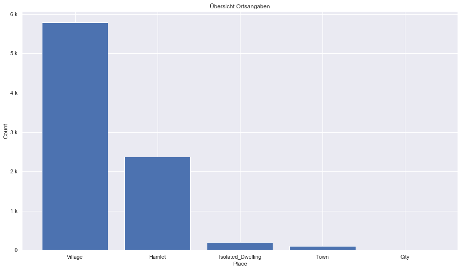

|Place|Count|
|-|-:|
|Village|5783|
|Hamlet|2378|
|Isolated_Dwelling|204|
|Town|108|
|City|8|

### Die 5 gr&ouml;&szlig;ten bewohnte Gebiete

|Name|Lat|Lon|Type|Population|
|----|--:|--:|:--:|---------:|
|Sarajevo|43.8519774|18.3866868|City|411161|
|Banja Luka|44.7719817|17.1898929|City|138963|
|Mostar|43.3416104|17.8030427|City|105797|
|Prijedor|44.9807105|16.7122495|Town|80000|
|Tuzla|44.5391105|18.675193|City|74475|

---

## Bulgaria [&#10159;](bulgaria.sqlite)

### Allgemeine Informationen

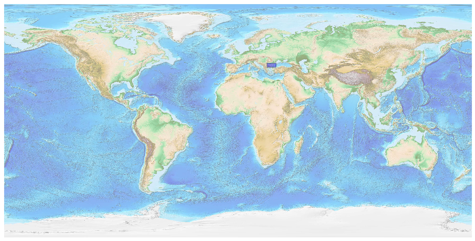

|Eigenschaft|Wert|
|-|-:|
Dateiname|[bulgaria.sqlite](bulgaria.sqlite)|
Zeitstempel|04.09.2019 20:30|
Dateigr&ouml;&szlig;e|8.97 Mb|
|||
Gesamtanzahl Nodes|181737|
|MinLat|41.22681|
|MaxLat|44.22477|
|MinLon|22.34875|
|MaxLon|29.18819|

### Top 5 Tags

|Tag|Count|
|-|-:|
|Man_Made|73990|
|Power|64309|
|Amenity|21659|
|Shop|11711|
|Place|7229|

### &Uuml;bersicht Ortsangaben

|Place|Count|
|-|-:|
|Village|4856|
|Hamlet|454|
|Town|224|
|City|34|
|Isolated_Dwelling|8|

### Die 5 gr&ouml;&szlig;ten bewohnte Gebiete

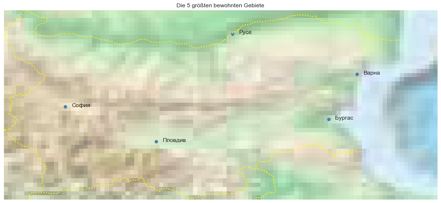

|Name|Lat|Lon|Type|Population|
|----|--:|--:|:--:|---------:|
|София|42.6978634|23.3221789|City|1286383|
|Пловдив|42.1418541|24.7499297|City|368983|
|Варна|43.2069025|27.9150855|City|348058|
|Бургас|42.4936616|27.4721276|City|206371|
|Русе|43.8480413|25.9542057|City|159798|

---

## Croatia [&#10159;](croatia.sqlite)

### Allgemeine Informationen

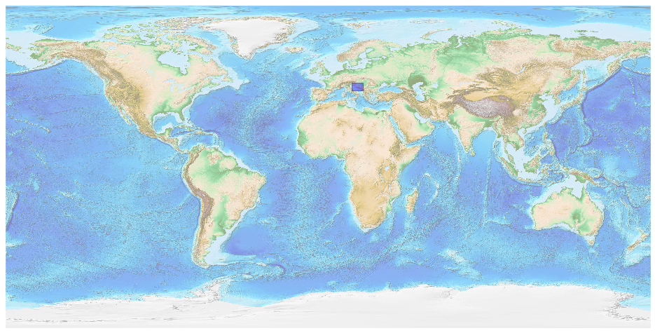

|Eigenschaft|Wert|
|-|-:|
Dateiname|[croatia.sqlite](croatia.sqlite)|
Zeitstempel|04.09.2019 20:33|
Dateigr&ouml;&szlig;e|3.87 Mb|
|||
Gesamtanzahl Nodes|81879|
|MinLat|42.16483|
|MaxLat|46.56498|
|MinLon|13.08916|
|MaxLon|19.45911|

### Top 5 Tags

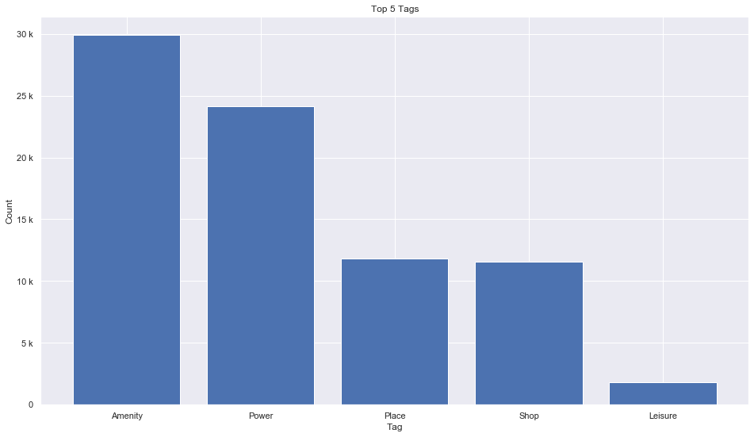

|Tag|Count|
|-|-:|
|Amenity|29894|
|Power|24144|
|Place|11843|
|Shop|11583|
|Leisure|1808|

### &Uuml;bersicht Ortsangaben

|Place|Count|
|-|-:|
|Village|5622|
|Hamlet|4234|
|Isolated_Dwelling|333|
|Town|130|
|City|8|

### Die 5 gr&ouml;&szlig;ten bewohnte Gebiete

|Name|Lat|Lon|Type|Population|
|----|--:|--:|:--:|---------:|
|Zagreb|45.813177|15.977048|City|790017|
|Split|43.5073034|16.4414229|City|167121|
|Rijeka|45.3271752|14.4412309|City|128624|
|Osijek|45.5548753|18.6953593|City|84104|
|Zadar|44.1186078|15.232136|City|71471|

---

## Cyprus [&#10159;](cyprus.sqlite)

### Allgemeine Informationen

|Eigenschaft|Wert|
|-|-:|
Dateiname|[cyprus.sqlite](cyprus.sqlite)|
Zeitstempel|04.09.2019 20:30|
Dateigr&ouml;&szlig;e|936.00 Kb|
|||
Gesamtanzahl Nodes|18826|
|MinLat|34.2337399|
|MaxLat|36.00323|
|MinLon|31.95244|
|MaxLon|34.96147|

### Top 5 Tags

|Tag|Count|
|-|-:|
|Amenity|8513|
|Shop|4670|
|Power|3549|
|Place|716|
|Leisure|694|

### &Uuml;bersicht Ortsangaben

|Place|Count|
|-|-:|
|Village|534|
|Hamlet|72|
|Town|17|
|City|4|
|Isolated_Dwelling|4|

### Die 5 gr&ouml;&szlig;ten bewohnte Gebiete

|Name|Lat|Lon|Type|Population|
|----|--:|--:|:--:|---------:|
|Λευκωσία|35.1739302|33.364726|City|310355|
|Λεμεσός|34.6735637|33.042341|City|101000|
|Στρόβολος|35.1328993|33.3454972|Town|67904|
|Λάρνακα|34.9172012|33.6378531|Town|51468|
|Gazimağusa|35.1176638|33.9402361|City|42526|

---

## Czech Republic [&#10159;](czech-republic.sqlite)

### Allgemeine Informationen

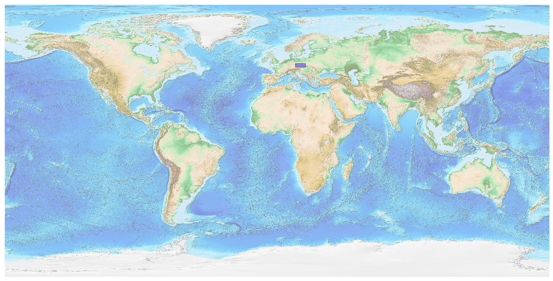

|Eigenschaft|Wert|
|-|-:|
Dateiname|[czech-republic.sqlite](czech-republic.sqlite)|
Zeitstempel|04.09.2019 21:12|
Dateigr&ouml;&szlig;e|21.24 Mb|
|||
Gesamtanzahl Nodes|484395|
|MinLat|48.54292|
|MaxLat|51.06426|
|MinLon|12.08477|
|MaxLon|18.86321|

### Top 5 Tags

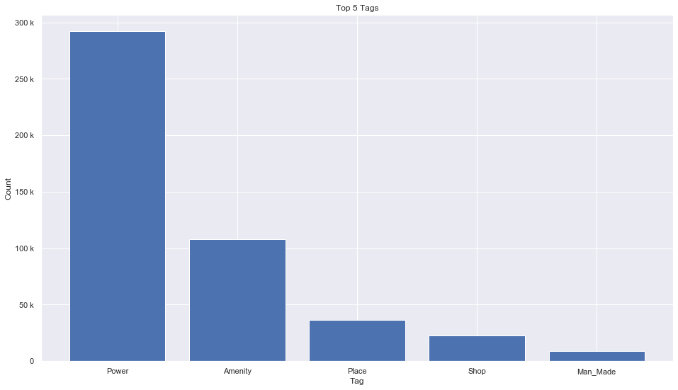

|Tag|Count|
|-|-:|
|Power|292088|
|Amenity|107809|
|Place|36786|
|Shop|22426|
|Man_Made|8913|

### &Uuml;bersicht Ortsangaben

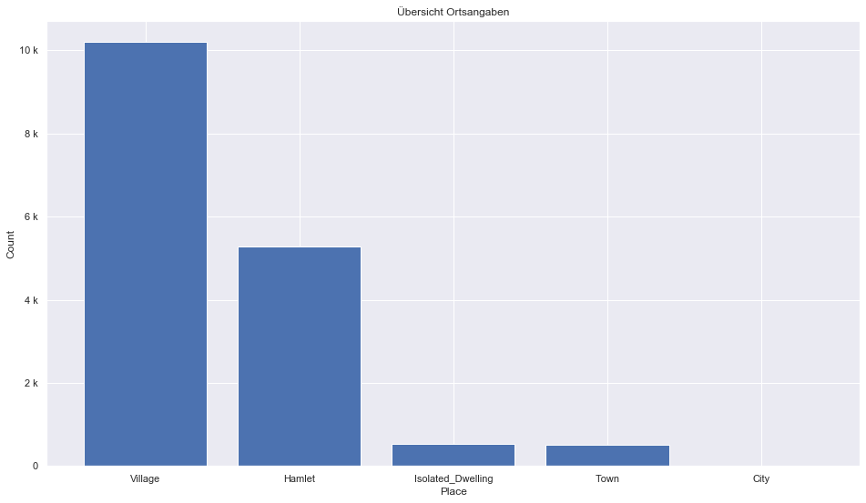

|Place|Count|
|-|-:|
|Village|10199|
|Hamlet|5272|
|Isolated_Dwelling|525|
|Town|517|
|City|13|

### Die 5 gr&ouml;&szlig;ten bewohnte Gebiete

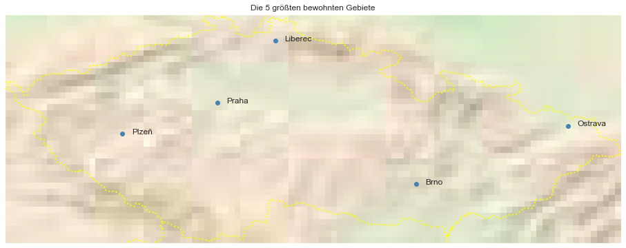

|Name|Lat|Lon|Type|Population|
|----|--:|--:|:--:|---------:|
|Praha|50.0874654|14.4212535|City|1243201|
|Ostrava|49.8349139|18.2820084|City|310464|
|Brno|49.1922443|16.6113382|City|293362|
|Plzeň|49.7477415|13.3775249|City|150824|
|Liberec|50.7702648|15.0583947|City|103228|

---

## Denmark [&#10159;](denmark.sqlite)

### Allgemeine Informationen

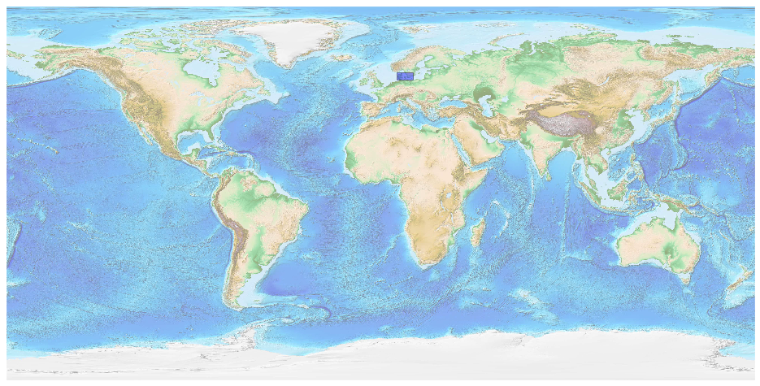

|Eigenschaft|Wert|
|-|-:|
Dateiname|[denmark.sqlite](denmark.sqlite)|
Zeitstempel|04.09.2019 20:47|
Dateigr&ouml;&szlig;e|5.57 Mb|
|||
Gesamtanzahl Nodes|119579|
|MinLat|54.44065|
|MaxLat|58.06239|
|MinLon|7.7011|
|MaxLon|15.65449|

### Top 5 Tags

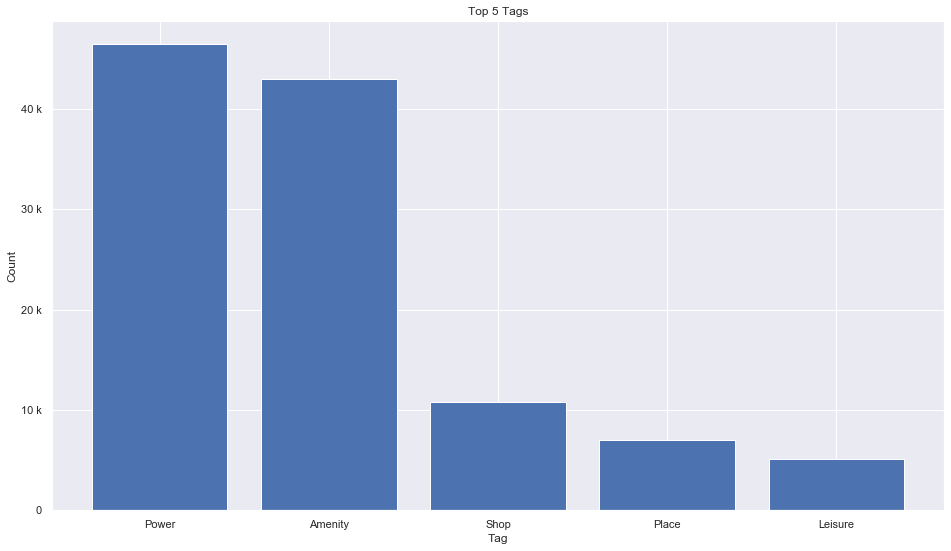

|Tag|Count|
|-|-:|
|Power|46448|
|Amenity|42945|
|Shop|10817|
|Place|7047|
|Leisure|5142|

### &Uuml;bersicht Ortsangaben

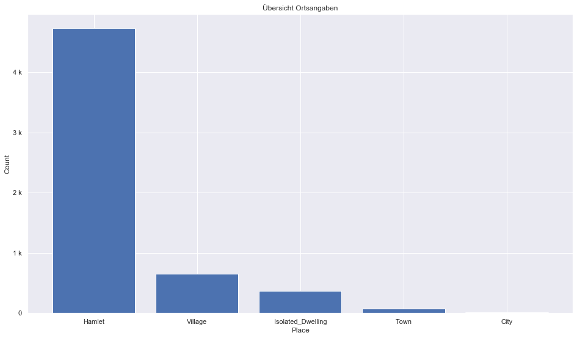

|Place|Count|
|-|-:|
|Hamlet|4729|
|Village|652|
|Isolated_Dwelling|373|
|Town|76|
|City|10|

### Die 5 gr&ouml;&szlig;ten bewohnte Gebiete

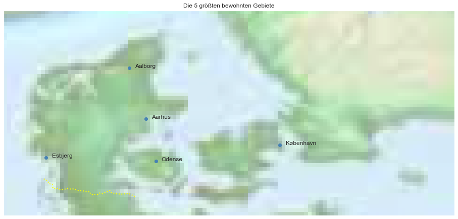

|Name|Lat|Lon|Type|Population|
|----|--:|--:|:--:|---------:|
|København|55.6867243|12.5700724|City|613288|
|Aarhus|56.1496278|10.2134046|City|273077|
|Odense|55.3997225|10.3852104|City|178210|
|Aalborg|57.0482206|9.9193939|City|114194|
|Esbjerg|55.4664892|8.4520751|City|72398|

---

## Estonia [&#10159;](estonia.sqlite)

### Allgemeine Informationen

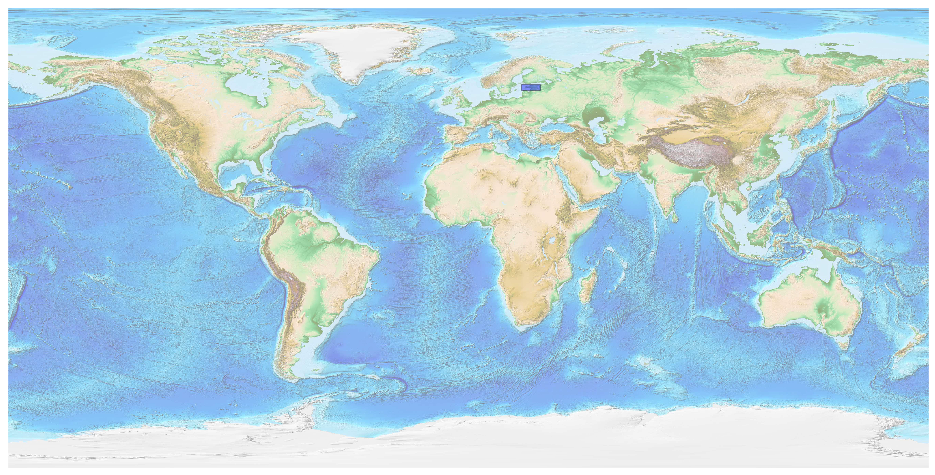

|Eigenschaft|Wert|
|-|-:|
Dateiname|[estonia.sqlite](estonia.sqlite)|
Zeitstempel|04.09.2019 20:41|
Dateigr&ouml;&szlig;e|2.84 Mb|
|||
Gesamtanzahl Nodes|65817|
|MinLat|57.49764|
|MaxLat|59.99705|
|MinLon|20.85166|
|MaxLon|28.21426|

### Top 5 Tags

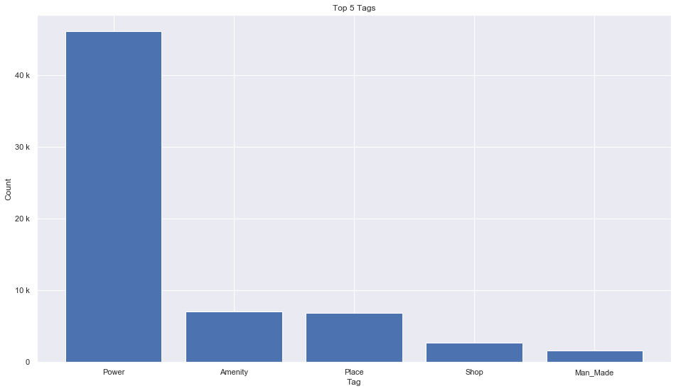

|Tag|Count|
|-|-:|
|Power|46075|
|Amenity|7020|
|Place|6862|
|Shop|2730|
|Man_Made|1634|

### &Uuml;bersicht Ortsangaben

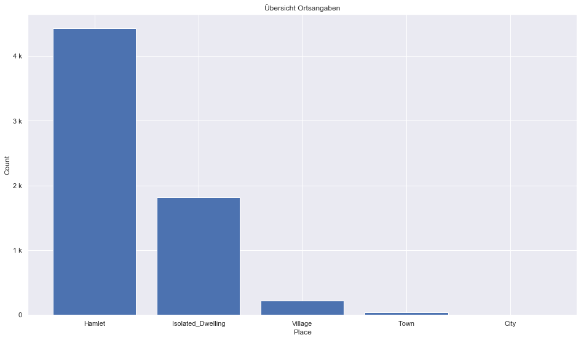

|Place|Count|
|-|-:|
|Hamlet|4426|
|Isolated_Dwelling|1817|
|Village|221|
|Town|45|
|City|2|

### Die 5 gr&ouml;&szlig;ten bewohnte Gebiete

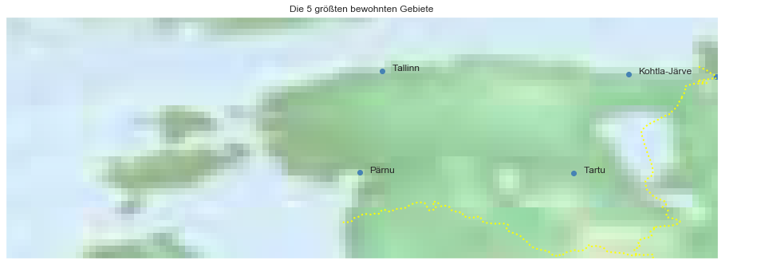

|Name|Lat|Lon|Type|Population|
|----|--:|--:|:--:|---------:|
|Tallinn|59.4372155|24.7453688|City|443623|
|Tartu|58.3801207|26.72245|City|102414|
|Narva|59.3794142|28.1993892|Town|66621|
|Kohtla-Järve|59.4025488|27.2880288|Town|44500|
|Pärnu|58.3835136|24.5081751|Town|43528|

---

## Faroe Islands [&#10159;](faroe-islands.sqlite)

### Allgemeine Informationen

|Eigenschaft|Wert|
|-|-:|
Dateiname|[faroe-islands.sqlite](faroe-islands.sqlite)|
Zeitstempel|04.09.2019 20:41|
Dateigr&ouml;&szlig;e|360.00 Kb|
|||
Gesamtanzahl Nodes|6862|
|MinLat|61.3|
|MaxLat|63.0|
|MinLon|-8.0|
|MaxLon|-6.0|

### Top 5 Tags

|Tag|Count|
|-|-:|
|Man_Made|5098|
|Place|577|
|Amenity|550|
|Power|384|
|Shop|158|

### &Uuml;bersicht Ortsangaben

|Place|Count|
|-|-:|
|Village|114|
|Hamlet|16|
|Town|1|

### Die 5 gr&ouml;&szlig;ten bewohnte Gebiete

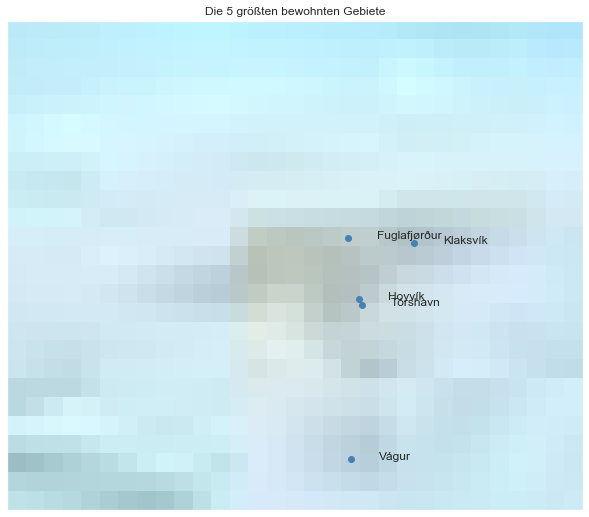

|Name|Lat|Lon|Type|Population|
|----|--:|--:|:--:|---------:|
|Tórshavn|62.012|-6.768|Town|12620|
|Klaksvík|62.2266084|-6.5852705|Village|4637|
|Hoyvík|62.0329436|-6.7766308|Village|2655|
|Fuglafjørður|62.2440229|-6.8141971|Village|1562|
|Vágur|61.475|-6.807|Village|1452|

---

## Finland [&#10159;](finland.sqlite)

### Allgemeine Informationen

|Eigenschaft|Wert|
|-|-:|
Dateiname|[finland.sqlite](finland.sqlite)|
Zeitstempel|04.09.2019 21:06|
Dateigr&ouml;&szlig;e|10.84 Mb|
|||
Gesamtanzahl Nodes|245086|
|MinLat|59.28783|
|MaxLat|70.09959|
|MinLon|19.02427|
|MaxLon|31.60089|

### Top 5 Tags

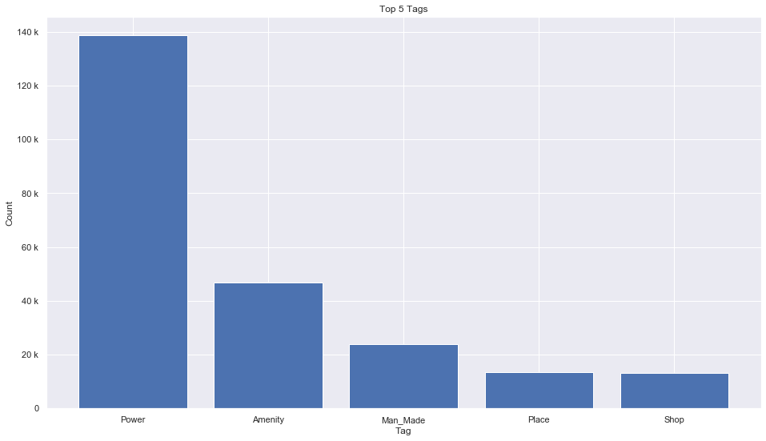

|Tag|Count|
|-|-:|
|Power|138674|
|Amenity|46761|
|Man_Made|23832|
|Place|13460|
|Shop|13106|

### &Uuml;bersicht Ortsangaben

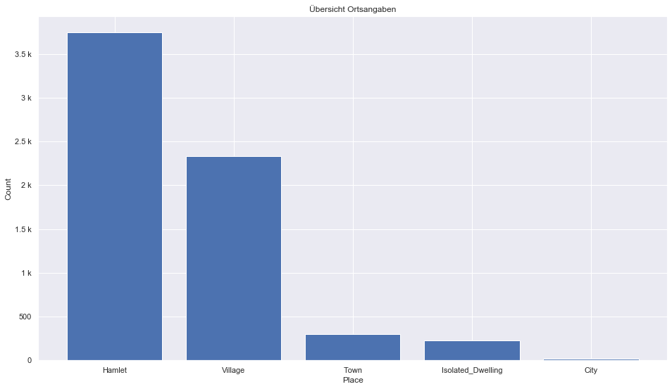

|Place|Count|
|-|-:|
|Hamlet|3744|
|Village|2329|
|Town|296|
|Isolated_Dwelling|229|
|City|22|

### Die 5 gr&ouml;&szlig;ten bewohnte Gebiete

|Name|Lat|Lon|Type|Population|
|----|--:|--:|:--:|---------:|
|Helsinki|60.1674098|24.9425769|City|629725|
|Espoo|60.2241869|24.6603626|City|260842|
|Tampere|61.4980214|23.7603118|City|220579|
|Vantaa|60.3091871|25.0364526|City|208052|
|Oulu|65.0118734|25.4716809|City|193825|

---

## France [&#10159;](france.sqlite)

### Allgemeine Informationen

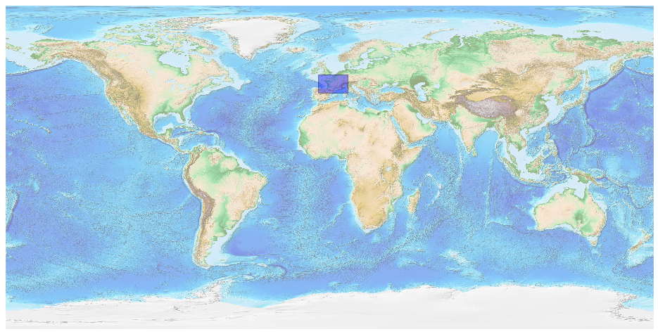

|Eigenschaft|Wert|
|-|-:|
Dateiname|[france.sqlite](france.sqlite)|
Zeitstempel|05.09.2019 11:18|
Dateigr&ouml;&szlig;e|120.50 Mb|
|||
Gesamtanzahl Nodes|2467072|
|MinLat|41.257249|
|MaxLat|51.32937|
|MinLon|-6.3|
|MaxLon|9.99206|

### Top 5 Tags

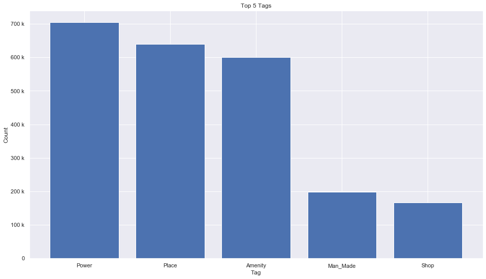

|Tag|Count|
|-|-:|
|Power|704227|
|Place|639416|
|Amenity|600037|
|Man_Made|198687|
|Shop|167165|

### &Uuml;bersicht Ortsangaben

|Place|Count|
|-|-:|
|Hamlet|184892|
|Isolated_Dwelling|130017|
|Village|37256|
|Town|967|
|City|48|

### Die 5 gr&ouml;&szlig;ten bewohnte Gebiete

|Name|Lat|Lon|Type|Population|
|----|--:|--:|:--:|---------:|
|Paris|48.8566969|2.3514616|City|2243833|
|Marseille|43.2961743|5.3699525|City|855393|
|Lyon|45.7578137|4.8320114|City|500715|
|Toulouse|43.6044622|1.4442469|City|441802|
|Nice|43.7009358|7.2683912|City|343304|

---

## Georgia [&#10159;](georgia.sqlite)

### Allgemeine Informationen

|Eigenschaft|Wert|
|-|-:|
Dateiname|[georgia.sqlite](georgia.sqlite)|
Zeitstempel|04.09.2019 20:57|
Dateigr&ouml;&szlig;e|2.69 Mb|
|||
Gesamtanzahl Nodes|49822|
|MinLat|41.05117|
|MaxLat|43.5899|
|MinLon|39.88093|
|MaxLon|46.73959|

### Top 5 Tags

|Tag|Count|
|-|-:|
|Amenity|17675|
|Power|14440|
|Shop|11836|
|Place|4711|
|Leisure|682|

### &Uuml;bersicht Ortsangaben

|Place|Count|
|-|-:|
|Village|3871|
|Hamlet|372|
|Town|84|
|Isolated_Dwelling|24|
|City|10|

### Die 5 gr&ouml;&szlig;ten bewohnte Gebiete

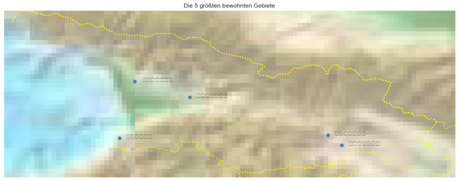

|Name|Lat|Lon|Type|Population|
|----|--:|--:|:--:|---------:|
|თბილისი|41.6934591|44.8014495|City|1132000|
|ქუთაისი|42.2716455|42.705359|City|186000|
|ბათუმი|41.6509502|41.6360085|City|121800|
|რუსთავი|41.54309|45.0112804|City|116400|
|ზუგდიდი|42.5067616|41.8713297|City|69000|

---

## Germany [&#10159;](germany.sqlite)

### Allgemeine Informationen

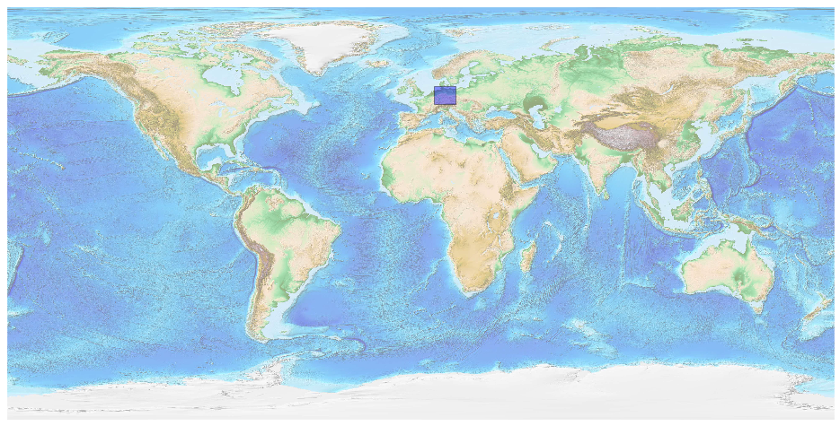

|Eigenschaft|Wert|
|-|-:|
Dateiname|[germany.sqlite](germany.sqlite)|
Zeitstempel|05.09.2019 11:07|
Dateigr&ouml;&szlig;e|161.50 Mb|
|||
Gesamtanzahl Nodes|3441241|
|MinLat|47.26543|
|MaxLat|55.14777|
|MinLon|5.864417|
|MaxLon|15.05078|

### Top 5 Tags

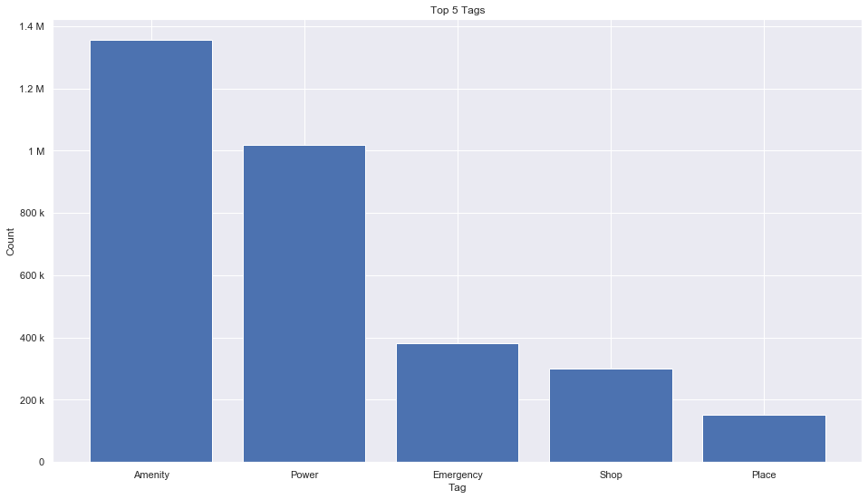

|Tag|Count|
|-|-:|
|Amenity|1355206|
|Power|1019953|
|Emergency|383123|
|Shop|299377|
|Place|150763|

### &Uuml;bersicht Ortsangaben

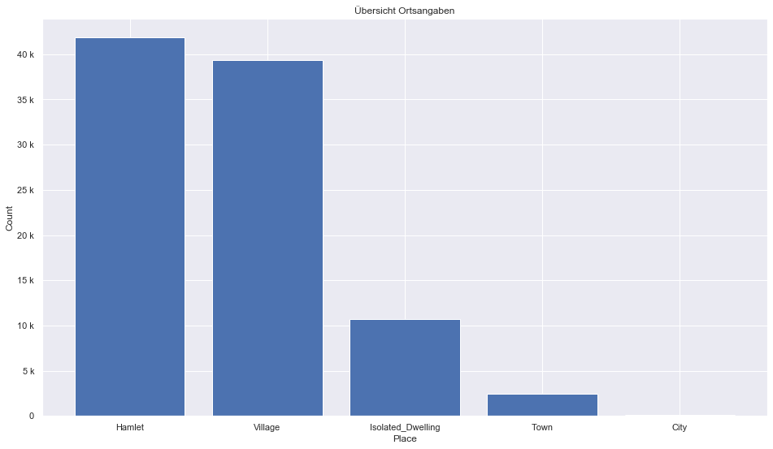

|Place|Count|
|-|-:|
|Hamlet|41837|
|Village|39309|
|Isolated_Dwelling|10706|
|Town|2441|
|City|82|

### Die 5 gr&ouml;&szlig;ten bewohnte Gebiete

|Name|Lat|Lon|Type|Population|
|----|--:|--:|:--:|---------:|
|Berlin|52.5170365|13.3888599|City|3531201|
|Hamburg|53.550341|10.000654|City|1812709|
|München|48.1371079|11.5753822|City|1528849|
|Köln|50.938361|6.959974|City|1069200|
|Frankfurt am Main|50.1106444|8.6820917|City|701350|

---

## Great Britain [&#10159;](great-britain.sqlite)

### Allgemeine Informationen

|Eigenschaft|Wert|
|-|-:|
Dateiname|[great-britain.sqlite](great-britain.sqlite)|
Zeitstempel|04.09.2019 22:09|
Dateigr&ouml;&szlig;e|53.14 Mb|
|||
Gesamtanzahl Nodes|1160182|
|MinLat|48.79409|
|MaxLat|61.92858|
|MinLon|-15.336777|
|MaxLon|2.25|

### Top 5 Tags

|Tag|Count|
|-|-:|
|Power|505697|
|Amenity|386022|
|Shop|110275|
|Place|95980|
|Man_Made|28966|

### &Uuml;bersicht Ortsangaben

|Place|Count|
|-|-:|
|Hamlet|16720|
|Village|14513|
|Isolated_Dwelling|8101|
|Town|1556|
|City|65|

### Die 5 gr&ouml;&szlig;ten bewohnte Gebiete

|Name|Lat|Lon|Type|Population|
|----|--:|--:|:--:|---------:|
|London|51.5073219|-0.1276474|City|8416535|
|Birmingham|52.4796992|-1.9026911|City|1036878|
|Leeds|53.7974185|-1.5437941|City|766399|
|Glasgow|55.8611389|-4.2501672|City|606340|
|Sheffield|53.3806626|-1.4702278|City|547000|

---

## Greece [&#10159;](greece.sqlite)

### Allgemeine Informationen

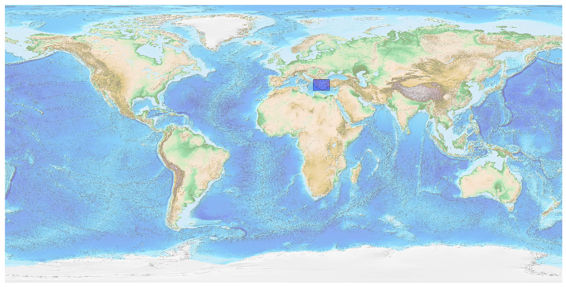

|Eigenschaft|Wert|
|-|-:|
Dateiname|[greece.sqlite](greece.sqlite)|
Zeitstempel|04.09.2019 21:23|
Dateigr&ouml;&szlig;e|7.29 Mb|
|||
Gesamtanzahl Nodes|149476|
|MinLat|34.59111|
|MaxLat|41.74954|
|MinLon|19.15881|
|MaxLon|29.65683|

### Top 5 Tags

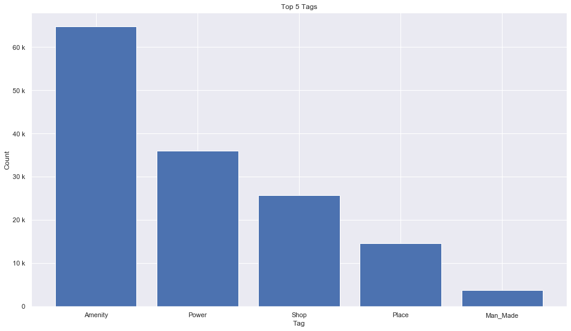

|Tag|Count|
|-|-:|
|Amenity|64728|
|Power|36019|
|Shop|25799|
|Place|14672|
|Man_Made|3844|

### &Uuml;bersicht Ortsangaben

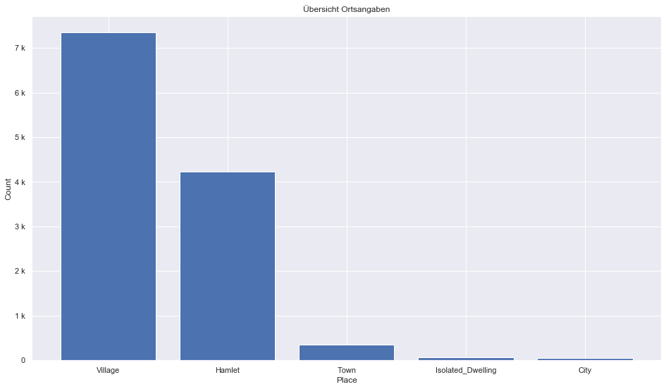

|Place|Count|
|-|-:|
|Village|7343|
|Hamlet|4231|
|Town|355|
|Isolated_Dwelling|64|
|City|52|

### Die 5 gr&ouml;&szlig;ten bewohnte Gebiete

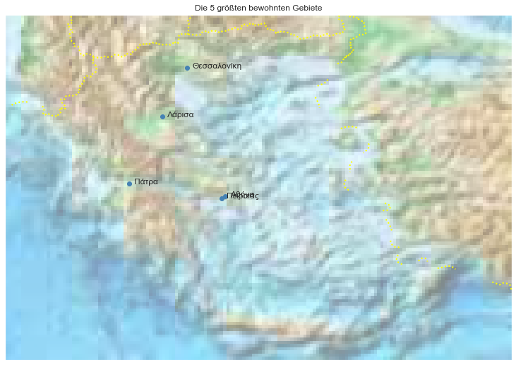

|Name|Lat|Lon|Type|Population|
|----|--:|--:|:--:|---------:|
|Αθήνα|37.9841493|23.7279843|City|3090508|
|Θεσσαλονίκη|40.6403167|22.9352716|City|790824|
|Πάτρα|38.246242|21.7350847|City|300000|
|Πειραιάς|37.9440078|23.6483599|City|163688|
|Λάρισα|39.6383092|22.4160706|City|144651|

---

## Hungary [&#10159;](hungary.sqlite)

### Allgemeine Informationen

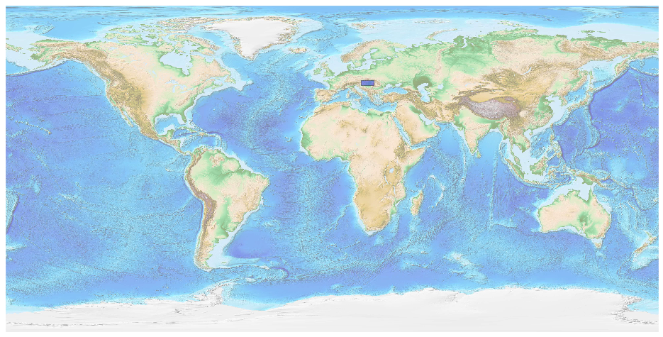

|Eigenschaft|Wert|
|-|-:|
Dateiname|[hungary.sqlite](hungary.sqlite)|
Zeitstempel|04.09.2019 21:42|
Dateigr&ouml;&szlig;e|16.45 Mb|
|||
Gesamtanzahl Nodes|368751|
|MinLat|45.73218|
|MaxLat|48.58766|
|MinLon|16.11262|
|MaxLon|22.90201|

### Top 5 Tags

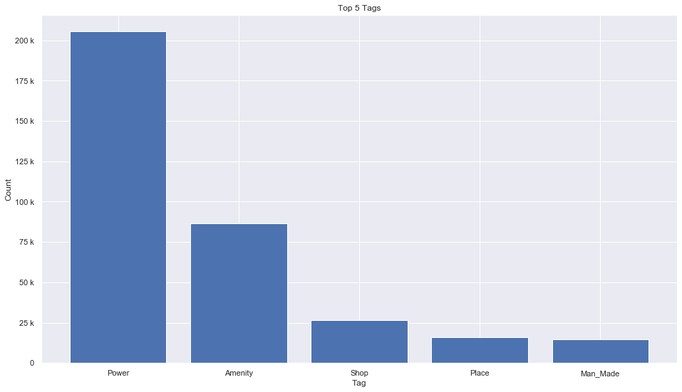

|Tag|Count|
|-|-:|
|Power|205424|
|Amenity|86508|
|Shop|26344|
|Place|16038|
|Man_Made|14742|

### &Uuml;bersicht Ortsangaben

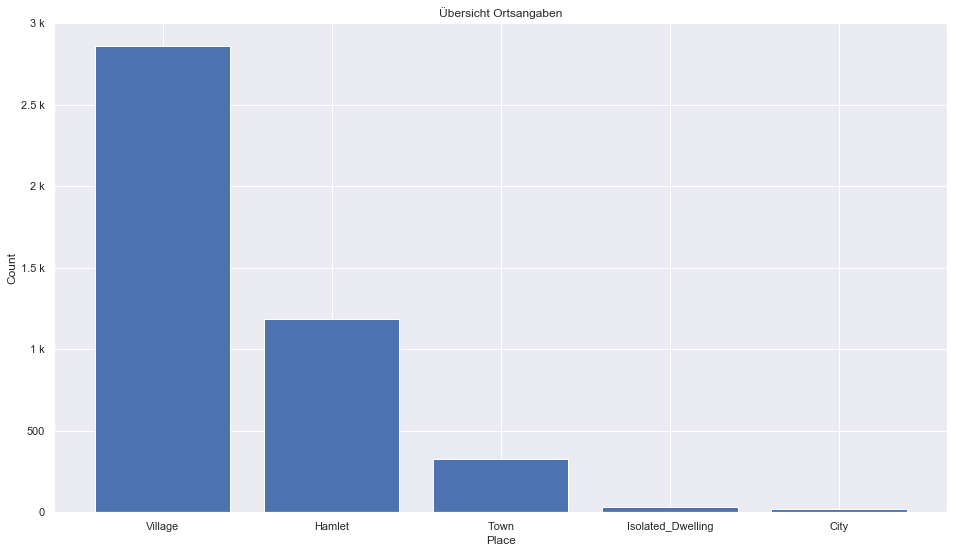

|Place|Count|
|-|-:|
|Village|2858|
|Hamlet|1185|
|Town|328|
|Isolated_Dwelling|33|
|City|19|

### Die 5 gr&ouml;&szlig;ten bewohnte Gebiete

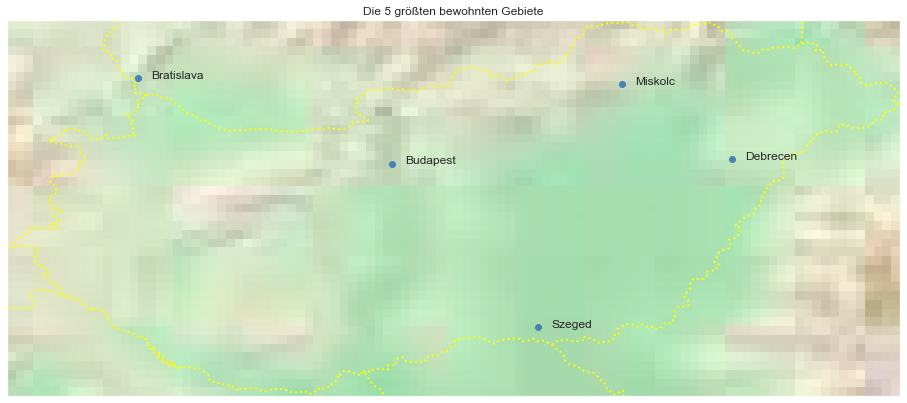

|Name|Lat|Lon|Type|Population|
|----|--:|--:|:--:|---------:|
|Budapest|47.4983815|19.0404707|City|1759407|
|Bratislava|48.1516988|17.1093063|City|432801|
|Debrecen|47.531399|21.6259782|City|203059|
|Szeged|46.2546312|20.1486016|City|162621|
|Miskolc|48.1031503|20.7901985|City|158101|

---

## Iceland [&#10159;](iceland.sqlite)

### Allgemeine Informationen

|Eigenschaft|Wert|
|-|-:|
Dateiname|[iceland.sqlite](iceland.sqlite)|
Zeitstempel|04.09.2019 21:45|
Dateigr&ouml;&szlig;e|2.77 Mb|
|||
Gesamtanzahl Nodes|66739|
|MinLat|62.84553|
|MaxLat|67.50085|
|MinLon|-25.74085|
|MaxLon|-12.41708|

### Top 5 Tags

|Tag|Count|
|-|-:|
|Power|55943|
|Amenity|6348|
|Place|1753|
|Shop|1422|
|Man_Made|608|

### &Uuml;bersicht Ortsangaben

|Place|Count|
|-|-:|
|Isolated_Dwelling|54|
|Village|42|
|Hamlet|39|
|Town|39|
|City|1|

### Die 5 gr&ouml;&szlig;ten bewohnte Gebiete

|Name|Lat|Lon|Type|Population|
|----|--:|--:|:--:|---------:|
|Reykjavík|64.145981|-21.9422367|City|127333|
|Kópavogur|64.1113504|-21.9048106|Town|36940|
|Hafnarfjörður|64.0695354|-21.9575664|Town|29796|
|Reykjanesbær|63.9832697|-22.5561494|Town|18629|
|Akureyri|65.6826364|-18.0912993|Town|18606|

---

## Ireland And Northern Ireland [&#10159;](ireland-and-northern-ireland.sqlite)

### Allgemeine Informationen

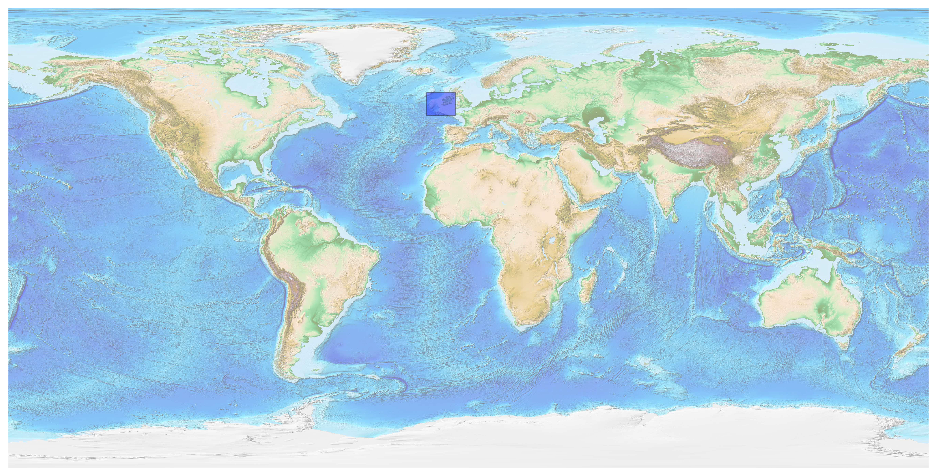

|Eigenschaft|Wert|
|-|-:|
Dateiname|[ireland-and-northern-ireland.sqlite](ireland-and-northern-ireland.sqlite)|
Zeitstempel|04.09.2019 21:58|
Dateigr&ouml;&szlig;e|11.00 Mb|
|||
Gesamtanzahl Nodes|254320|
|MinLat|47.96052|
|MaxLat|56.86553|
|MinLon|-16.30824|
|MaxLon|-5.059265|

### Top 5 Tags

|Tag|Count|
|-|-:|
|Power|179430|
|Amenity|32549|
|Place|21421|
|Shop|13419|
|Man_Made|3430|

### &Uuml;bersicht Ortsangaben

|Place|Count|
|-|-:|
|Hamlet|1853|
|Village|1242|
|Town|293|
|City|10|
|Isolated_Dwelling|5|

### Die 5 gr&ouml;&szlig;ten bewohnte Gebiete

|Name|Lat|Lon|Type|Population|
|----|--:|--:|:--:|---------:|
|Dublin|53.3497645|-6.2602732|City|553165|
|Belfast|54.5964411|-5.9302761|City|333000|
|Cork|51.8979282|-8.4705806|City|125622|
|Tallaght|53.2878314|-6.3622774|Town|101055|
|Londonderry/Derry|54.9919421|-7.316801|City|85016|

---

## Isle Of Man [&#10159;](isle-of-man.sqlite)

### Allgemeine Informationen

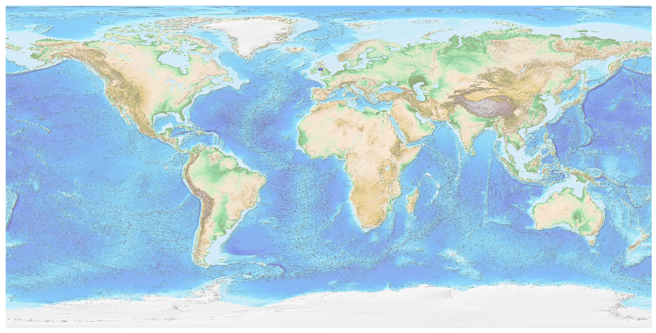

|Eigenschaft|Wert|
|-|-:|
Dateiname|[isle-of-man.sqlite](isle-of-man.sqlite)|
Zeitstempel|04.09.2019 21:58|
Dateigr&ouml;&szlig;e|192.00 Kb|
|||
Gesamtanzahl Nodes|3728|
|MinLat|53.73236|
|MaxLat|54.6706|
|MinLon|-5.434554|
|MaxLon|-3.688718|

### Top 5 Tags

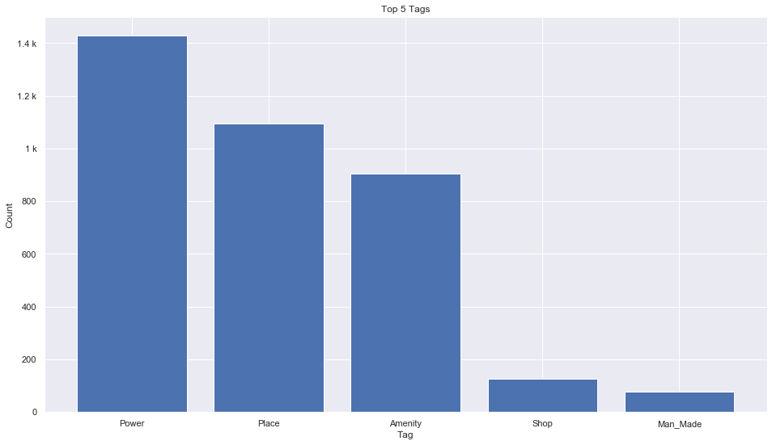

|Tag|Count|
|-|-:|
|Power|1428|
|Place|1094|
|Amenity|906|
|Shop|125|
|Man_Made|76|

### &Uuml;bersicht Ortsangaben

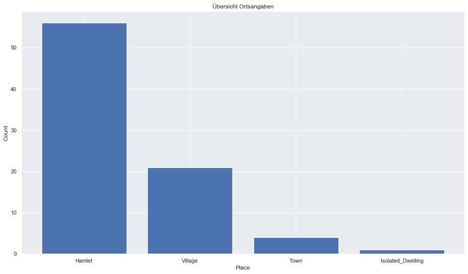

|Place|Count|
|-|-:|
|Hamlet|56|
|Village|21|
|Town|4|
|Isolated_Dwelling|1|

### Die 5 gr&ouml;&szlig;ten bewohnte Gebiete

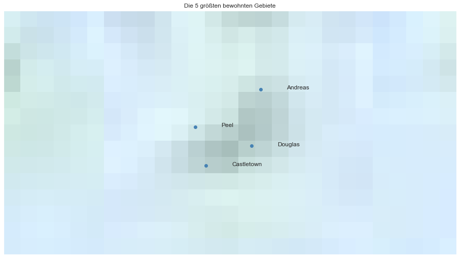

|Name|Lat|Lon|Type|Population|
|----|--:|--:|:--:|---------:|
|Douglas|54.149774|-4.4779021|Town|27938|
|Peel|54.2229326|-4.6957105|Town|5093|
|Castletown|54.0735192|-4.6538304|Town|3097|
|Andreas|54.3670794|-4.4443798|Village|1428|

---

## Italy [&#10159;](italy.sqlite)

### Allgemeine Informationen

|Eigenschaft|Wert|
|-|-:|
Dateiname|[italy.sqlite](italy.sqlite)|
Zeitstempel|04.09.2019 23:11|
Dateigr&ouml;&szlig;e|51.15 Mb|
|||
Gesamtanzahl Nodes|1082603|
|MinLat|35.07638|
|MaxLat|47.10169|
|MinLon|6.602696|
|MaxLon|19.12499|

### Top 5 Tags

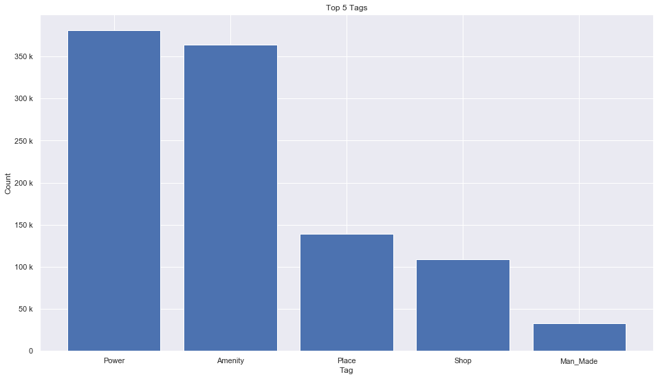

|Tag|Count|
|-|-:|
|Power|380872|
|Amenity|363987|
|Place|138761|
|Shop|109313|
|Man_Made|32881|

### &Uuml;bersicht Ortsangaben

|Place|Count|
|-|-:|
|Hamlet|44275|
|Isolated_Dwelling|26180|
|Village|15143|
|Town|1114|
|City|99|

### Die 5 gr&ouml;&szlig;ten bewohnte Gebiete

|Name|Lat|Lon|Type|Population|
|----|--:|--:|:--:|---------:|
|Roma|41.894812|12.4853491|City|2864731|
|Milano|45.4667971|9.1904984|City|1350487|
|Napoli|40.8359336|14.2487826|City|972212|
|Torino|45.0677551|7.6824892|City|902000|
|Palermo|38.1112268|13.3524434|City|665566|

---

## Kosovo [&#10159;](kosovo.sqlite)

### Allgemeine Informationen

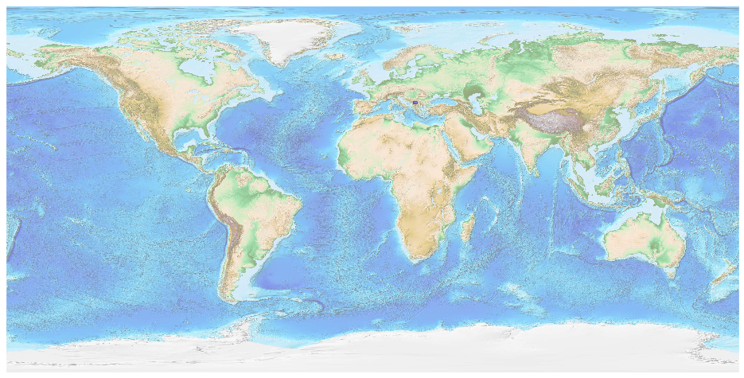

|Eigenschaft|Wert|
|-|-:|
Dateiname|[kosovo.sqlite](kosovo.sqlite)|
Zeitstempel|04.09.2019 22:10|
Dateigr&ouml;&szlig;e|568.00 Kb|
|||
Gesamtanzahl Nodes|11430|
|MinLat|41.85101|
|MaxLat|43.27416|
|MinLon|20.01357|
|MaxLon|21.80449|

### Top 5 Tags

|Tag|Count|
|-|-:|
|Amenity|4396|
|Power|2798|
|Place|2049|
|Shop|1775|
|Man_Made|196|

### &Uuml;bersicht Ortsangaben

|Place|Count|
|-|-:|
|Village|1548|
|Hamlet|265|
|Town|31|
|City|7|

### Die 5 gr&ouml;&szlig;ten bewohnte Gebiete

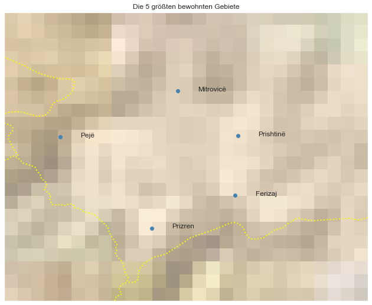

|Name|Lat|Lon|Type|Population|
|----|--:|--:|:--:|---------:|
|Prishtinë|42.6638771|21.1640849|City|465186|
|Prizren|42.2089656|20.7404242|City|177781|
|Ferizaj|42.3705175|21.1518203|City|108610|
|Mitrovicë|42.885298|20.8673427|City|107000|
|Pejë|42.6594354|20.288468|City|97776|

---

## Latvia [&#10159;](latvia.sqlite)

### Allgemeine Informationen

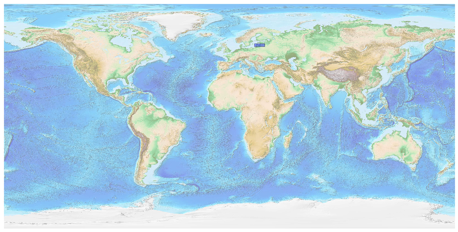

|Eigenschaft|Wert|
|-|-:|
Dateiname|[latvia.sqlite](latvia.sqlite)|
Zeitstempel|04.09.2019 22:16|
Dateigr&ouml;&szlig;e|7.18 Mb|
|||
Gesamtanzahl Nodes|136239|
|MinLat|55.66109|
|MaxLat|58.0947|
|MinLon|19.73348|
|MaxLon|28.25501|

### Top 5 Tags

|Tag|Count|
|-|-:|
|Place|79183|
|Power|35311|
|Amenity|10818|
|Shop|5376|
|Man_Made|3007|

### &Uuml;bersicht Ortsangaben

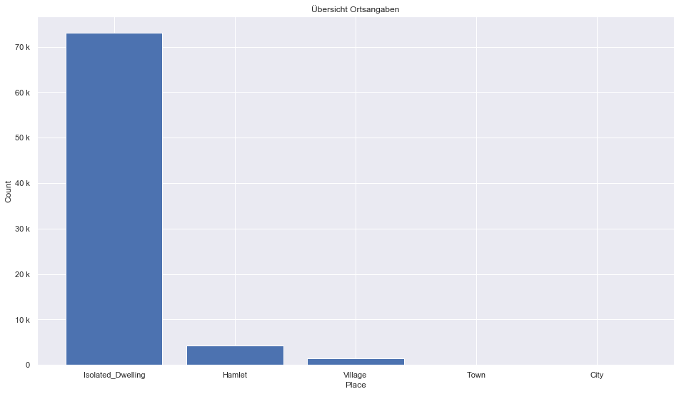

|Place|Count|
|-|-:|
|Isolated_Dwelling|73024|
|Hamlet|4318|
|Village|1442|
|Town|73|
|City|9|

### Die 5 gr&ouml;&szlig;ten bewohnte Gebiete

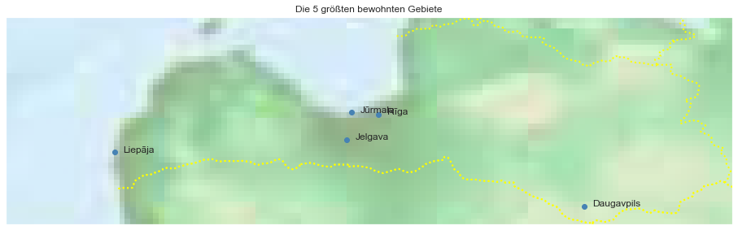

|Name|Lat|Lon|Type|Population|
|----|--:|--:|:--:|---------:|
|Rīga|56.9493977|24.1051846|City|698529|
|Daugavpils|55.8712267|26.5159337|City|101057|
|Liepāja|56.5048435|21.0070903|City|78787|
|Jelgava|56.6514394|23.7339143|City|63534|
|Jūrmala|56.9727164|23.7886979|City|57671|

---

## Liechtenstein [&#10159;](liechtenstein.sqlite)

### Allgemeine Informationen

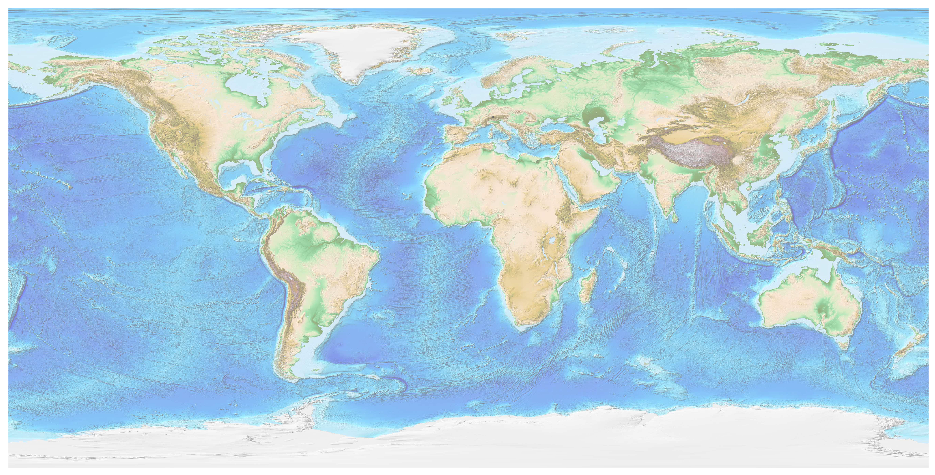

|Eigenschaft|Wert|
|-|-:|
Dateiname|[liechtenstein.sqlite](liechtenstein.sqlite)|
Zeitstempel|04.09.2019 22:16|
Dateigr&ouml;&szlig;e|64.00 Kb|
|||
Gesamtanzahl Nodes|1064|
|MinLat|47.04774|
|MaxLat|47.27128|
|MinLon|9.471078|
|MaxLon|9.636217|

### Top 5 Tags

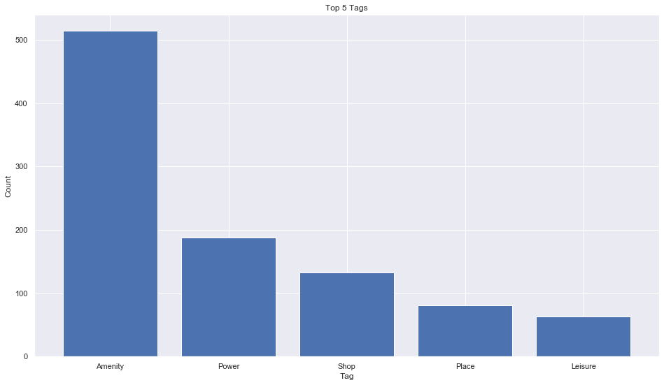

|Tag|Count|
|-|-:|
|Amenity|514|
|Power|188|
|Shop|133|
|Place|81|
|Leisure|63|

### &Uuml;bersicht Ortsangaben

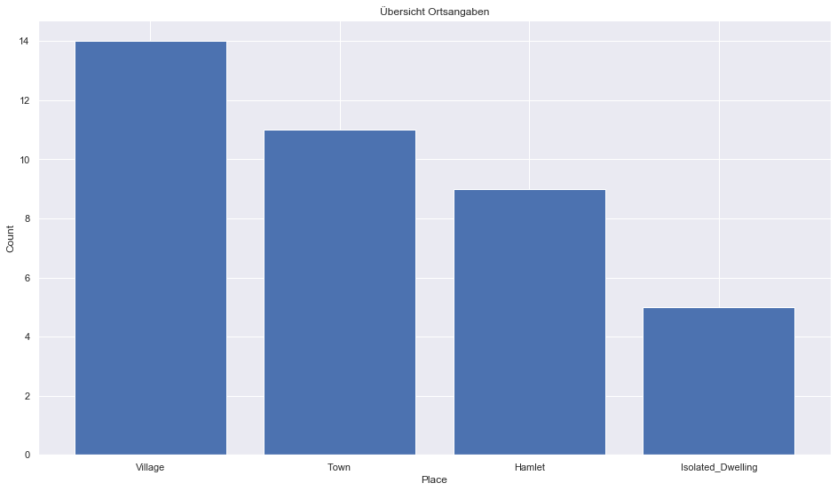

|Place|Count|
|-|-:|
|Village|14|
|Town|11|
|Hamlet|9|
|Isolated_Dwelling|5|

### Die 5 gr&ouml;&szlig;ten bewohnte Gebiete

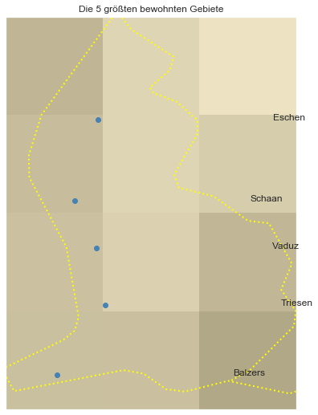

|Name|Lat|Lon|Type|Population|
|----|--:|--:|:--:|---------:|
|Schaan|47.1663397|9.510312|Town|6002|
|Vaduz|47.1392862|9.5227962|Town|5229|
|Triesen|47.106994|9.5274876|Town|5050|
|Balzers|47.0671067|9.5002584|Town|4608|
|Eschen|47.2126274|9.5233202|Town|4407|

---

## Lithuania [&#10159;](lithuania.sqlite)

### Allgemeine Informationen

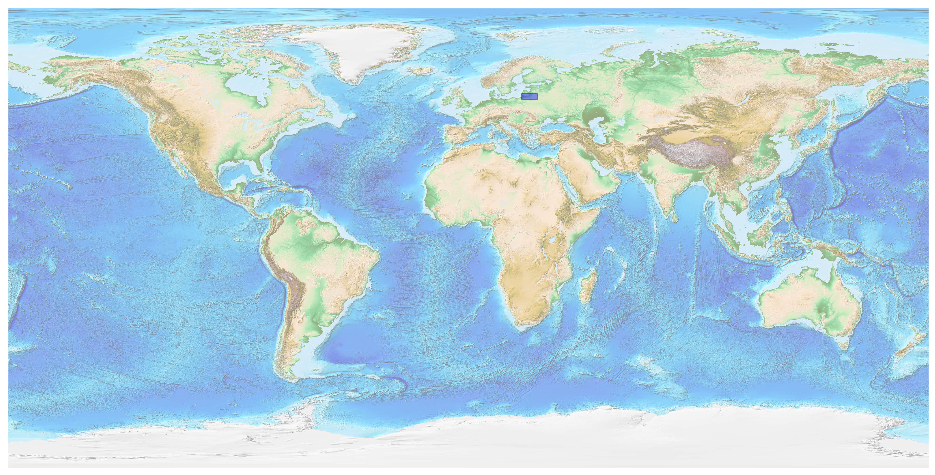

|Eigenschaft|Wert|
|-|-:|
Dateiname|[lithuania.sqlite](lithuania.sqlite)|
Zeitstempel|04.09.2019 22:22|
Dateigr&ouml;&szlig;e|4.79 Mb|
|||
Gesamtanzahl Nodes|106629|
|MinLat|53.89605|
|MaxLat|56.45106|
|MinLon|20.63822|
|MaxLon|26.83873|

### Top 5 Tags

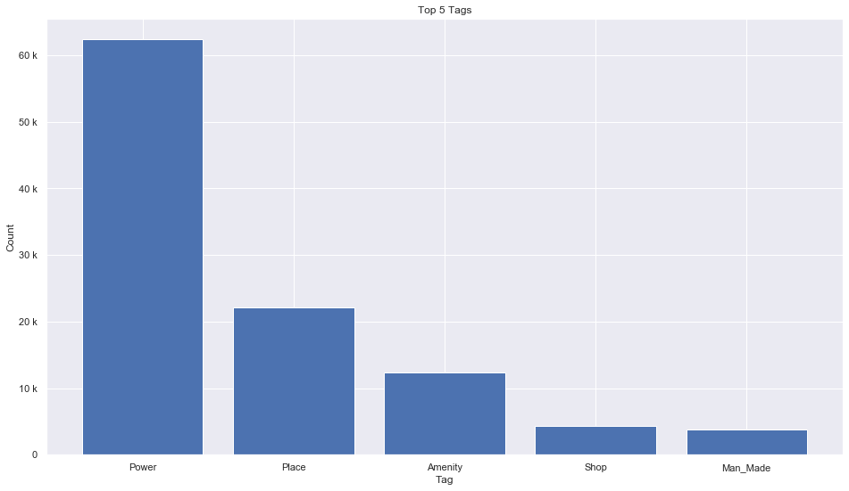

|Tag|Count|
|-|-:|
|Power|62371|
|Place|22175|
|Amenity|12319|
|Shop|4343|
|Man_Made|3732|

### &Uuml;bersicht Ortsangaben

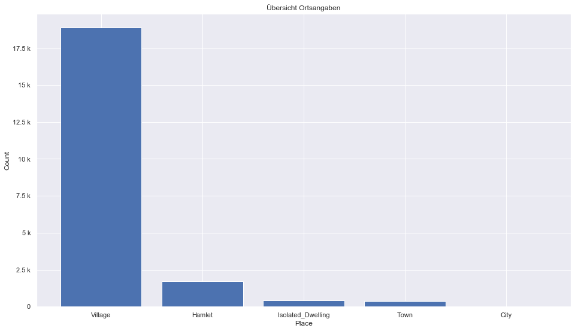

|Place|Count|
|-|-:|
|Village|18882|
|Hamlet|1710|
|Isolated_Dwelling|401|
|Town|371|
|City|5|

### Die 5 gr&ouml;&szlig;ten bewohnte Gebiete

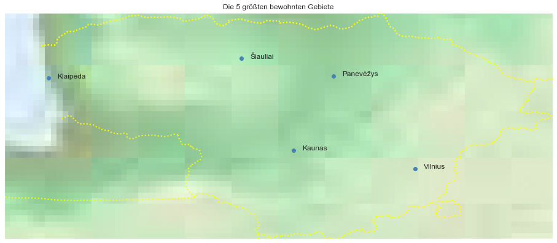

|Name|Lat|Lon|Type|Population|
|----|--:|--:|:--:|---------:|
|Vilnius|54.6870458|25.2829111|City|526356|
|Kaunas|54.8982139|23.9044817|City|315993|
|Klaipėda|55.7127529|21.1350469|City|162360|
|Šiauliai|55.9340823|23.3157775|City|109328|
|Panevėžys|55.7344985|24.3578055|City|99690|

---

## Luxembourg [&#10159;](luxembourg.sqlite)

### Allgemeine Informationen

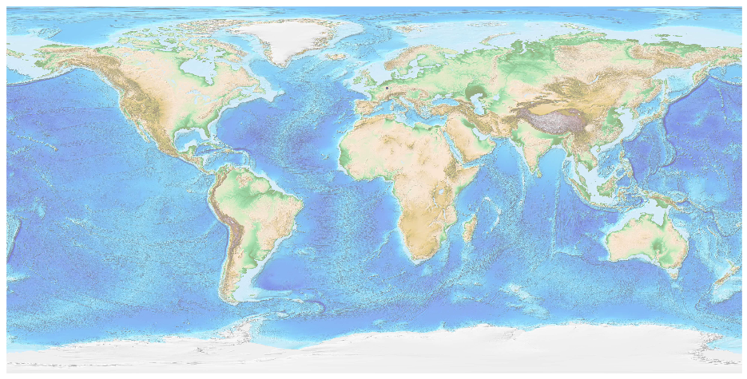

|Eigenschaft|Wert|
|-|-:|
Dateiname|[luxembourg.sqlite](luxembourg.sqlite)|
Zeitstempel|04.09.2019 22:24|
Dateigr&ouml;&szlig;e|1.38 Mb|
|||
Gesamtanzahl Nodes|29743|
|MinLat|49.44553|
|MaxLat|50.18496|
|MinLon|5.733033|
|MaxLon|6.532249|

### Top 5 Tags

|Tag|Count|
|-|-:|
|Amenity|14378|
|Power|8408|
|Emergency|2166|
|Shop|1905|
|Place|1100|

### &Uuml;bersicht Ortsangaben

|Place|Count|
|-|-:|
|Village|463|
|Hamlet|190|
|Isolated_Dwelling|15|
|Town|12|
|City|1|

### Die 5 gr&ouml;&szlig;ten bewohnte Gebiete

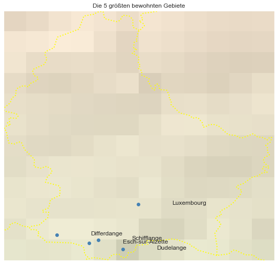

|Name|Lat|Lon|Type|Population|
|----|--:|--:|:--:|---------:|
|Luxembourg|49.6112768|6.129799|City|103641|
|Esch-sur-Alzette|49.4959628|5.9850306|Town|33286|
|Dudelange|49.4786477|6.0847792|Town|20000|
|Differdange|49.5208469|5.889242|Town|19000|
|Schifflange|49.5062732|6.0118175|Town|10379|

---

## Macedonia [&#10159;](macedonia.sqlite)

### Allgemeine Informationen

|Eigenschaft|Wert|
|-|-:|
Dateiname|[macedonia.sqlite](macedonia.sqlite)|
Zeitstempel|04.09.2019 22:24|
Dateigr&ouml;&szlig;e|564.00 Kb|
|||
Gesamtanzahl Nodes|11045|
|MinLat|40.84759|
|MaxLat|42.37969|
|MinLon|20.44671|
|MaxLon|23.04012|

### Top 5 Tags

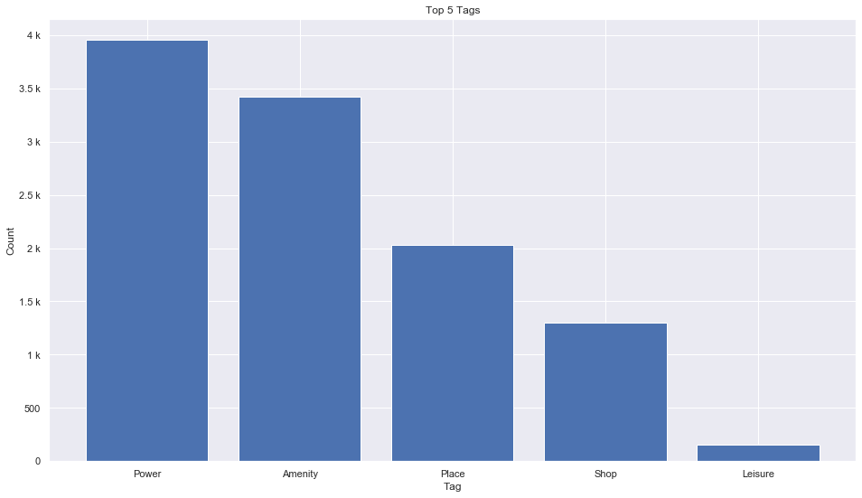

|Tag|Count|
|-|-:|
|Power|3953|
|Amenity|3424|
|Place|2032|
|Shop|1301|
|Leisure|152|

### &Uuml;bersicht Ortsangaben

|Place|Count|
|-|-:|
|Village|1283|
|Hamlet|497|
|Town|19|
|City|14|
|Isolated_Dwelling|13|

### Die 5 gr&ouml;&szlig;ten bewohnte Gebiete

|Name|Lat|Lon|Type|Population|
|----|--:|--:|:--:|---------:|
|Скопје|41.9960924|21.4316495|City|668500|
|Куманово|42.1359459|21.7177635|City|105000|
|Битола|41.0327325|21.3315306|City|74550|
|Прилеп|41.3455945|21.5538227|City|66246|
|Штип|41.7374724|22.1935856|City|65000|

---

## Malta [&#10159;](malta.sqlite)

### Allgemeine Informationen

|Eigenschaft|Wert|
|-|-:|
Dateiname|[malta.sqlite](malta.sqlite)|
Zeitstempel|04.09.2019 22:25|
Dateigr&ouml;&szlig;e|252.00 Kb|
|||
Gesamtanzahl Nodes|4715|
|MinLat|35.51985|
|MaxLat|36.332958|
|MinLon|13.815377|
|MaxLon|14.856099|

### Top 5 Tags

|Tag|Count|
|-|-:|
|Amenity|2941|
|Shop|1064|
|Place|169|
|Leisure|151|
|Man_Made|151|

### &Uuml;bersicht Ortsangaben

|Place|Count|
|-|-:|
|Village|46|
|Town|29|
|Hamlet|14|
|City|2|

### Die 5 gr&ouml;&szlig;ten bewohnte Gebiete

|Name|Lat|Lon|Type|Population|
|----|--:|--:|:--:|---------:|
|Birkirkara|35.8994547|14.4649578|Town|22247|
|San Pawl Il-Baħar|35.9480742|14.3973929|Town|21046|
|Il-Mosta|35.9079178|14.4241508|Town|20241|
|Tas-Sliema|35.9127609|14.5020708|Town|16854|
|Ħal Qormi|35.877464|14.4739598|Town|16779|

---

## Moldova [&#10159;](moldova.sqlite)

### Allgemeine Informationen

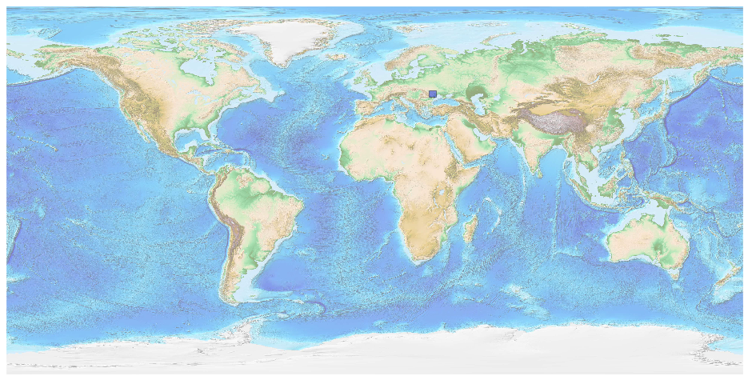

|Eigenschaft|Wert|
|-|-:|
Dateiname|[moldova.sqlite](moldova.sqlite)|
Zeitstempel|04.09.2019 22:30|
Dateigr&ouml;&szlig;e|4.96 Mb|
|||
Gesamtanzahl Nodes|119760|
|MinLat|45.4689|
|MaxLat|48.49017|
|MinLon|26.61889|
|MaxLon|30.16374|

### Top 5 Tags

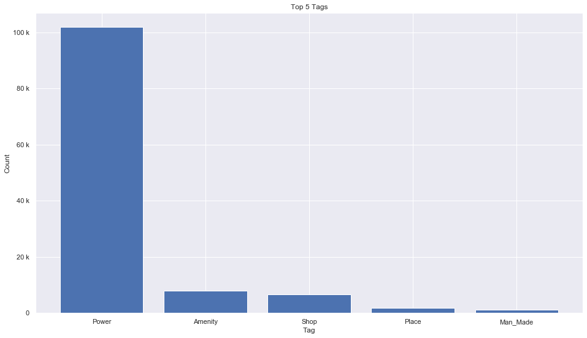

|Tag|Count|
|-|-:|
|Power|101825|
|Amenity|7894|
|Shop|6575|
|Place|1809|
|Man_Made|1047|

### &Uuml;bersicht Ortsangaben

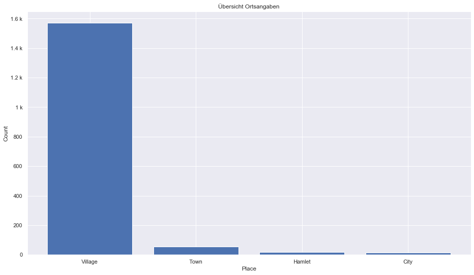

|Place|Count|
|-|-:|
|Village|1570|
|Town|54|
|Hamlet|18|
|City|14|

### Die 5 gr&ouml;&szlig;ten bewohnte Gebiete

|Name|Lat|Lon|Type|Population|
|----|--:|--:|:--:|---------:|
|Chișinău|47.0244707|28.8322534|City|750000|
|Bălți|47.7620065|27.9286221|City|144800|
|Тирасполь|46.8379988|29.6109543|City|135700|
|Бендеры|46.8233664|29.4803622|City|97027|
|Рыбница|47.7658526|29.0078097|City|50086|

---

## Montenegro [&#10159;](montenegro.sqlite)

### Allgemeine Informationen

|Eigenschaft|Wert|
|-|-:|
Dateiname|[montenegro.sqlite](montenegro.sqlite)|
Zeitstempel|04.09.2019 22:31|
Dateigr&ouml;&szlig;e|872.00 Kb|
|||
Gesamtanzahl Nodes|17595|
|MinLat|41.61621|
|MaxLat|43.55504|
|MinLon|18.17282|
|MaxLon|20.36638|

### Top 5 Tags

|Tag|Count|
|-|-:|
|Amenity|6816|
|Place|4260|
|Power|3793|
|Shop|2270|
|Leisure|249|

### &Uuml;bersicht Ortsangaben

|Place|Count|
|-|-:|
|Hamlet|2087|
|Village|783|
|Isolated_Dwelling|31|
|Town|25|
|City|1|

### Die 5 gr&ouml;&szlig;ten bewohnte Gebiete

|Name|Lat|Lon|Type|Population|
|----|--:|--:|:--:|---------:|
|Podgorica|42.4415238|19.2621081|City|150799|
|Nikšić|42.7739559|18.9488746|Town|58212|
|Pljevlja|43.3565611|19.3584715|Town|27000|
|Rožaje|42.8416663|20.1659665|Town|22693|
|Bar|42.0979745|19.0954528|Town|17727|

---

## Netherlands [&#10159;](netherlands.sqlite)

### Allgemeine Informationen

|Eigenschaft|Wert|
|-|-:|
Dateiname|[netherlands.sqlite](netherlands.sqlite)|
Zeitstempel|04.09.2019 23:01|
Dateigr&ouml;&szlig;e|13.57 Mb|
|||
Gesamtanzahl Nodes|278686|
|MinLat|50.74753|
|MaxLat|54.01786|
|MinLon|2.992192|
|MaxLon|7.230455|

### Top 5 Tags

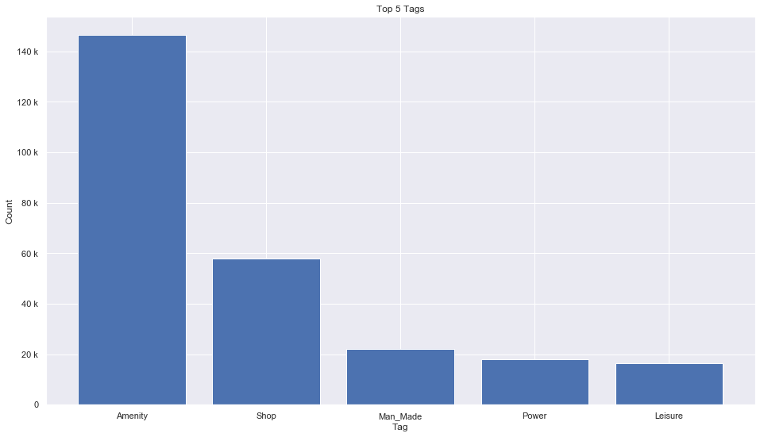

|Tag|Count|
|-|-:|
|Amenity|146437|
|Shop|57840|
|Man_Made|22145|
|Power|17875|
|Leisure|16270|

### &Uuml;bersicht Ortsangaben

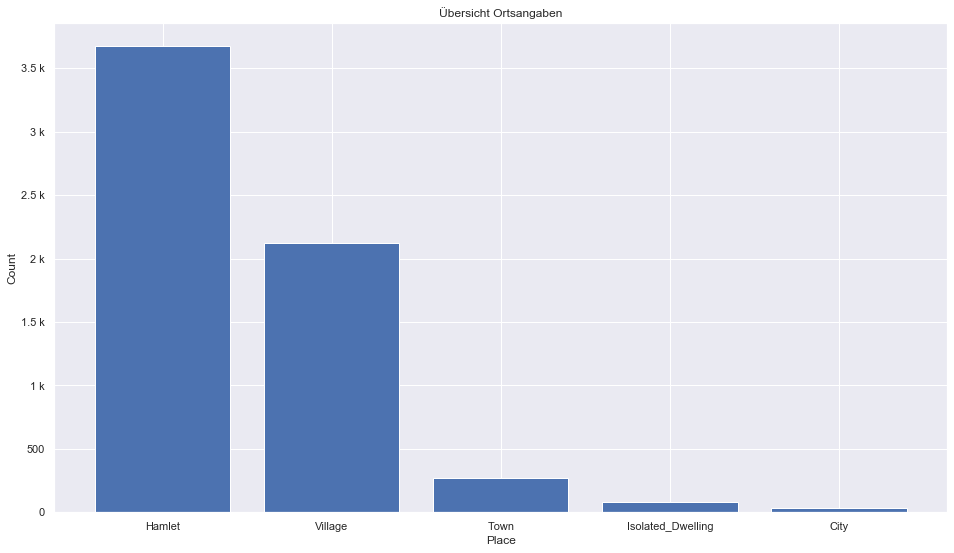

|Place|Count|
|-|-:|
|Hamlet|3674|
|Village|2125|
|Town|271|
|Isolated_Dwelling|78|
|City|33|

### Die 5 gr&ouml;&szlig;ten bewohnte Gebiete

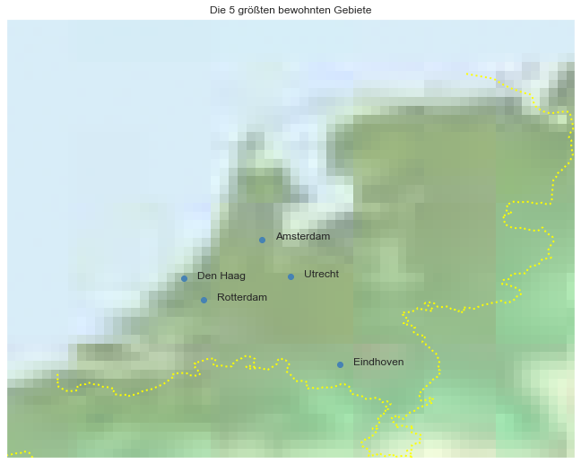

|Name|Lat|Lon|Type|Population|
|----|--:|--:|:--:|---------:|
|Amsterdam|52.3727598|4.8936041|City|841282|
|Rotterdam|51.9228958|4.4631727|City|572392|
|Den Haag|52.0799838|4.3113461|City|525745|
|Utrecht|52.0949753|5.109708|City|295591|
|Eindhoven|51.4392648|5.478633|City|226921|

---

## Norway [&#10159;](norway.sqlite)

### Allgemeine Informationen

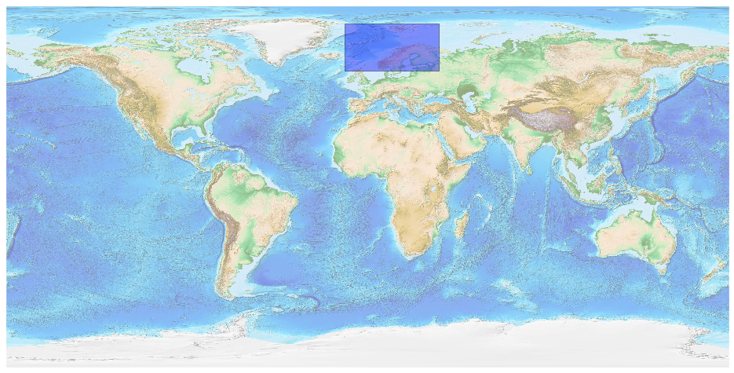

|Eigenschaft|Wert|
|-|-:|
Dateiname|[norway.sqlite](norway.sqlite)|
Zeitstempel|05.09.2019 11:21|
Dateigr&ouml;&szlig;e|15.71 Mb|
|||
Gesamtanzahl Nodes|353270|
|MinLat|57.55323|
|MaxLat|81.05195|
|MinLon|-11.36801|
|MaxLon|35.52711|

### Top 5 Tags

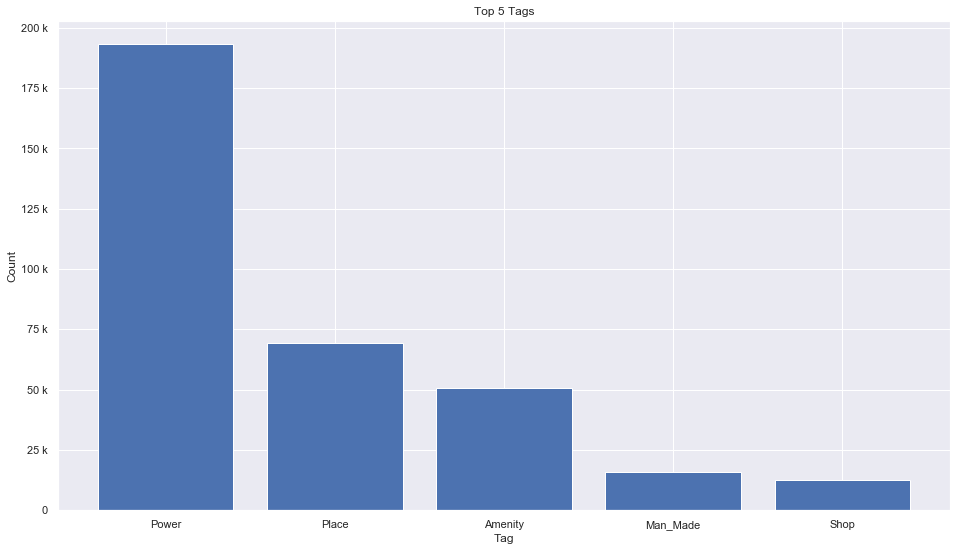

|Tag|Count|
|-|-:|
|Power|193124|
|Place|69268|
|Amenity|50510|
|Man_Made|15669|
|Shop|12571|

### &Uuml;bersicht Ortsangaben

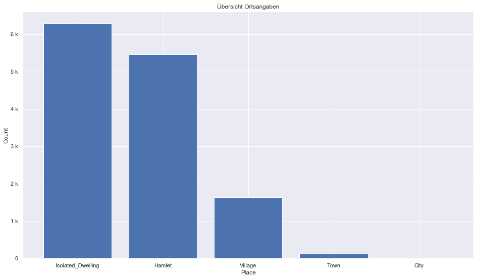

|Place|Count|
|-|-:|
|Isolated_Dwelling|6295|
|Hamlet|5464|
|Village|1637|
|Town|120|
|City|9|

### Die 5 gr&ouml;&szlig;ten bewohnte Gebiete

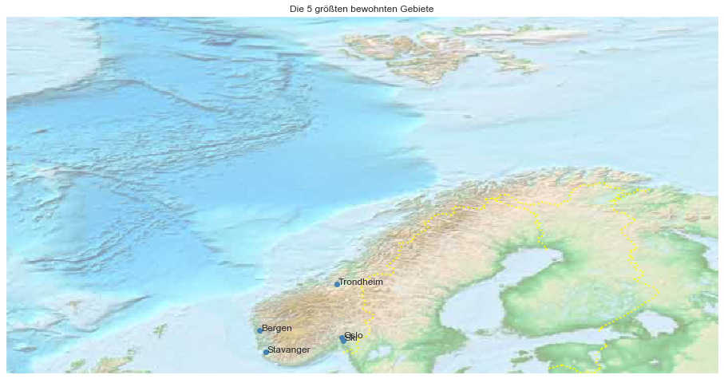

|Name|Lat|Lon|Type|Population|
|----|--:|--:|:--:|---------:|
|Oslo|59.9133301|10.7389701|City|616754|
|Bergen|60.3943034|5.3258117|City|250420|
|Ski|59.719758|10.8381993|Town|195357|
|Trondheim|63.4305658|10.3951929|City|180000|
|Stavanger|58.9680427|5.7324722|City|129300|

---

## Poland [&#10159;](poland.sqlite)

### Allgemeine Informationen

|Eigenschaft|Wert|
|-|-:|
Dateiname|[poland.sqlite](poland.sqlite)|
Zeitstempel|05.09.2019 11:46|
Dateigr&ouml;&szlig;e|47.95 Mb|
|||
Gesamtanzahl Nodes|1002587|
|MinLat|48.986421|
|MaxLat|55.228256|
|MinLon|13.990216|
|MaxLon|24.161023|

### Top 5 Tags

|Tag|Count|
|-|-:|
|Emergency|281095|
|Power|265651|
|Amenity|204220|
|Place|126687|
|Shop|85747|

### &Uuml;bersicht Ortsangaben

|Place|Count|
|-|-:|
|Hamlet|56948|
|Village|47965|
|Isolated_Dwelling|3751|
|Town|893|
|City|66|

### Die 5 gr&ouml;&szlig;ten bewohnte Gebiete

|Name|Lat|Lon|Type|Population|
|----|--:|--:|:--:|---------:|
|Warszawa|52.2319581|21.0067249|City|1744351|
|Kraków|50.0619474|19.9368564|City|762508|
|Łódź|51.7687323|19.4569911|City|711332|
|Wrocław|51.1089776|17.0326689|City|634487|
|Poznań|52.4082663|16.9335199|City|548028|

---

## Portugal [&#10159;](portugal.sqlite)

### Allgemeine Informationen

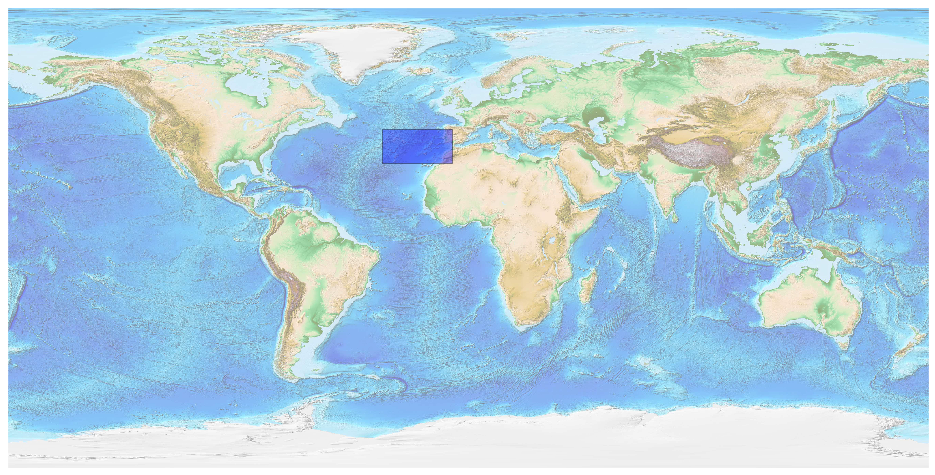

|Eigenschaft|Wert|
|-|-:|
Dateiname|[portugal.sqlite](portugal.sqlite)|
Zeitstempel|05.09.2019 11:26|
Dateigr&ouml;&szlig;e|9.05 Mb|
|||
Gesamtanzahl Nodes|187178|
|MinLat|29.251448|
|MaxLat|42.1639|
|MinLon|-33.616492|
|MaxLon|-6.179513|

### Top 5 Tags

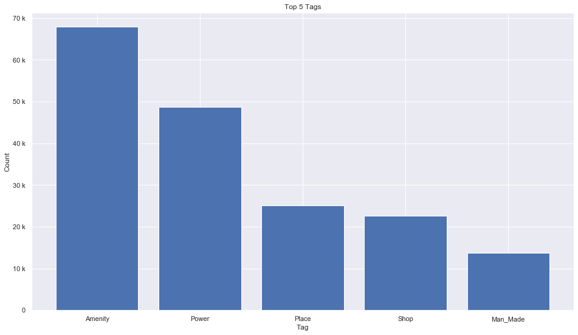

|Tag|Count|
|-|-:|
|Amenity|67894|
|Power|48711|
|Place|25132|
|Shop|22633|
|Man_Made|13766|

### &Uuml;bersicht Ortsangaben

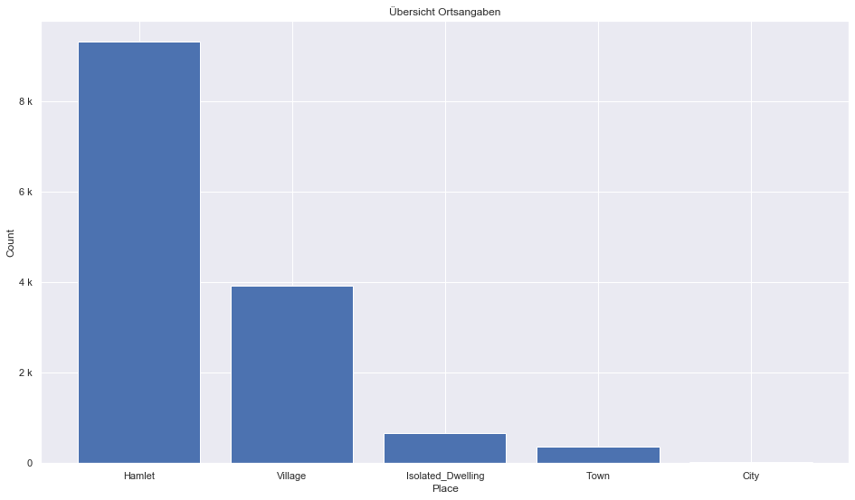

|Place|Count|
|-|-:|
|Hamlet|9308|
|Village|3915|
|Isolated_Dwelling|663|
|Town|358|
|City|24|

### Die 5 gr&ouml;&szlig;ten bewohnte Gebiete

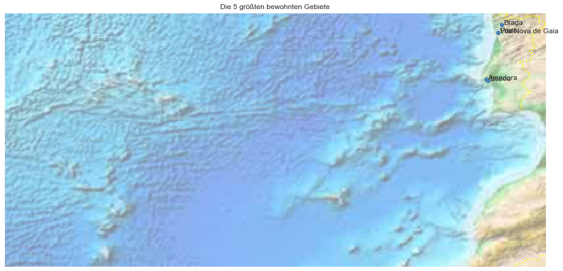

|Name|Lat|Lon|Type|Population|
|----|--:|--:|:--:|---------:|
|Lisboa|38.7077507|-9.1365919|City|552700|
|Porto|41.1494512|-8.6107884|City|237591|
|Vila Nova de Gaia|41.1300103|-8.6058415|Town|186502|
|Amadora|38.758959|-9.2365233|Town|175136|
|Braga|41.5510583|-8.4280045|City|136885|

---

## Romania [&#10159;](romania.sqlite)

### Allgemeine Informationen

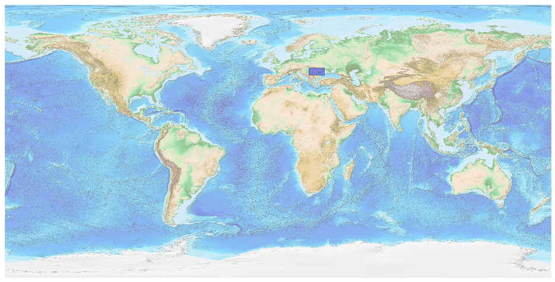

|Eigenschaft|Wert|
|-|-:|
Dateiname|[romania.sqlite](romania.sqlite)|
Zeitstempel|05.09.2019 11:31|
Dateigr&ouml;&szlig;e|9.35 Mb|
|||
Gesamtanzahl Nodes|207266|
|MinLat|43.59703|
|MaxLat|48.28633|
|MinLon|20.24181|
|MaxLon|30.27896|

### Top 5 Tags

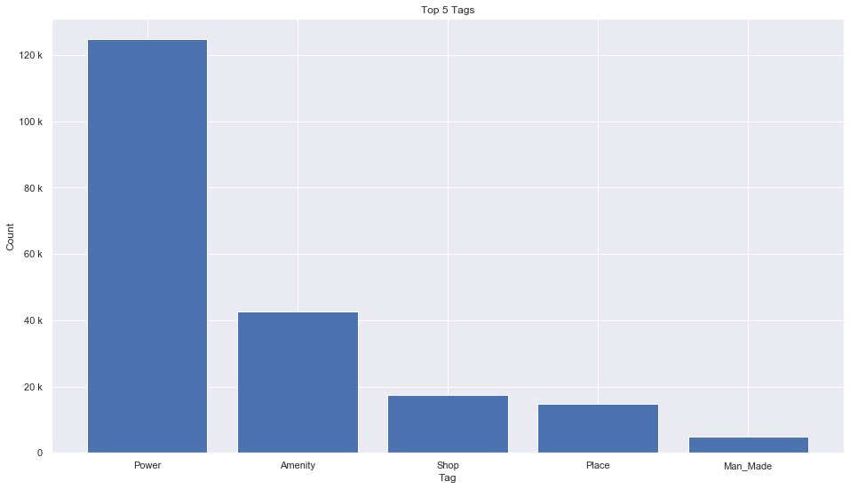

|Tag|Count|
|-|-:|
|Power|124703|
|Amenity|42497|
|Shop|17518|
|Place|14835|
|Man_Made|4770|

### &Uuml;bersicht Ortsangaben

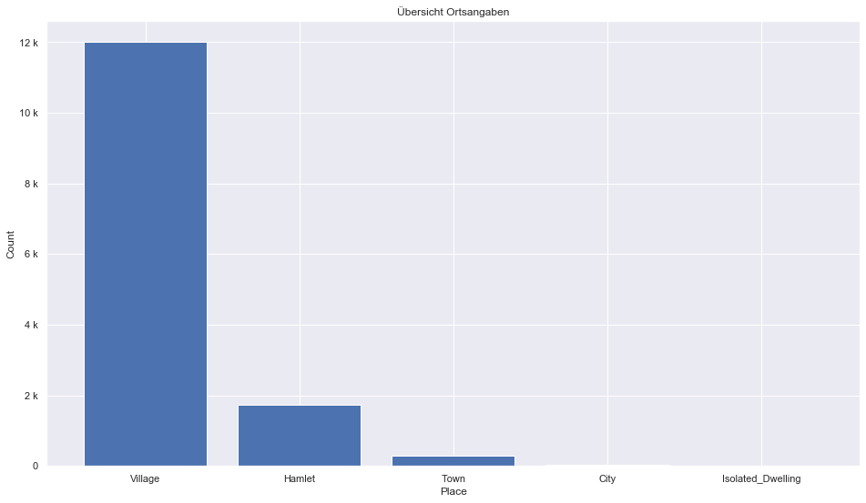

|Place|Count|
|-|-:|
|Village|12004|
|Hamlet|1734|
|Town|302|
|City|44|
|Isolated_Dwelling|3|

### Die 5 gr&ouml;&szlig;ten bewohnte Gebiete

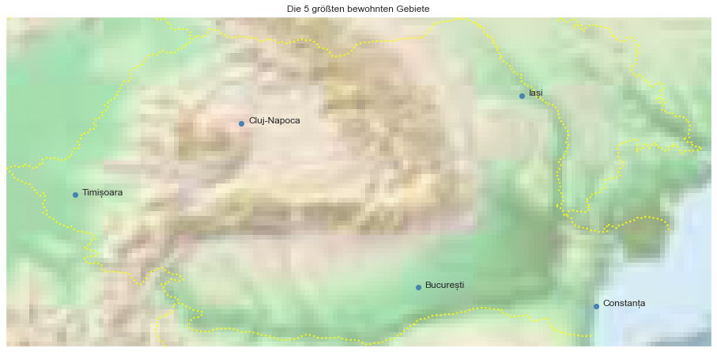

|Name|Lat|Lon|Type|Population|
|----|--:|--:|:--:|---------:|
|București|44.4361414|26.1027202|City|1883425|
|Cluj-Napoca|46.769379|23.5899542|City|324576|
|Timișoara|45.7538355|21.2257474|City|319279|
|Iași|47.161494|27.5840504|City|290422|
|Constanța|44.1717856|28.6319765|City|283872|

---

## Serbia [&#10159;](serbia.sqlite)

### Allgemeine Informationen

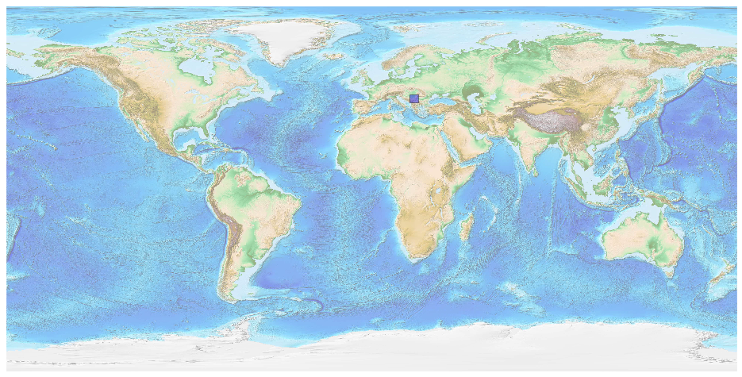

|Eigenschaft|Wert|
|-|-:|
Dateiname|[serbia.sqlite](serbia.sqlite)|
Zeitstempel|05.09.2019 11:32|
Dateigr&ouml;&szlig;e|2.73 Mb|
|||
Gesamtanzahl Nodes|60514|
|MinLat|42.24909|
|MaxLat|46.19125|
|MinLon|18.82347|
|MaxLon|23.00617|

### Top 5 Tags

|Tag|Count|
|-|-:|
|Power|37944|
|Amenity|9998|
|Place|6177|
|Shop|4702|
|Man_Made|840|

### &Uuml;bersicht Ortsangaben

|Place|Count|
|-|-:|
|Village|4242|
|Hamlet|919|
|Town|142|
|Isolated_Dwelling|20|
|City|19|

### Die 5 gr&ouml;&szlig;ten bewohnte Gebiete

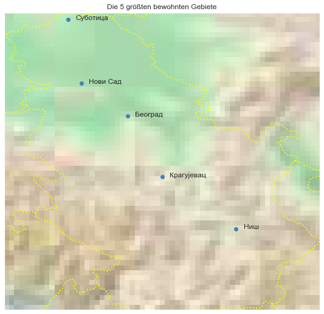

|Name|Lat|Lon|Type|Population|
|----|--:|--:|:--:|---------:|
|Београд|44.8178131|20.4568974|City|1346930|
|Нови Сад|45.2551338|19.8451756|City|250439|
|Ниш|43.321504|21.8957301|City|202208|
|Крагујевац|44.010103|20.9171723|City|190000|
|Суботица|46.1000129|19.6640974|City|148000|

---

## Slovakia [&#10159;](slovakia.sqlite)

### Allgemeine Informationen

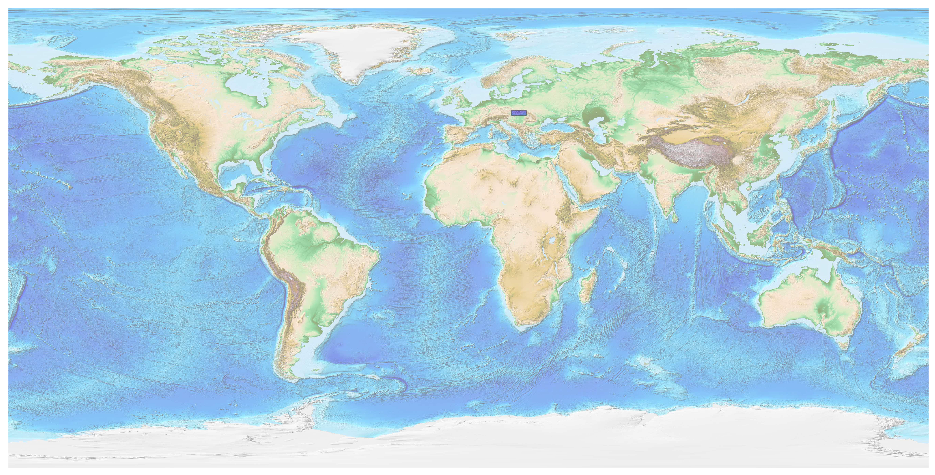

|Eigenschaft|Wert|
|-|-:|
Dateiname|[slovakia.sqlite](slovakia.sqlite)|
Zeitstempel|05.09.2019 11:37|
Dateigr&ouml;&szlig;e|11.04 Mb|
|||
Gesamtanzahl Nodes|229511|
|MinLat|47.72646|
|MaxLat|49.6186|
|MinLon|16.8283999|
|MaxLon|22.57051|

### Top 5 Tags

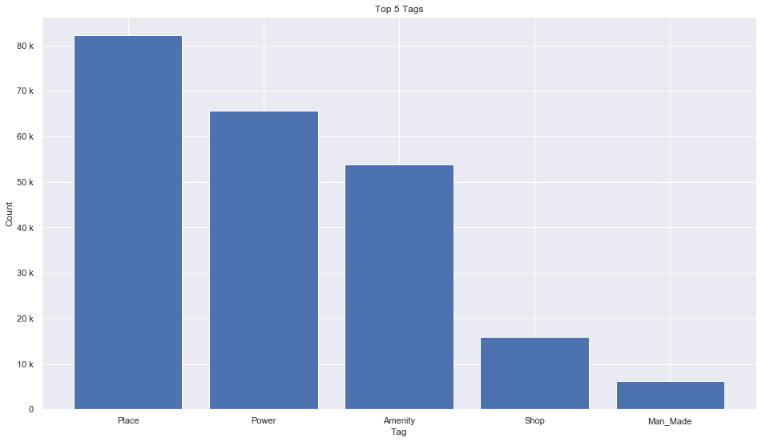

|Tag|Count|
|-|-:|
|Place|82160|
|Power|65720|
|Amenity|53907|
|Shop|15903|
|Man_Made|6188|

### &Uuml;bersicht Ortsangaben

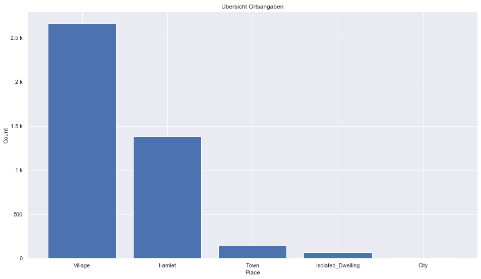

|Place|Count|
|-|-:|
|Village|2663|
|Hamlet|1383|
|Town|147|
|Isolated_Dwelling|68|
|City|8|

### Die 5 gr&ouml;&szlig;ten bewohnte Gebiete

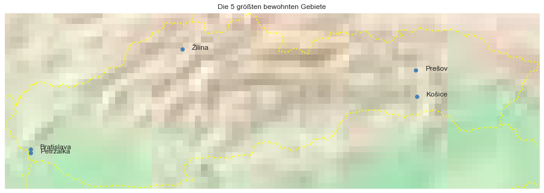

|Name|Lat|Lon|Type|Population|
|----|--:|--:|:--:|---------:|
|Bratislava|48.1516988|17.1093063|City|432801|
|Košice|48.7172272|21.2496774|City|238757|
|Petržalka|48.110972|17.1112897|Town|113443|
|Prešov|48.997631|21.2401873|City|91498|
|Žilina|49.2234674|18.7393139|City|85558|

---

## Slovenia [&#10159;](slovenia.sqlite)

### Allgemeine Informationen

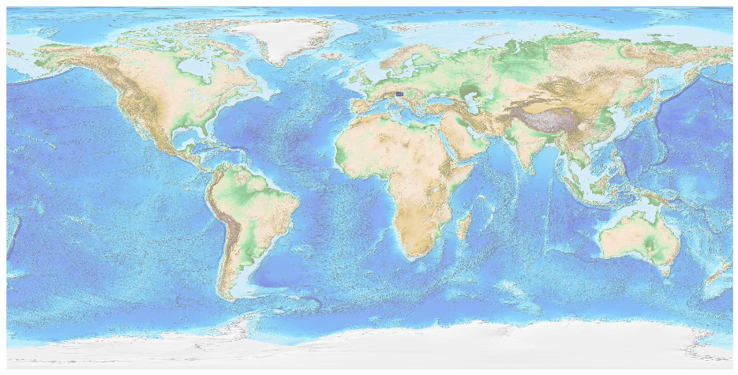

|Eigenschaft|Wert|
|-|-:|
Dateiname|[slovenia.sqlite](slovenia.sqlite)|
Zeitstempel|05.09.2019 11:42|
Dateigr&ouml;&szlig;e|2.15 Mb|
|||
Gesamtanzahl Nodes|45763|
|MinLat|45.420805|
|MaxLat|46.879555|
|MinLon|13.305086|
|MaxLon|16.600342|

### Top 5 Tags

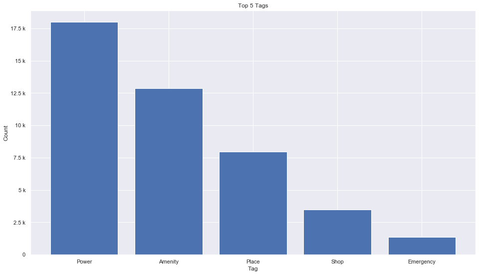

|Tag|Count|
|-|-:|
|Power|17987|
|Amenity|12857|
|Place|7968|
|Shop|3477|
|Emergency|1367|

### &Uuml;bersicht Ortsangaben

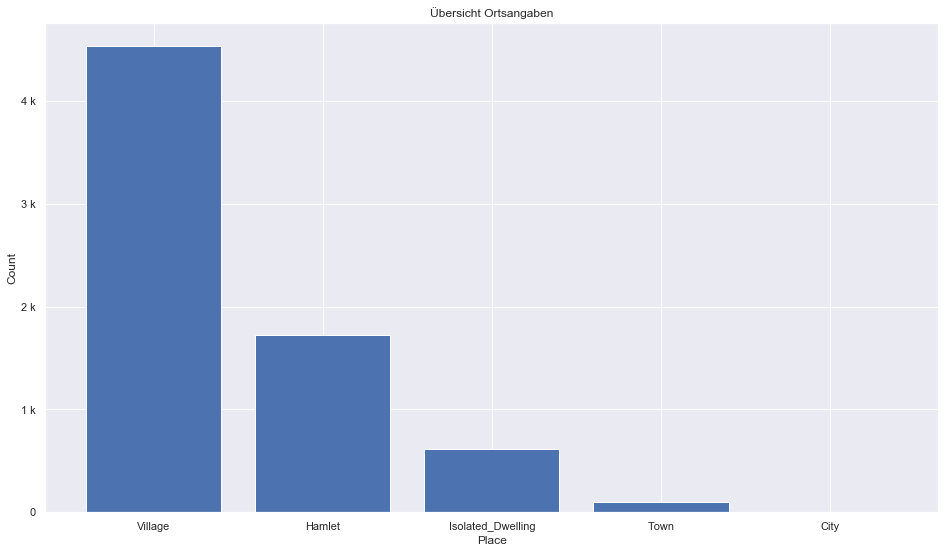

|Place|Count|
|-|-:|
|Village|4534|
|Hamlet|1726|
|Isolated_Dwelling|619|
|Town|101|
|City|2|

### Die 5 gr&ouml;&szlig;ten bewohnte Gebiete

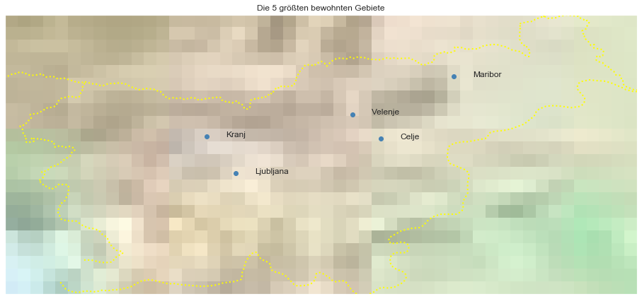

|Name|Lat|Lon|Type|Population|
|----|--:|--:|:--:|---------:|
|Ljubljana|46.0499803|14.5068602|City|272000|
|Maribor|46.555628|15.64477|City|96000|
|Celje|46.2309234|15.2659932|Town|37800|
|Kranj|46.2432635|14.3549501|Town|36800|
|Velenje|46.3592869|15.1150301|Town|25800|

---

## Spain [&#10159;](spain.sqlite)

### Allgemeine Informationen

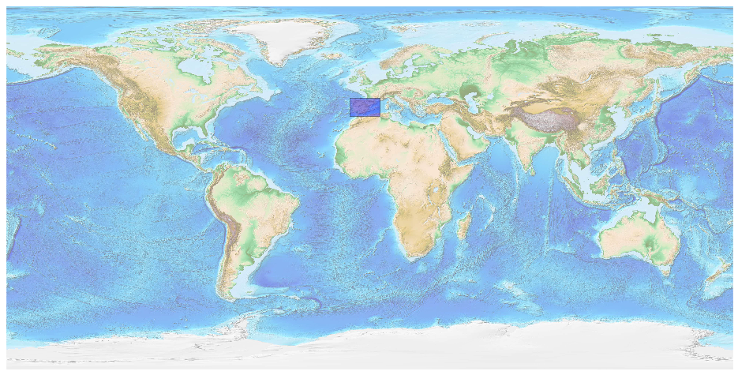

|Eigenschaft|Wert|
|-|-:|
Dateiname|[spain.sqlite](spain.sqlite)|
Zeitstempel|05.09.2019 12:03|
Dateigr&ouml;&szlig;e|68.33 Mb|
|||
Gesamtanzahl Nodes|1346857|
|MinLat|35.154153|
|MaxLat|44.14855|
|MinLon|-9.779014|
|MaxLon|5.098525|

### Top 5 Tags

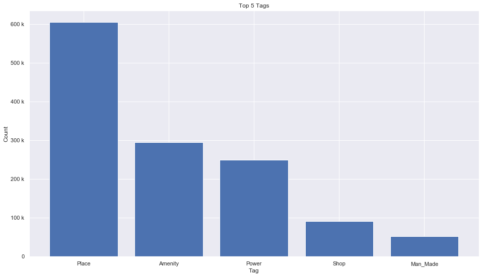

|Tag|Count|
|-|-:|
|Place|604595|
|Amenity|294597|
|Power|249433|
|Shop|90895|
|Man_Made|52612|

### &Uuml;bersicht Ortsangaben

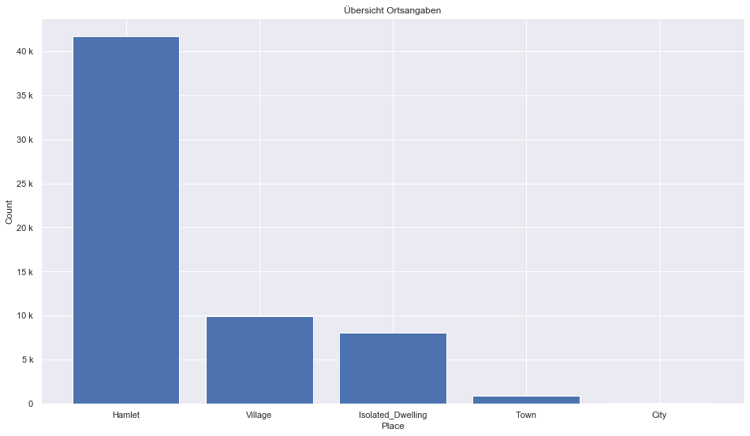

|Place|Count|
|-|-:|
|Hamlet|41641|
|Village|9987|
|Isolated_Dwelling|8056|
|Town|904|
|City|78|

### Die 5 gr&ouml;&szlig;ten bewohnte Gebiete

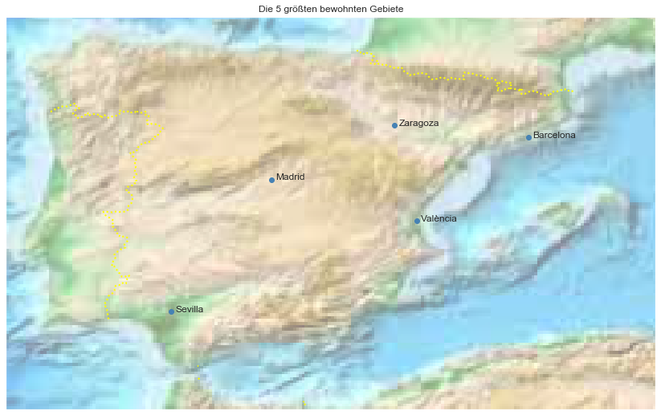

|Name|Lat|Lon|Type|Population|
|----|--:|--:|:--:|---------:|
|Madrid|40.4167047|-3.7035825|City|3233527|
|Barcelona|41.3828939|2.1774322|City|1615908|
|València|39.4699014|-0.3759513|City|797654|
|Sevilla|37.3886303|-5.9953403|City|703206|
|Zaragoza|41.6521342|-0.8809428|City|654390|

---

## Sweden [&#10159;](sweden.sqlite)

### Allgemeine Informationen

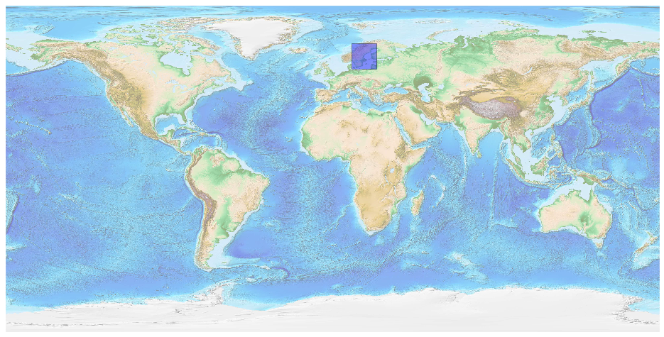

|Eigenschaft|Wert|
|-|-:|
Dateiname|[sweden.sqlite](sweden.sqlite)|
Zeitstempel|05.09.2019 11:55|
Dateigr&ouml;&szlig;e|12.51 Mb|
|||
Gesamtanzahl Nodes|269144|
|MinLat|55.02652|
|MaxLat|69.06643|
|MinLon|10.54138|
|MaxLon|24.22472|

### Top 5 Tags

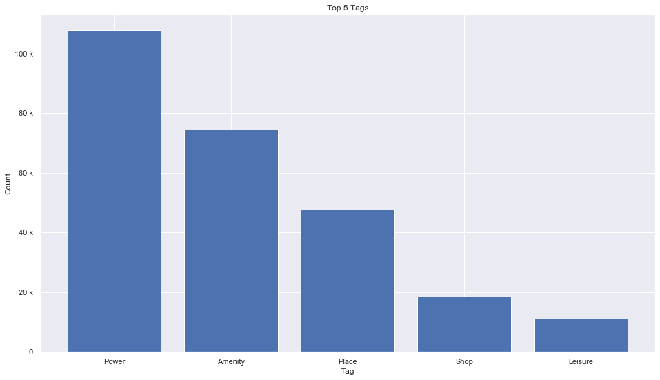

|Tag|Count|
|-|-:|
|Power|107714|
|Amenity|74608|
|Place|47687|
|Shop|18441|
|Leisure|11160|

### &Uuml;bersicht Ortsangaben

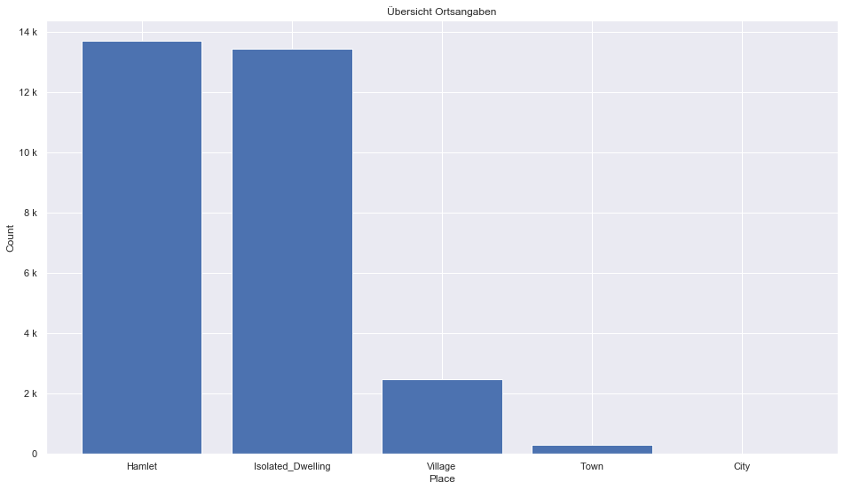

|Place|Count|
|-|-:|
|Hamlet|13701|
|Isolated_Dwelling|13436|
|Village|2468|
|Town|300|
|City|21|

### Die 5 gr&ouml;&szlig;ten bewohnte Gebiete

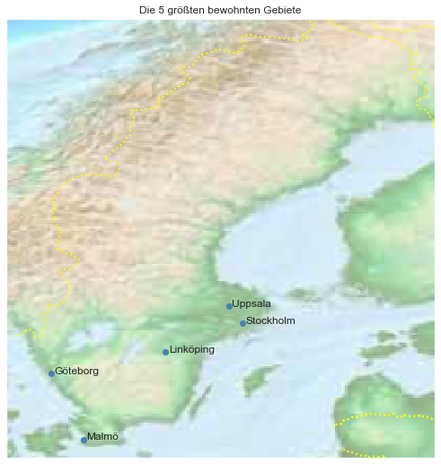

|Name|Lat|Lon|Type|Population|
|----|--:|--:|:--:|---------:|
|Stockholm|59.3251172|18.0710935|City|829417|
|Göteborg|57.7072326|11.9670171|City|522259|
|Malmö|55.6052931|13.0001566|City|316588|
|Uppsala|59.8586126|17.6387436|City|128400|
|Linköping|58.4098135|15.6245252|City|111267|

---

## Switzerland [&#10159;](switzerland.sqlite)

### Allgemeine Informationen

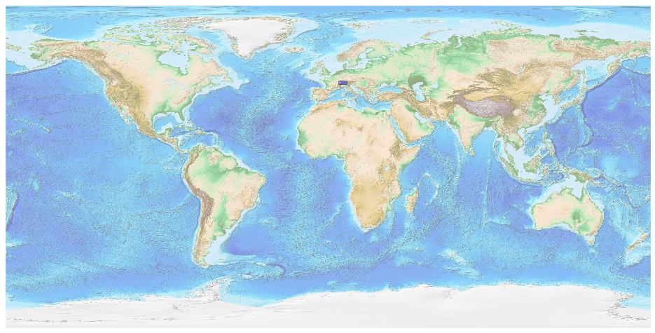

|Eigenschaft|Wert|
|-|-:|
Dateiname|[switzerland.sqlite](switzerland.sqlite)|
Zeitstempel|05.09.2019 12:03|
Dateigr&ouml;&szlig;e|16.11 Mb|
|||
Gesamtanzahl Nodes|344023|
|MinLat|45.81617|
|MaxLat|47.81126|
|MinLon|5.952882|
|MaxLon|10.49584|

### Top 5 Tags

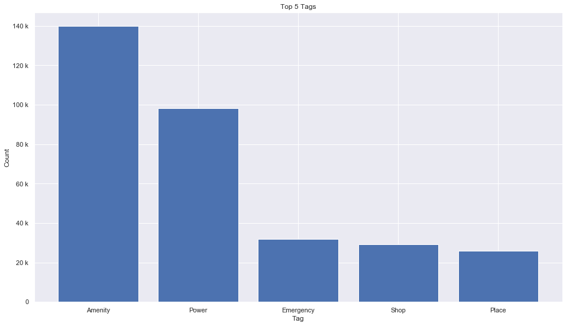

|Tag|Count|
|-|-:|
|Amenity|139833|
|Power|98337|
|Emergency|31901|
|Shop|29042|
|Place|25992|

### &Uuml;bersicht Ortsangaben

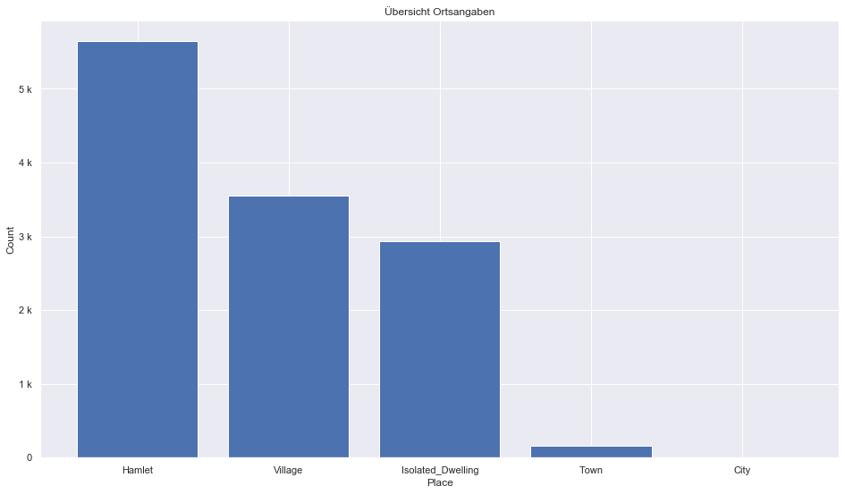

|Place|Count|
|-|-:|
|Hamlet|5644|
|Village|3548|
|Isolated_Dwelling|2929|
|Town|161|
|City|6|

### Die 5 gr&ouml;&szlig;ten bewohnte Gebiete

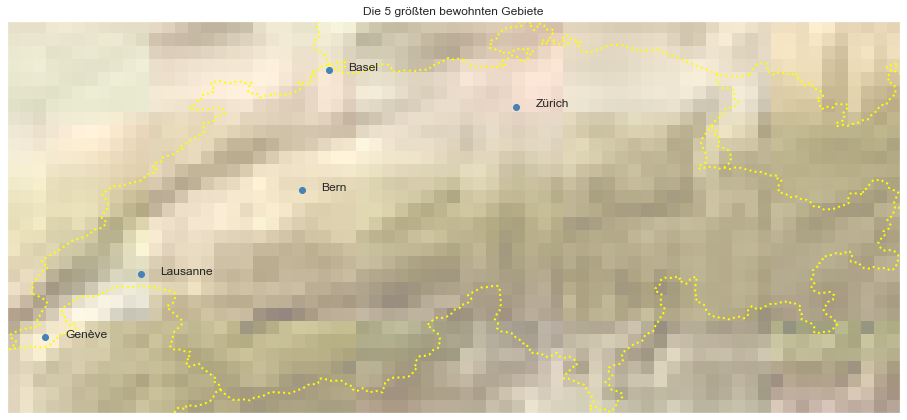

|Name|Lat|Lon|Type|Population|
|----|--:|--:|:--:|---------:|
|Zürich|47.3723941|8.5423328|City|396027|
|Genève|46.2017559|6.1466014|City|191557|
|Basel|47.5581077|7.5878261|City|174491|
|Lausanne|46.5218269|6.6327025|City|133521|
|Bern|46.9482713|7.4514512|City|128848|

---

## Turkey [&#10159;](turkey.sqlite)

### Allgemeine Informationen

|Eigenschaft|Wert|
|-|-:|
Dateiname|[turkey.sqlite](turkey.sqlite)|
Zeitstempel|05.09.2019 12:09|
Dateigr&ouml;&szlig;e|14.27 Mb|
|||
Gesamtanzahl Nodes|308469|
|MinLat|35.717|
|MaxLat|42.397|
|MinLon|25.6071|
|MaxLon|44.91345|

### Top 5 Tags

|Tag|Count|
|-|-:|
|Power|132331|
|Amenity|63225|
|Place|61099|
|Shop|33958|
|Man_Made|12951|

### &Uuml;bersicht Ortsangaben

|Place|Count|
|-|-:|
|Village|39398|
|Hamlet|5466|
|Town|960|
|Isolated_Dwelling|215|
|City|82|

### Die 5 gr&ouml;&szlig;ten bewohnte Gebiete

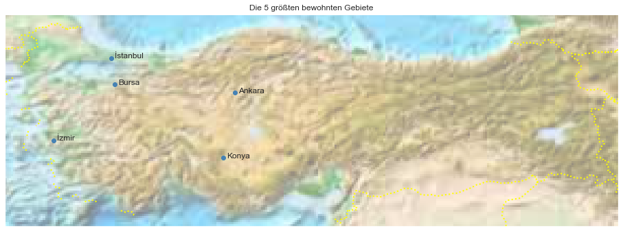

|Name|Lat|Lon|Type|Population|
|----|--:|--:|:--:|---------:|
|İstanbul|41.0096334|28.9651646|City|14804116|
|Ankara|39.9207774|32.854067|City|4338620|
|İzmir|38.4153421|27.144474|City|4223545|
|Bursa|40.1827347|29.0678382|City|2901396|
|Konya|37.8719963|32.4844015|City|2161303|

---

## Ukraine [&#10159;](ukraine.sqlite)

### Allgemeine Informationen

|Eigenschaft|Wert|
|-|-:|
Dateiname|[ukraine.sqlite](ukraine.sqlite)|
Zeitstempel|05.09.2019 12:13|
Dateigr&ouml;&szlig;e|40.82 Mb|
|||
Gesamtanzahl Nodes|934400|
|MinLat|44.027381|
|MaxLat|52.423256|
|MinLon|22.101655|
|MaxLon|40.258417|

### Top 5 Tags

|Tag|Count|
|-|-:|
|Power|692924|
|Amenity|101451|
|Shop|71125|
|Place|39056|
|Man_Made|14253|

### &Uuml;bersicht Ortsangaben

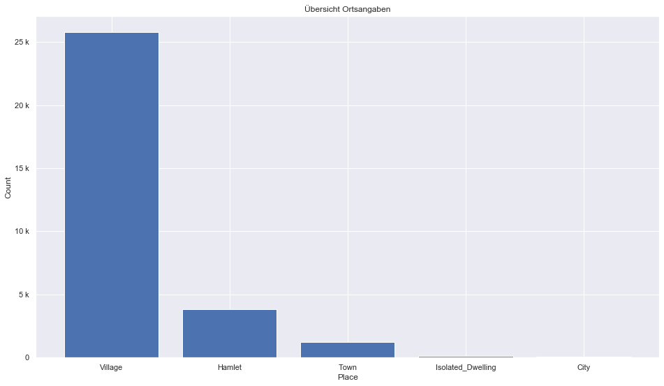

|Place|Count|
|-|-:|
|Village|25761|
|Hamlet|3839|
|Town|1203|
|Isolated_Dwelling|146|
|City|47|

### Die 5 gr&ouml;&szlig;ten bewohnte Gebiete

|Name|Lat|Lon|Type|Population|
|----|--:|--:|:--:|---------:|
|Київ|50.4500336|30.5241361|City|2909697|
|Харків|49.9902794|36.2303893|City|1447652|
|Одеса|46.4852419|30.7433894|City|1008852|
|Дніпро|48.4680221|35.0417711|City|983836|
|Донецьк|48.0158753|37.8013407|City|929063|

---

**Some Useful Links:**

- [OpenStreetMap Data Extracts](http://download.geofabrik.de)
- [OpenStreetMap Map Features](https://wiki.openstreetmap.org/wiki/DE:Map_Features)
