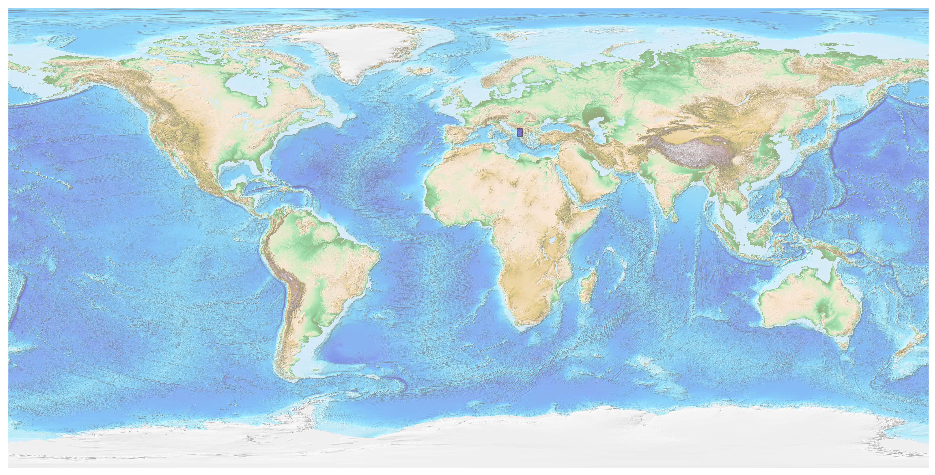
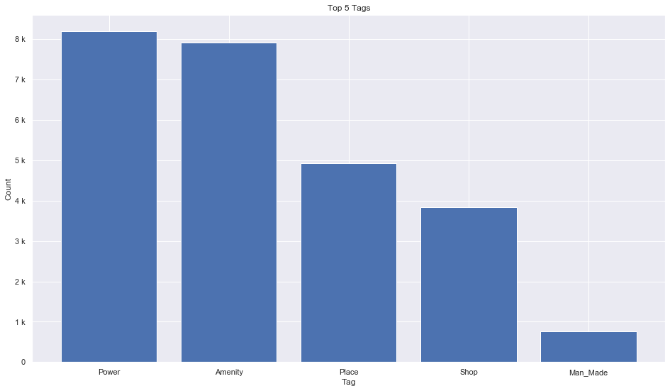
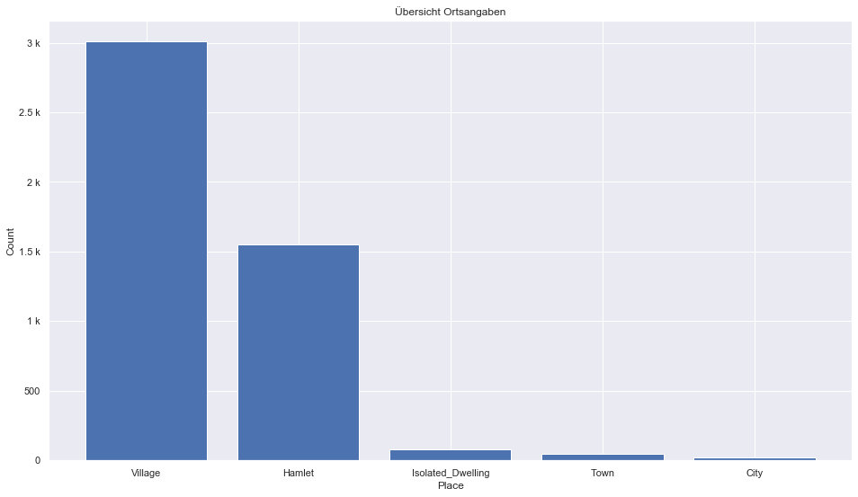
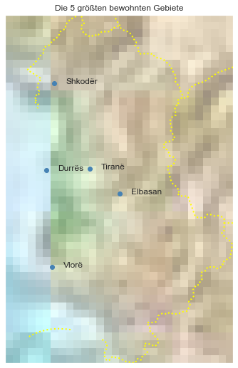

## Albania [&#10159;](albania.sqlite)

### Allgemeine Informationen

|Eigenschaft|Wert|
|-|-:|
Dateiname|[albania.sqlite](albania.sqlite)|
Zeitstempel|04.09.2019 20:17|
Dateigr&ouml;&szlig;e|1.24 Mb|
|||
Gesamtanzahl Nodes|26278|
|MinLat|39.643636|
|MaxLat|42.663125|
|MinLon|19.08737|
|MaxLon|21.062851|

### Top 5 Tags

|Tag|Count|
|-|-:|
|Power|8193|
|Amenity|7918|
|Place|4922|
|Shop|3844|
|Man_Made|766|

### &Uuml;bersicht Ortsangaben

|Place|Count|
|-|-:|
|Village|3008|
|Hamlet|1552|
|Isolated_Dwelling|82|
|Town|45|
|City|21|

### Die 5 gr&ouml;&szlig;ten bewohnte Gebiete

|Name|Lat|Lon|Type|Population|
|----|--:|--:|:--:|---------:|
|Tiranë|41.3268733|19.8187913|City|557422|
|Durrës|41.313255|19.4462348|City|130566|
|Elbasan|41.1105874|20.0794072|City|130000|
|Vlorë|40.4738898|19.4933647|City|124000|
|Shkodër|42.0681371|19.5121437|City|96000|
