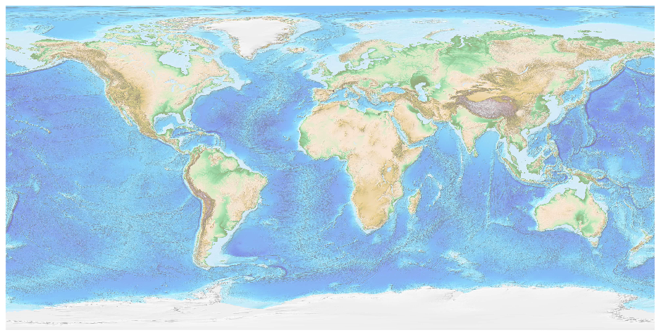
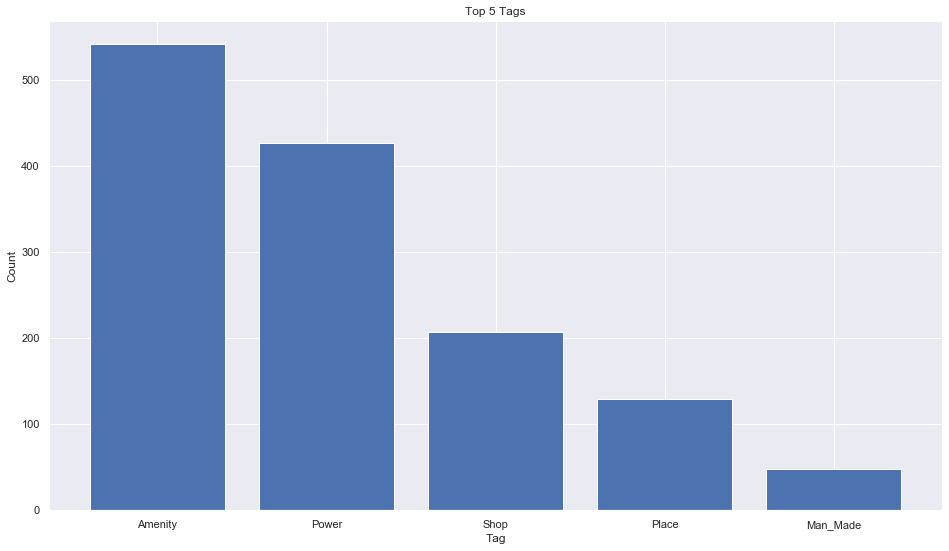
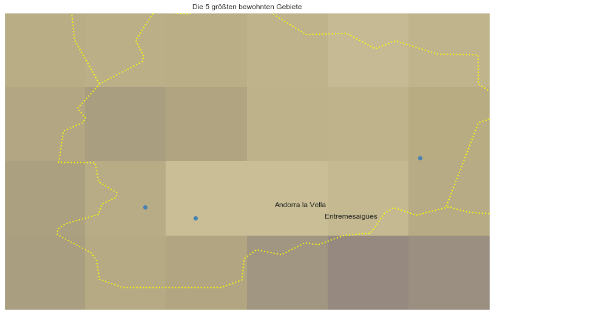

## Andorra [&#10159;](andorra.sqlite)

### Allgemeine Informationen

|Eigenschaft|Wert|
|-|-:|
Dateiname|[andorra.sqlite](andorra.sqlite)|
Zeitstempel|11.09.2019 16:23|
Dateigr&ouml;&szlig;e|88.00 Kb|
|||
Gesamtanzahl Nodes|1395|
|MinLat|42.4276|
|MaxLat|42.65717|
|MinLon|1.412368|
|MaxLon|1.787481|

### Top 5 Tags

|Tag|Count|
|-|-:|
|Amenity|541|
|Power|426|
|Shop|207|
|Place|129|
|Man_Made|48|

### &Uuml;bersicht Ortsangaben

|Place|Count|
|-|-:|
|Village|33|
|Hamlet|23|
|Town|7|
|Isolated_Dwelling|2|

### Die 5 gr&ouml;&szlig;ten bewohnte Gebiete

|Name|Lat|Lon|Type|Population|
|----|--:|--:|:--:|---------:|
|Andorra la Vella|42.5069391|1.5212467|Town|24678|
|Pas de la Casa|42.5447098|1.733494|Village|2996|
|Entremesaigües|42.4981805|1.5601251|Hamlet|0|
