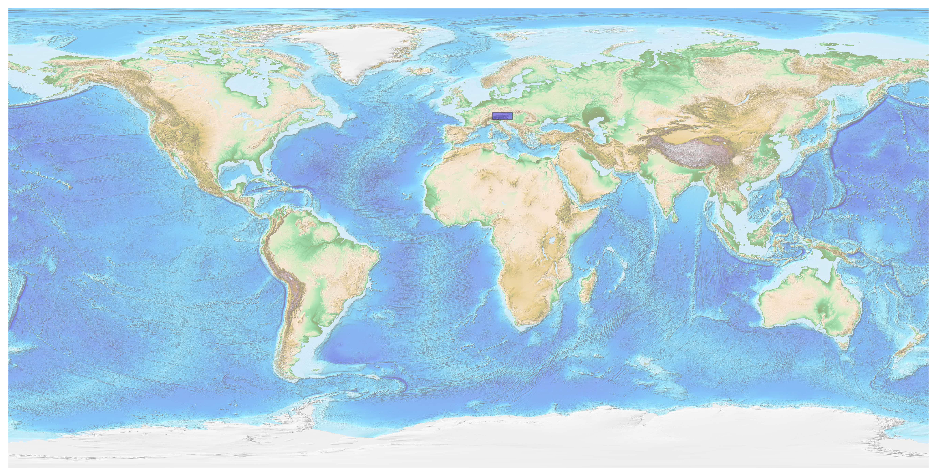

## Austria [&#10159;](austria.sqlite)

### Allgemeine Informationen

|Eigenschaft|Wert|
|-|-:|
Dateiname|[austria.sqlite](austria.sqlite)|
Zeitstempel|04.09.2019 20:52|
Dateigr&ouml;&szlig;e|24.12 Mb|
|||
Gesamtanzahl Nodes|532399|
|MinLat|46.36851|
|MaxLat|49.02403|
|MinLon|9.52678|
|MaxLon|17.16273|

### Top 5 Tags

|Tag|Count|
|-|-:|
|Power|250523|
|Amenity|162550|
|Place|39489|
|Shop|33076|
|Emergency|22855|

### &Uuml;bersicht Ortsangaben

|Place|Count|
|-|-:|
|Hamlet|13254|
|Village|6598|
|Isolated_Dwelling|3325|
|Town|298|
|City|7|

### Die 5 gr&ouml;&szlig;ten bewohnte Gebiete

|Name|Lat|Lon|Type|Population|
|----|--:|--:|:--:|---------:|
|Wien|48.2083537|16.3725042|City|1897481|
|Bratislava|48.1516988|17.1093063|City|432801|
|Graz|47.0702563|15.4385716|City|286292|
|Linz|48.3059078|14.286198|City|197283|
|Salzburg|47.7981346|13.0464806|City|152083|
