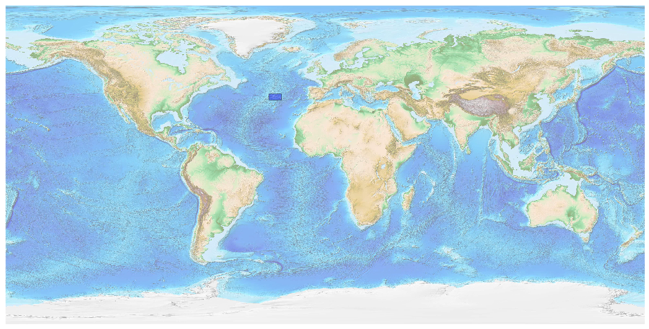
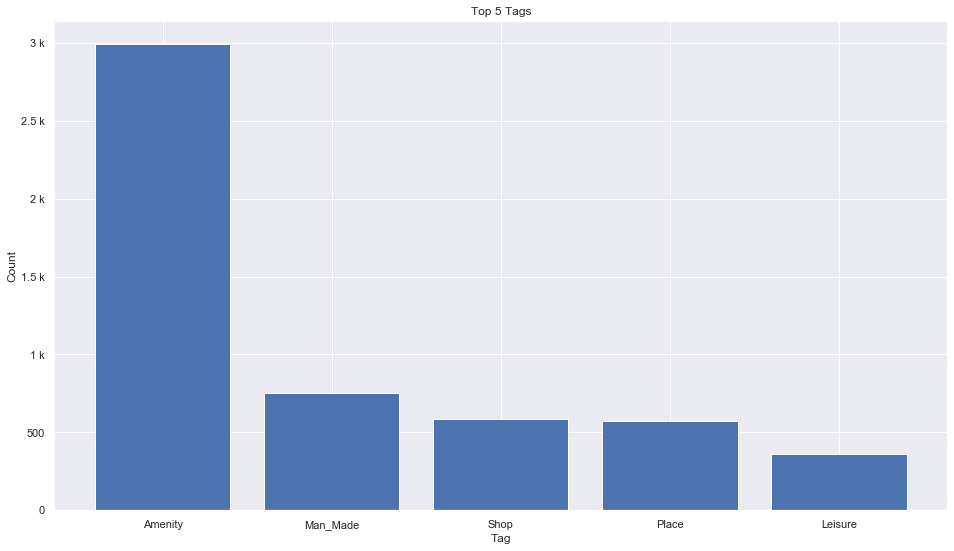
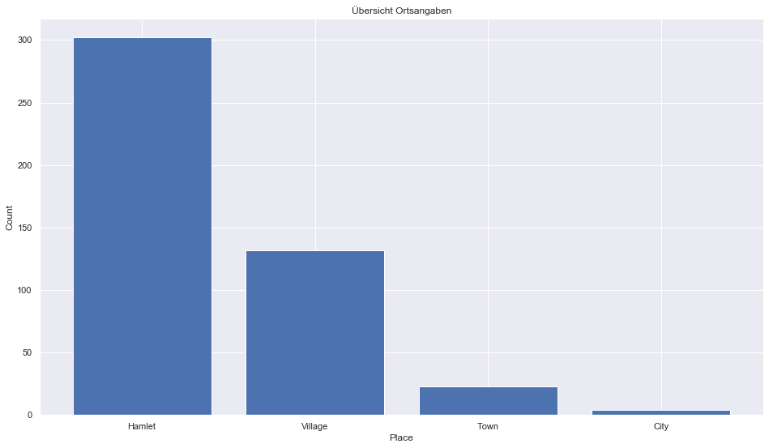
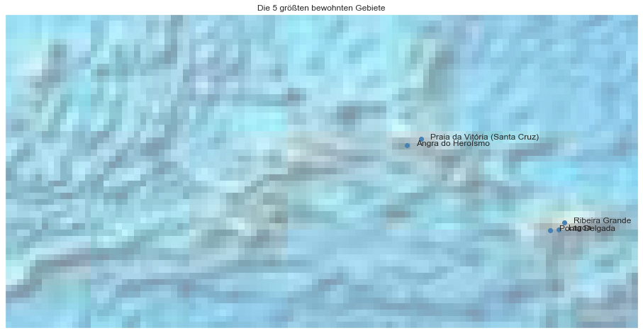

## Azores [&#10159;](azores.sqlite)

### Allgemeine Informationen

|Eigenschaft|Wert|
|-|-:|
Dateiname|[azores.sqlite](azores.sqlite)|
Zeitstempel|04.09.2019 20:16|
Dateigr&ouml;&szlig;e|296.00 Kb|
|||
Gesamtanzahl Nodes|5597|
|MinLat|36.67791|
|MaxLat|40.0757|
|MinLon|-31.57293|
|MaxLon|-24.71814|

### Top 5 Tags

|Tag|Count|
|-|-:|
|Amenity|2990|
|Man_Made|750|
|Shop|584|
|Place|572|
|Leisure|361|

### &Uuml;bersicht Ortsangaben

|Place|Count|
|-|-:|
|Hamlet|302|
|Village|132|
|Town|23|
|City|4|

### Die 5 gr&ouml;&szlig;ten bewohnte Gebiete

|Name|Lat|Lon|Type|Population|
|----|--:|--:|:--:|---------:|
|Ponta Delgada|37.7394344|-25.6683618|City|40661|
|Ribeira Grande|37.8225227|-25.5194914|City|12663|
|Angra do Heroísmo|38.6593167|-27.2195578|City|8654|
|Lagoa|37.747009|-25.578405|Town|8080|
|Praia da Vitória (Santa Cruz)|38.7291291|-27.0657557|Village|6690|
