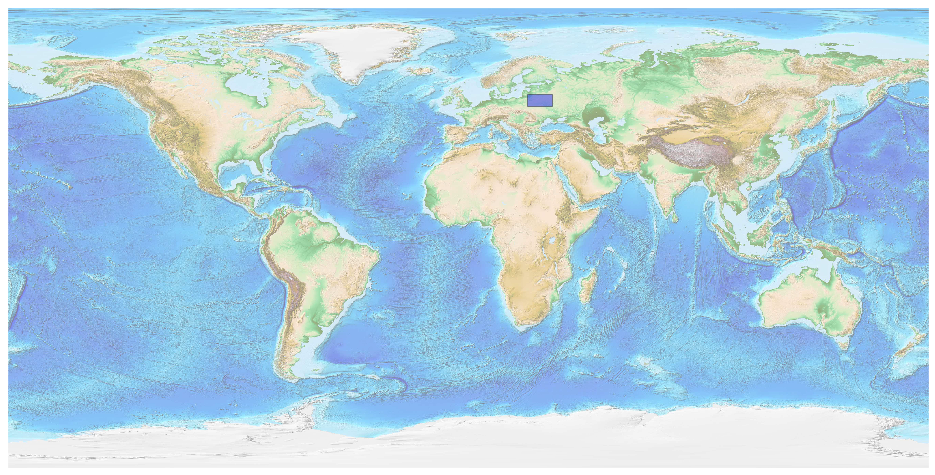
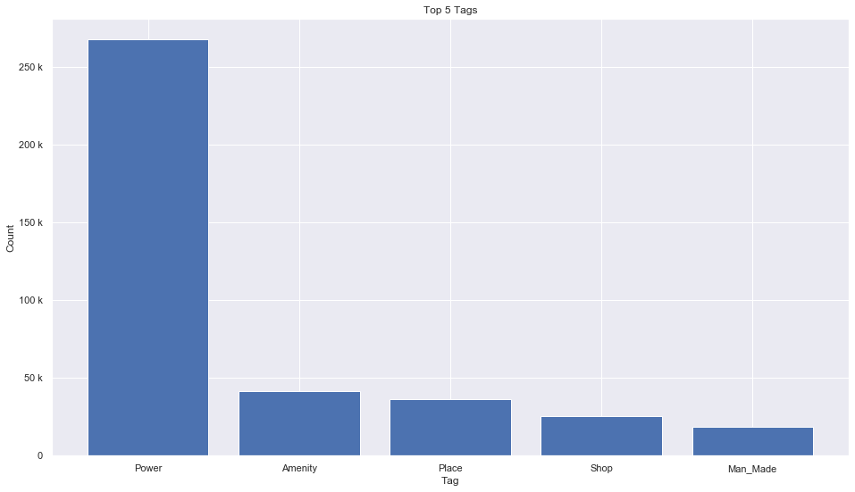
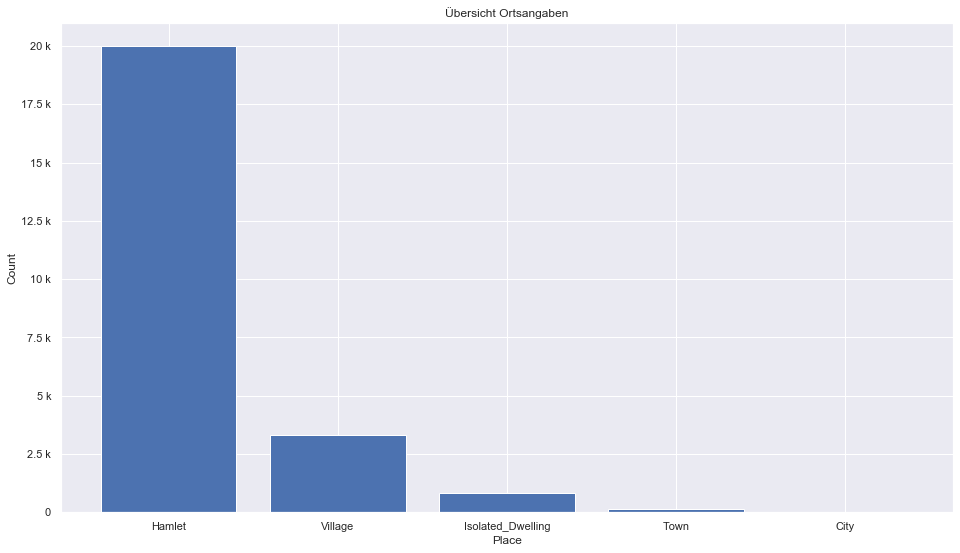
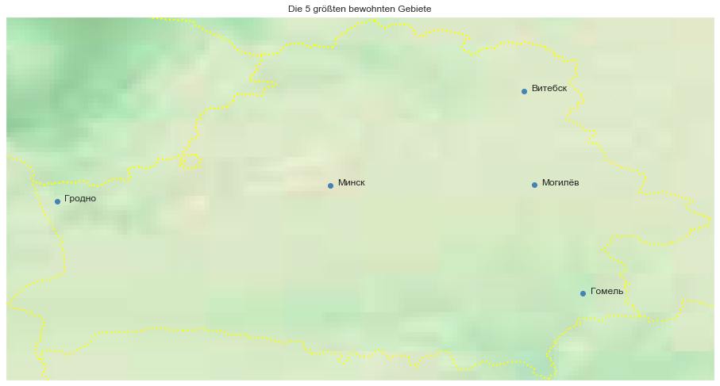

## Belarus [&#10159;](belarus.sqlite)

### Allgemeine Informationen

|Eigenschaft|Wert|
|-|-:|
Dateiname|[belarus.sqlite](belarus.sqlite)|
Zeitstempel|11.09.2019 16:32|
Dateigr&ouml;&szlig;e|19.01 Mb|
|||
Gesamtanzahl Nodes|399628|
|MinLat|51.23751|
|MaxLat|56.20996|
|MinLon|23.13474|
|MaxLon|32.80613|

### Top 5 Tags

|Tag|Count|
|-|-:|
|Power|267359|
|Amenity|41240|
|Place|36548|
|Shop|25198|
|Man_Made|18577|

### &Uuml;bersicht Ortsangaben

|Place|Count|
|-|-:|
|Hamlet|19990|
|Village|3332|
|Isolated_Dwelling|834|
|Town|140|
|City|16|

### Die 5 gr&ouml;&szlig;ten bewohnte Gebiete

|Name|Lat|Lon|Type|Population|
|----|--:|--:|:--:|---------:|
|Минск|53.902334|27.5618791|City|1982444|
|Гомель|52.4238936|31.0131698|City|535693|
|Могилёв|53.9090245|30.3429838|City|381353|
|Гродно|53.6834599|23.8342648|City|370919|
|Витебск|55.1930197|30.2070437|City|370298|
