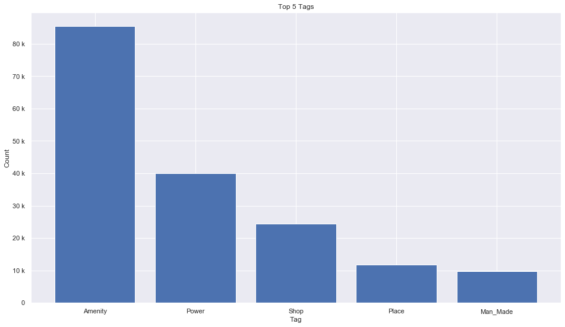
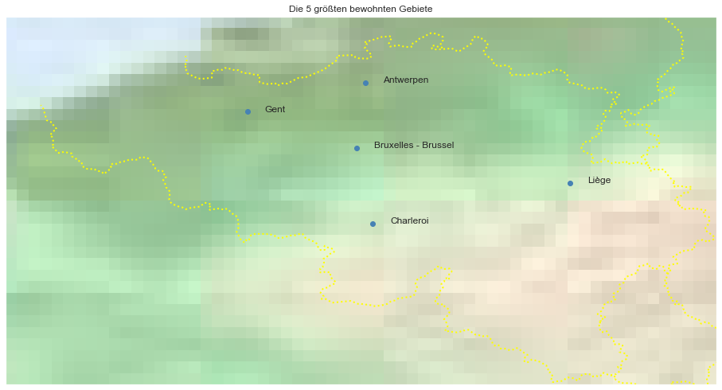

## Belgium [&#10159;](belgium.sqlite)

### Allgemeine Informationen

|Eigenschaft|Wert|
|-|-:|
Dateiname|[belgium.sqlite](belgium.sqlite)|
Zeitstempel|11.09.2019 16:35|
Dateigr&ouml;&szlig;e|9.39 Mb|
|||
Gesamtanzahl Nodes|185419|
|MinLat|49.49196|
|MaxLat|51.59839|
|MinLon|2.340725|
|MaxLon|6.411619|

### Top 5 Tags

|Tag|Count|
|-|-:|
|Amenity|85406|
|Power|40064|
|Shop|24434|
|Place|11834|
|Man_Made|9690|

### &Uuml;bersicht Ortsangaben

|Place|Count|
|-|-:|
|Village|3031|
|Hamlet|1813|
|Town|374|
|Isolated_Dwelling|106|
|City|10|

### Die 5 gr&ouml;&szlig;ten bewohnte Gebiete

|Name|Lat|Lon|Type|Population|
|----|--:|--:|:--:|---------:|
|Antwerpen|51.2211097|4.3997081|City|506922|
|Gent|51.0538286|3.7250121|City|237000|
|Charleroi|50.4120332|4.4436244|City|202730|
|Liège|50.6451381|5.5734203|City|197013|
|Bruxelles - Brussel|50.8465573|4.351697|City|153377|
