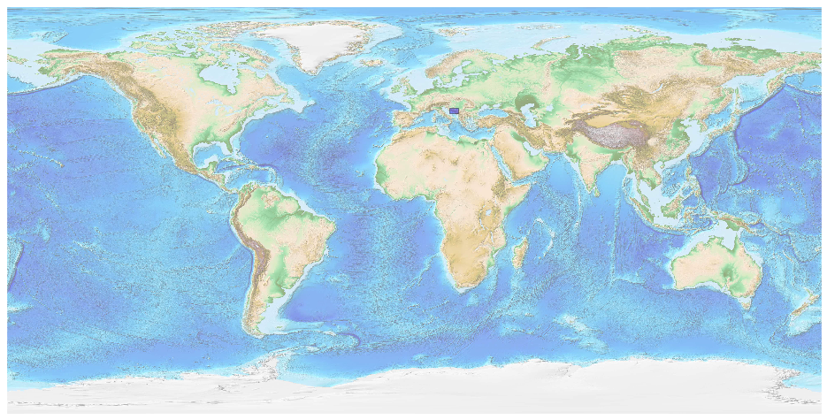
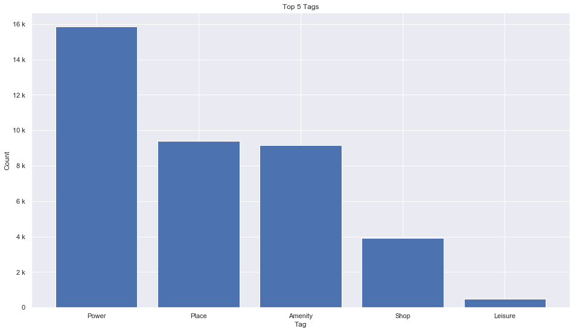
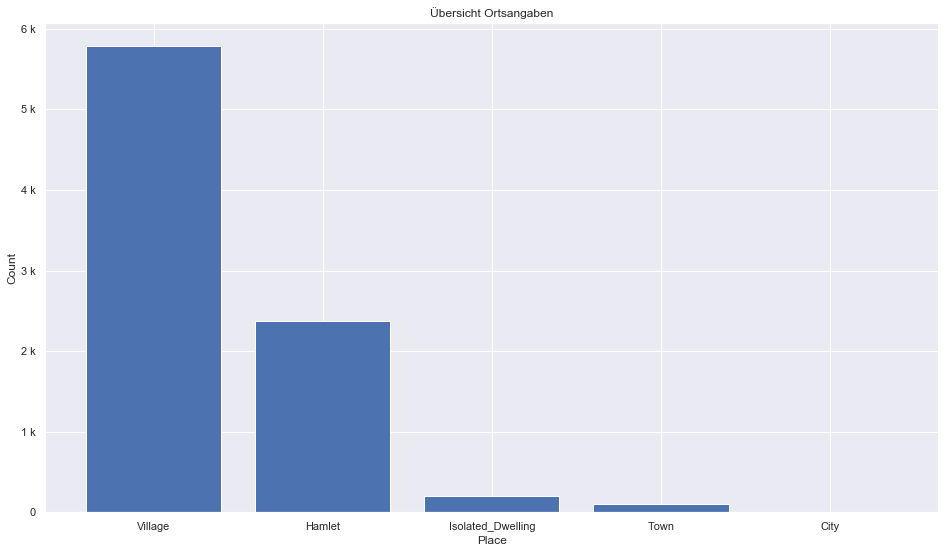
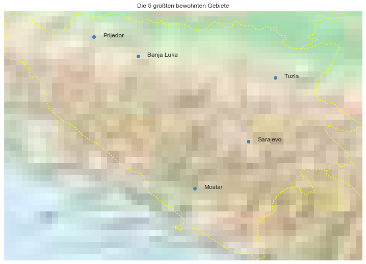

## Bosnia Herzegovina [&#10159;](bosnia-herzegovina.sqlite)

### Allgemeine Informationen

|Eigenschaft|Wert|
|-|-:|
Dateiname|[bosnia-herzegovina.sqlite](bosnia-herzegovina.sqlite)|
Zeitstempel|04.09.2019 20:21|
Dateigr&ouml;&szlig;e|1.84 Mb|
|||
Gesamtanzahl Nodes|39437|
|MinLat|42.56583|
|MaxLat|45.26595|
|MinLon|15.73639|
|MaxLon|19.62176|

### Top 5 Tags

|Tag|Count|
|-|-:|
|Power|15849|
|Place|9386|
|Amenity|9155|
|Shop|3916|
|Leisure|469|

### &Uuml;bersicht Ortsangaben

|Place|Count|
|-|-:|
|Village|5783|
|Hamlet|2378|
|Isolated_Dwelling|204|
|Town|108|
|City|8|

### Die 5 gr&ouml;&szlig;ten bewohnte Gebiete

|Name|Lat|Lon|Type|Population|
|----|--:|--:|:--:|---------:|
|Sarajevo|43.8519774|18.3866868|City|411161|
|Banja Luka|44.7719817|17.1898929|City|138963|
|Mostar|43.3416104|17.8030427|City|105797|
|Prijedor|44.9807105|16.7122495|Town|80000|
|Tuzla|44.5391105|18.675193|City|74475|
