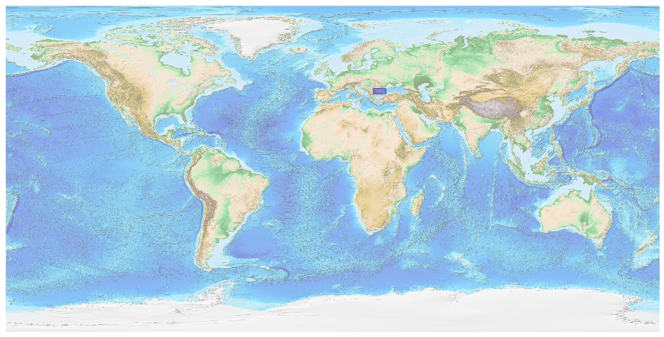
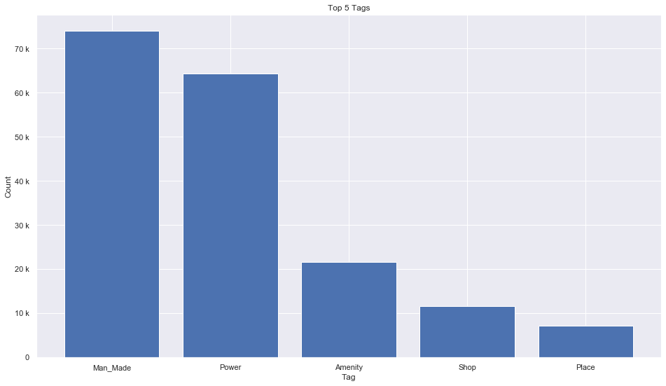
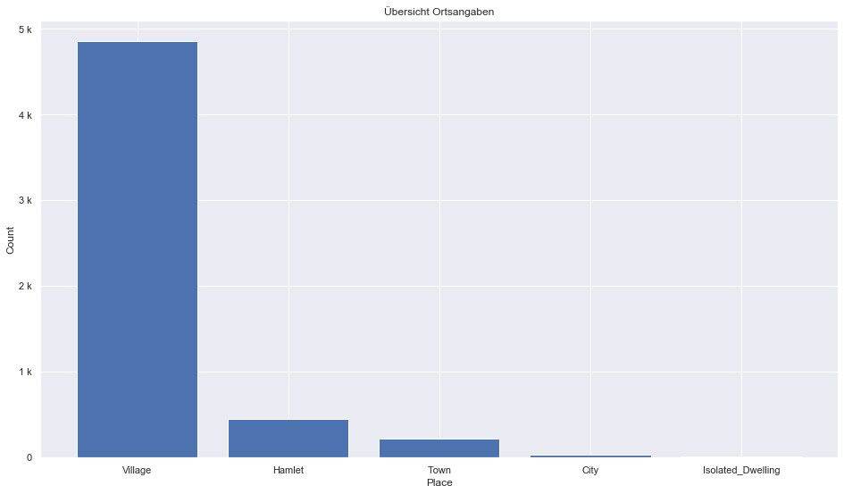
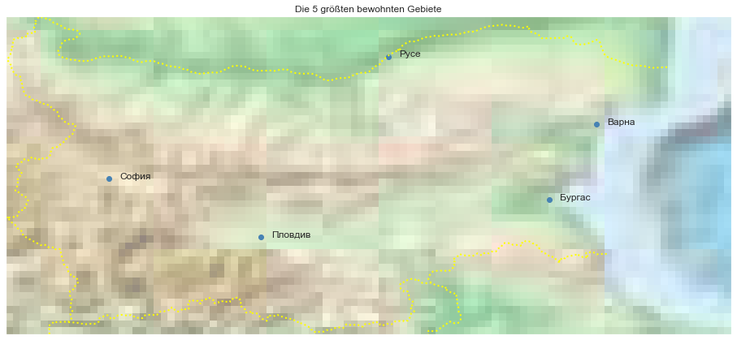

## Bulgaria [&#10159;](bulgaria.sqlite)

### Allgemeine Informationen

|Eigenschaft|Wert|
|-|-:|
Dateiname|[bulgaria.sqlite](bulgaria.sqlite)|
Zeitstempel|11.09.2019 16:37|
Dateigr&ouml;&szlig;e|9.60 Mb|
|||
Gesamtanzahl Nodes|181737|
|MinLat|41.22681|
|MaxLat|44.22477|
|MinLon|22.34875|
|MaxLon|29.18819|

### Top 5 Tags

|Tag|Count|
|-|-:|
|Man_Made|73990|
|Power|64309|
|Amenity|21659|
|Shop|11711|
|Place|7229|

### &Uuml;bersicht Ortsangaben

|Place|Count|
|-|-:|
|Village|4856|
|Hamlet|454|
|Town|224|
|City|34|
|Isolated_Dwelling|8|

### Die 5 gr&ouml;&szlig;ten bewohnte Gebiete

|Name|Lat|Lon|Type|Population|
|----|--:|--:|:--:|---------:|
|София|42.6978634|23.3221789|City|1286383|
|Пловдив|42.1418541|24.7499297|City|368983|
|Варна|43.2069025|27.9150855|City|348058|
|Бургас|42.4936616|27.4721276|City|206371|
|Русе|43.8480413|25.9542057|City|159798|
