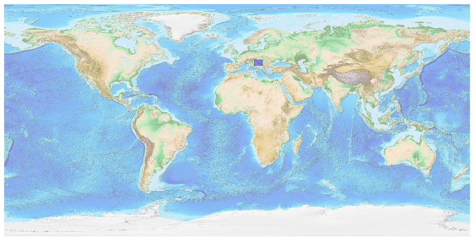
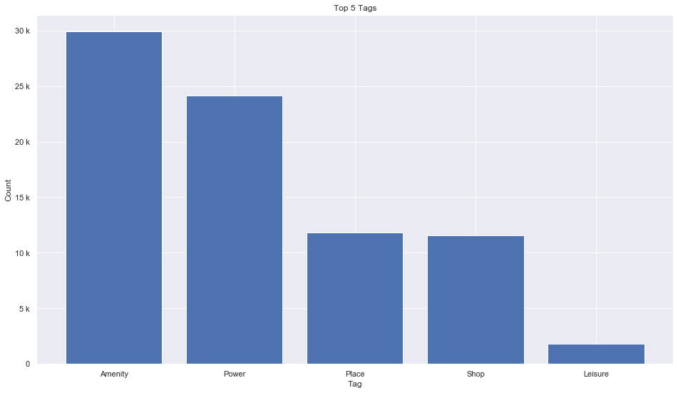
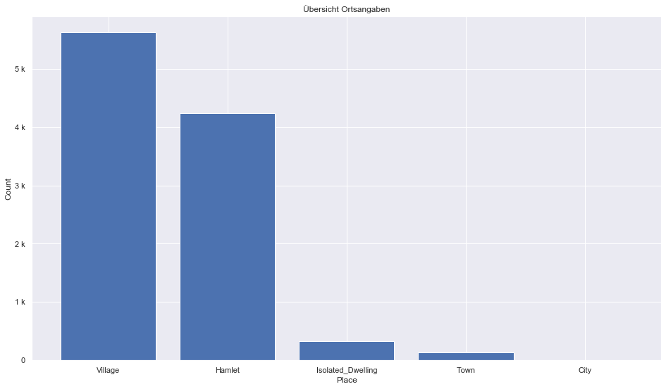
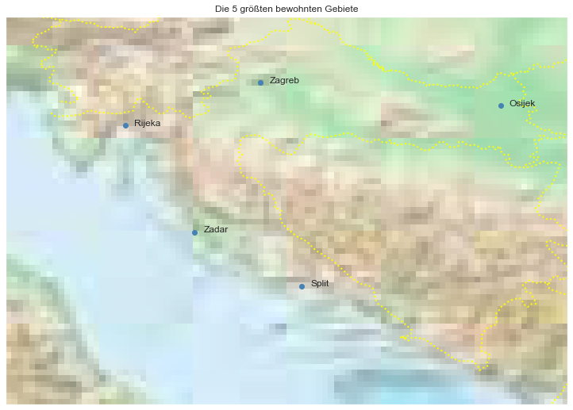

## Croatia [&#10159;](croatia.sqlite)

### Allgemeine Informationen

|Eigenschaft|Wert|
|-|-:|
Dateiname|[croatia.sqlite](croatia.sqlite)|
Zeitstempel|04.09.2019 20:33|
Dateigr&ouml;&szlig;e|3.87 Mb|
|||
Gesamtanzahl Nodes|81879|
|MinLat|42.16483|
|MaxLat|46.56498|
|MinLon|13.08916|
|MaxLon|19.45911|

### Top 5 Tags

|Tag|Count|
|-|-:|
|Amenity|29894|
|Power|24144|
|Place|11843|
|Shop|11583|
|Leisure|1808|

### &Uuml;bersicht Ortsangaben

|Place|Count|
|-|-:|
|Village|5622|
|Hamlet|4234|
|Isolated_Dwelling|333|
|Town|130|
|City|8|

### Die 5 gr&ouml;&szlig;ten bewohnte Gebiete

|Name|Lat|Lon|Type|Population|
|----|--:|--:|:--:|---------:|
|Zagreb|45.813177|15.977048|City|790017|
|Split|43.5073034|16.4414229|City|167121|
|Rijeka|45.3271752|14.4412309|City|128624|
|Osijek|45.5548753|18.6953593|City|84104|
|Zadar|44.1186078|15.232136|City|71471|
