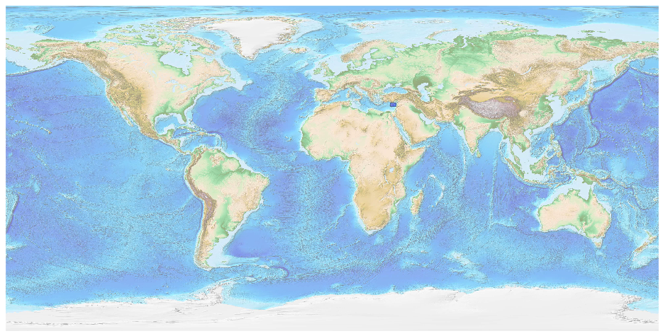
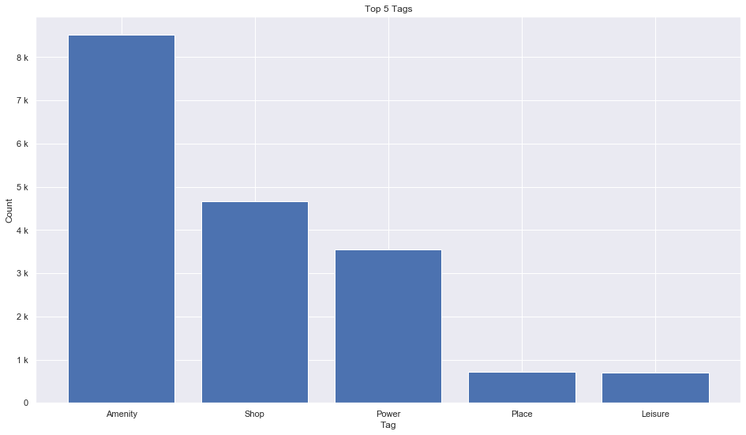
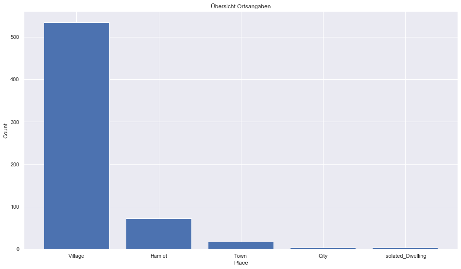
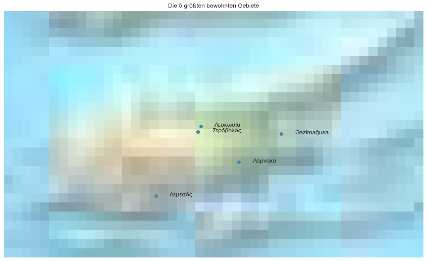

## Cyprus [&#10159;](cyprus.sqlite)

### Allgemeine Informationen

|Eigenschaft|Wert|
|-|-:|
Dateiname|[cyprus.sqlite](cyprus.sqlite)|
Zeitstempel|11.09.2019 16:39|
Dateigr&ouml;&szlig;e|1.03 Mb|
|||
Gesamtanzahl Nodes|18826|
|MinLat|34.2337399|
|MaxLat|36.00323|
|MinLon|31.95244|
|MaxLon|34.96147|

### Top 5 Tags

|Tag|Count|
|-|-:|
|Amenity|8513|
|Shop|4670|
|Power|3549|
|Place|716|
|Leisure|694|

### &Uuml;bersicht Ortsangaben

|Place|Count|
|-|-:|
|Village|534|
|Hamlet|72|
|Town|17|
|City|4|
|Isolated_Dwelling|4|

### Die 5 gr&ouml;&szlig;ten bewohnte Gebiete

|Name|Lat|Lon|Type|Population|
|----|--:|--:|:--:|---------:|
|Λευκωσία|35.1739302|33.364726|City|310355|
|Λεμεσός|34.6735637|33.042341|City|101000|
|Στρόβολος|35.1328993|33.3454972|Town|67904|
|Λάρνακα|34.9172012|33.6378531|Town|51468|
|Gazimağusa|35.1176638|33.9402361|City|42526|
