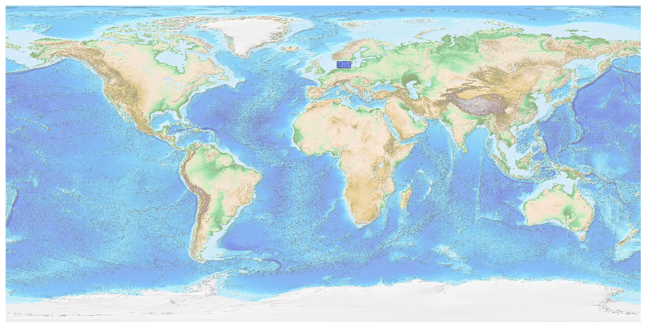
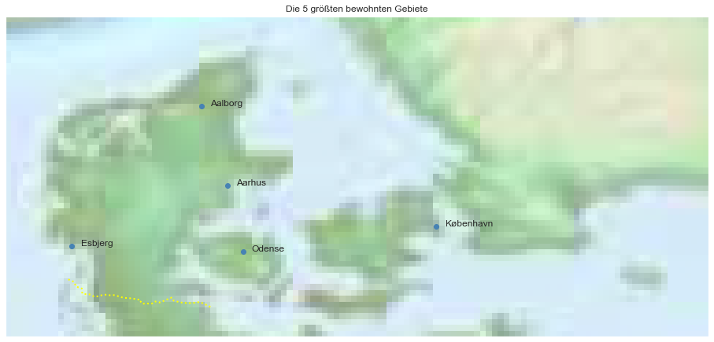

## Denmark [&#10159;](denmark.sqlite)

### Allgemeine Informationen

|Eigenschaft|Wert|
|-|-:|
Dateiname|[denmark.sqlite](denmark.sqlite)|
Zeitstempel|04.09.2019 20:47|
Dateigr&ouml;&szlig;e|5.57 Mb|
|||
Gesamtanzahl Nodes|119579|
|MinLat|54.44065|
|MaxLat|58.06239|
|MinLon|7.7011|
|MaxLon|15.65449|

### Top 5 Tags

|Tag|Count|
|-|-:|
|Power|46448|
|Amenity|42945|
|Shop|10817|
|Place|7047|
|Leisure|5142|

### &Uuml;bersicht Ortsangaben

|Place|Count|
|-|-:|
|Hamlet|4729|
|Village|652|
|Isolated_Dwelling|373|
|Town|76|
|City|10|

### Die 5 gr&ouml;&szlig;ten bewohnte Gebiete

|Name|Lat|Lon|Type|Population|
|----|--:|--:|:--:|---------:|
|København|55.6867243|12.5700724|City|613288|
|Aarhus|56.1496278|10.2134046|City|273077|
|Odense|55.3997225|10.3852104|City|178210|
|Aalborg|57.0482206|9.9193939|City|114194|
|Esbjerg|55.4664892|8.4520751|City|72398|
