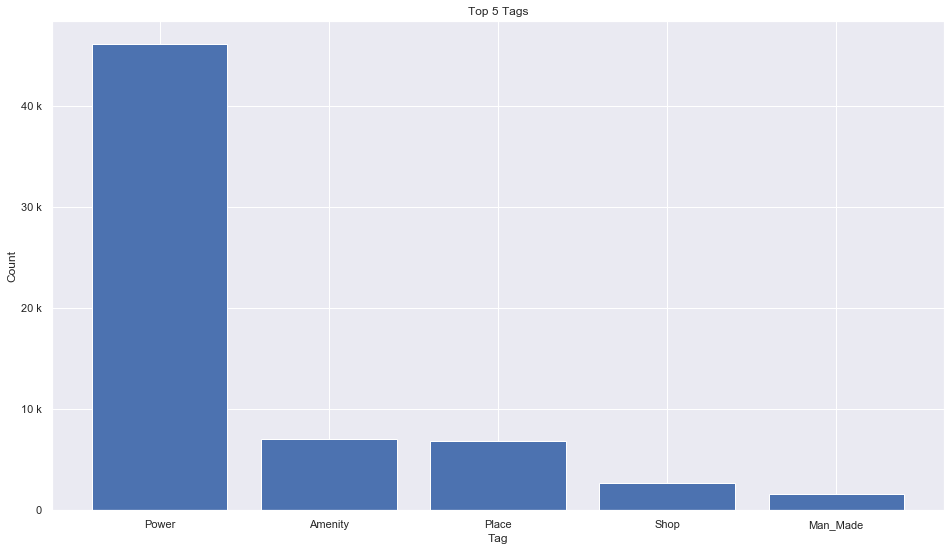
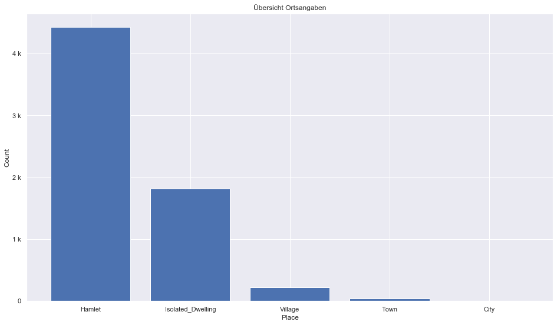

## Estonia [&#10159;](estonia.sqlite)

### Allgemeine Informationen

|Eigenschaft|Wert|
|-|-:|
Dateiname|[estonia.sqlite](estonia.sqlite)|
Zeitstempel|11.09.2019 16:53|
Dateigr&ouml;&szlig;e|3.04 Mb|
|||
Gesamtanzahl Nodes|65817|
|MinLat|57.49764|
|MaxLat|59.99705|
|MinLon|20.85166|
|MaxLon|28.21426|

### Top 5 Tags

|Tag|Count|
|-|-:|
|Power|46075|
|Amenity|7020|
|Place|6862|
|Shop|2730|
|Man_Made|1634|

### &Uuml;bersicht Ortsangaben

|Place|Count|
|-|-:|
|Hamlet|4426|
|Isolated_Dwelling|1817|
|Village|221|
|Town|45|
|City|2|

### Die 5 gr&ouml;&szlig;ten bewohnte Gebiete

|Name|Lat|Lon|Type|Population|
|----|--:|--:|:--:|---------:|
|Tallinn|59.4372155|24.7453688|City|443623|
|Tartu|58.3801207|26.72245|City|102414|
|Narva|59.3794142|28.1993892|Town|66621|
|Kohtla-Järve|59.4025488|27.2880288|Town|44500|
|Pärnu|58.3835136|24.5081751|Town|43528|
