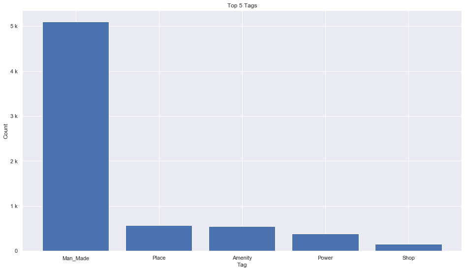
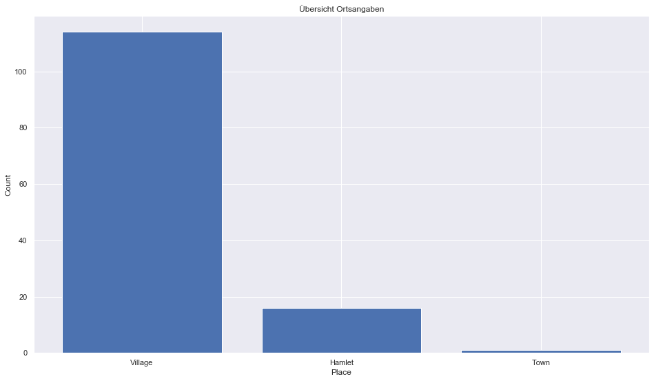
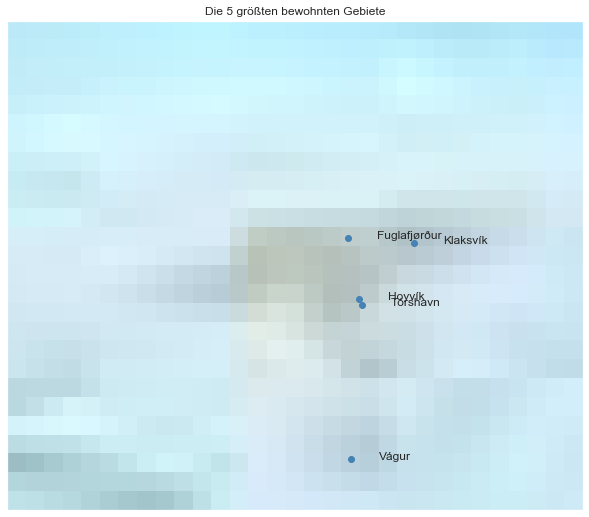

## Faroe Islands [&#10159;](faroe-islands.sqlite)

### Allgemeine Informationen

|Eigenschaft|Wert|
|-|-:|
Dateiname|[faroe-islands.sqlite](faroe-islands.sqlite)|
Zeitstempel|11.09.2019 16:53|
Dateigr&ouml;&szlig;e|380.00 Kb|
|||
Gesamtanzahl Nodes|6862|
|MinLat|61.3|
|MaxLat|63.0|
|MinLon|-8.0|
|MaxLon|-6.0|

### Top 5 Tags

|Tag|Count|
|-|-:|
|Man_Made|5098|
|Place|577|
|Amenity|550|
|Power|384|
|Shop|158|

### &Uuml;bersicht Ortsangaben

|Place|Count|
|-|-:|
|Village|114|
|Hamlet|16|
|Town|1|

### Die 5 gr&ouml;&szlig;ten bewohnte Gebiete

|Name|Lat|Lon|Type|Population|
|----|--:|--:|:--:|---------:|
|Tórshavn|62.012|-6.768|Town|12620|
|Klaksvík|62.2266084|-6.5852705|Village|4637|
|Hoyvík|62.0329436|-6.7766308|Village|2655|
|Fuglafjørður|62.2440229|-6.8141971|Village|1562|
|Vágur|61.475|-6.807|Village|1452|
