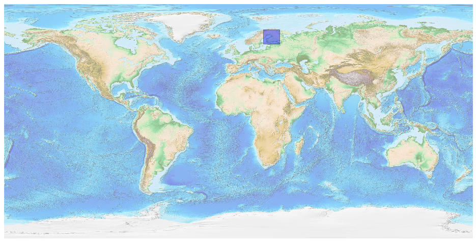
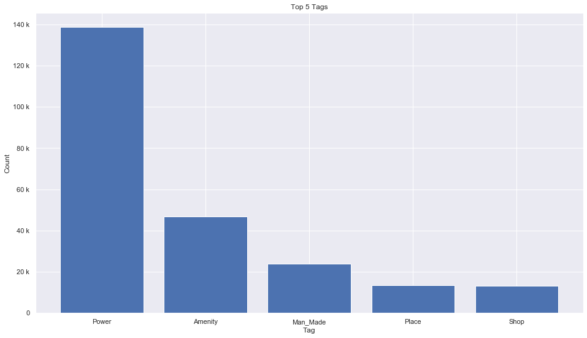
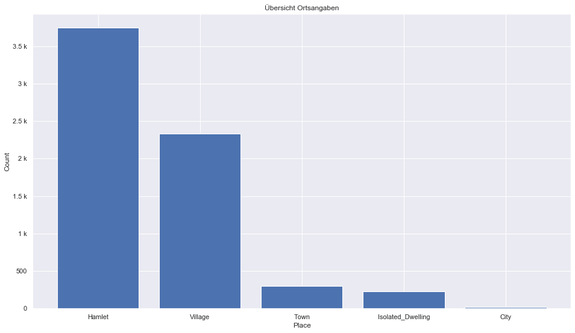
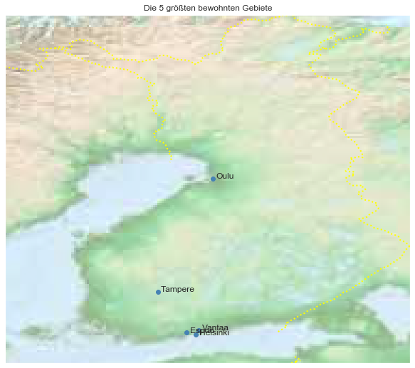

## Finland [&#10159;](finland.sqlite)

### Allgemeine Informationen

|Eigenschaft|Wert|
|-|-:|
Dateiname|[finland.sqlite](finland.sqlite)|
Zeitstempel|11.09.2019 17:00|
Dateigr&ouml;&szlig;e|11.61 Mb|
|||
Gesamtanzahl Nodes|245086|
|MinLat|59.28783|
|MaxLat|70.09959|
|MinLon|19.02427|
|MaxLon|31.60089|

### Top 5 Tags

|Tag|Count|
|-|-:|
|Power|138674|
|Amenity|46761|
|Man_Made|23832|
|Place|13460|
|Shop|13106|

### &Uuml;bersicht Ortsangaben

|Place|Count|
|-|-:|
|Hamlet|3744|
|Village|2329|
|Town|296|
|Isolated_Dwelling|229|
|City|22|

### Die 5 gr&ouml;&szlig;ten bewohnte Gebiete

|Name|Lat|Lon|Type|Population|
|----|--:|--:|:--:|---------:|
|Helsinki|60.1674098|24.9425769|City|629725|
|Espoo|60.2241869|24.6603626|City|260842|
|Tampere|61.4980214|23.7603118|City|220579|
|Vantaa|60.3091871|25.0364526|City|208052|
|Oulu|65.0118734|25.4716809|City|193825|
