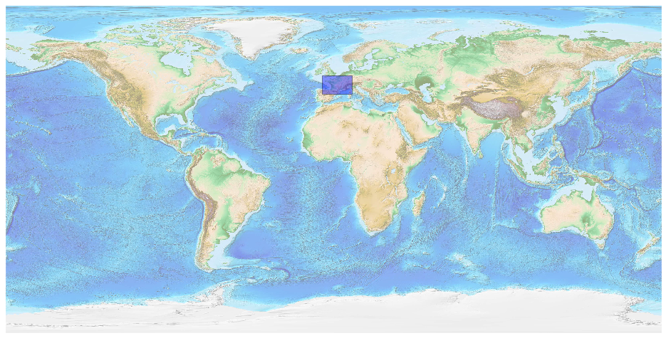
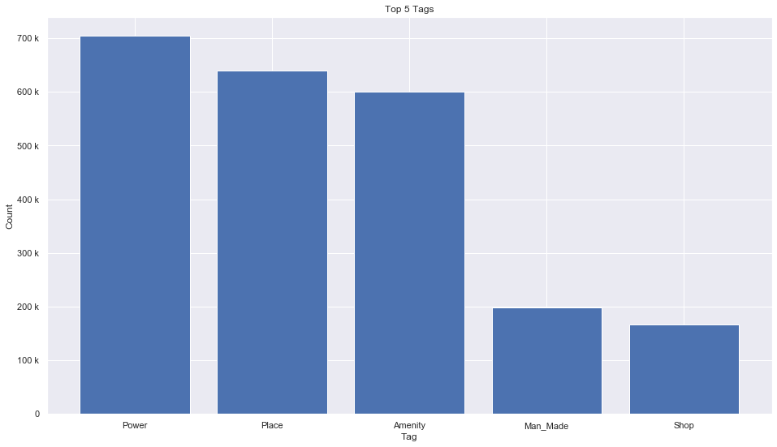
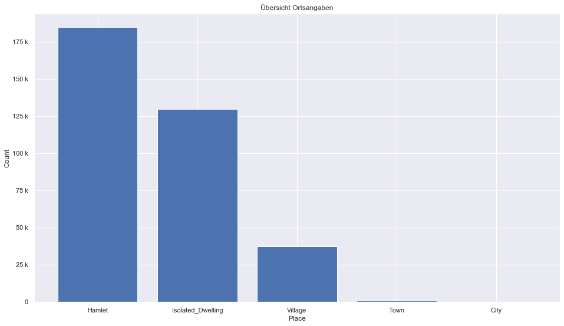
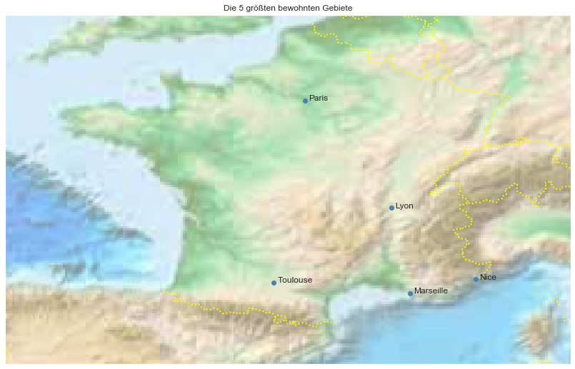

## France [&#10159;](france.sqlite)

### Allgemeine Informationen

|Eigenschaft|Wert|
|-|-:|
Dateiname|[france.sqlite](france.sqlite)|
Zeitstempel|05.09.2019 11:18|
Dateigr&ouml;&szlig;e|120.50 Mb|
|||
Gesamtanzahl Nodes|2467072|
|MinLat|41.257249|
|MaxLat|51.32937|
|MinLon|-6.3|
|MaxLon|9.99206|

### Top 5 Tags

|Tag|Count|
|-|-:|
|Power|704227|
|Place|639416|
|Amenity|600037|
|Man_Made|198687|
|Shop|167165|

### &Uuml;bersicht Ortsangaben

|Place|Count|
|-|-:|
|Hamlet|184892|
|Isolated_Dwelling|130017|
|Village|37256|
|Town|967|
|City|48|

### Die 5 gr&ouml;&szlig;ten bewohnte Gebiete

|Name|Lat|Lon|Type|Population|
|----|--:|--:|:--:|---------:|
|Paris|48.8566969|2.3514616|City|2243833|
|Marseille|43.2961743|5.3699525|City|855393|
|Lyon|45.7578137|4.8320114|City|500715|
|Toulouse|43.6044622|1.4442469|City|441802|
|Nice|43.7009358|7.2683912|City|343304|
