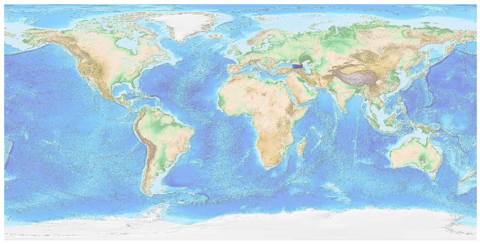
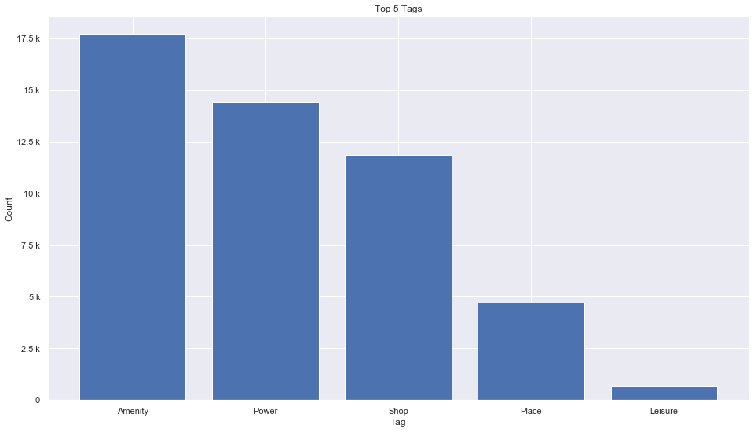
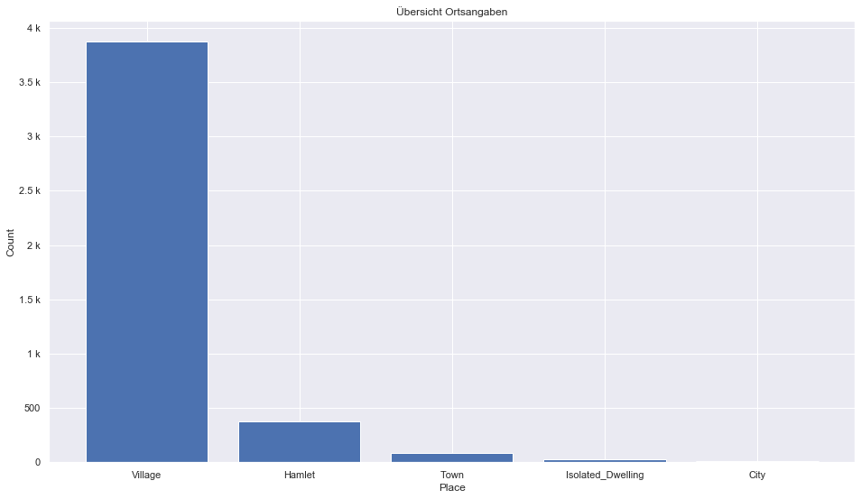
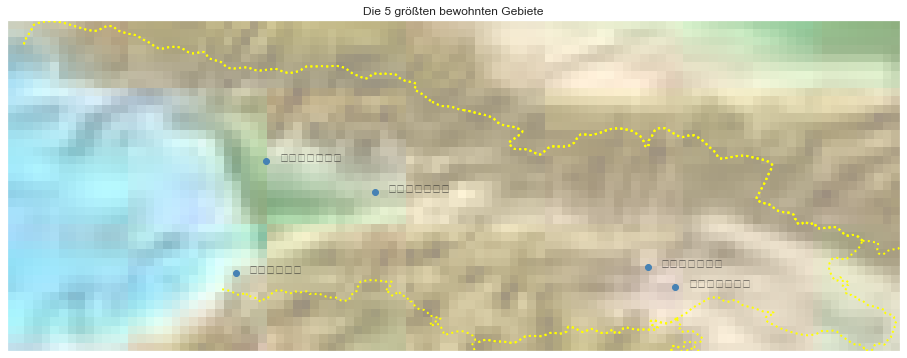

## Georgia [&#10159;](georgia.sqlite)

### Allgemeine Informationen

|Eigenschaft|Wert|
|-|-:|
Dateiname|[georgia.sqlite](georgia.sqlite)|
Zeitstempel|04.09.2019 20:57|
Dateigr&ouml;&szlig;e|2.69 Mb|
|||
Gesamtanzahl Nodes|49822|
|MinLat|41.05117|
|MaxLat|43.5899|
|MinLon|39.88093|
|MaxLon|46.73959|

### Top 5 Tags

|Tag|Count|
|-|-:|
|Amenity|17675|
|Power|14440|
|Shop|11836|
|Place|4711|
|Leisure|682|

### &Uuml;bersicht Ortsangaben

|Place|Count|
|-|-:|
|Village|3871|
|Hamlet|372|
|Town|84|
|Isolated_Dwelling|24|
|City|10|

### Die 5 gr&ouml;&szlig;ten bewohnte Gebiete

|Name|Lat|Lon|Type|Population|
|----|--:|--:|:--:|---------:|
|თბილისი|41.6934591|44.8014495|City|1132000|
|ქუთაისი|42.2716455|42.705359|City|186000|
|ბათუმი|41.6509502|41.6360085|City|121800|
|რუსთავი|41.54309|45.0112804|City|116400|
|ზუგდიდი|42.5067616|41.8713297|City|69000|
