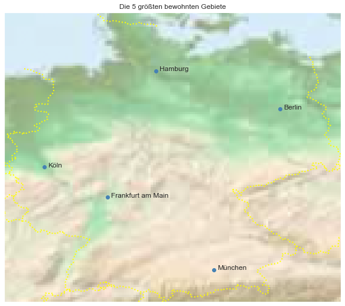

## Germany [&#10159;](germany.sqlite)

### Allgemeine Informationen

|Eigenschaft|Wert|
|-|-:|
Dateiname|[germany.sqlite](germany.sqlite)|
Zeitstempel|11.09.2019 18:13|
Dateigr&ouml;&szlig;e|171.70 Mb|
|||
Gesamtanzahl Nodes|3441241|
|MinLat|47.26543|
|MaxLat|55.14777|
|MinLon|5.864417|
|MaxLon|15.05078|

### Top 5 Tags

|Tag|Count|
|-|-:|
|Amenity|1355206|
|Power|1019953|
|Emergency|383123|
|Shop|299377|
|Place|150763|

### &Uuml;bersicht Ortsangaben

|Place|Count|
|-|-:|
|Hamlet|41837|
|Village|39309|
|Isolated_Dwelling|10706|
|Town|2441|
|City|82|

### Die 5 gr&ouml;&szlig;ten bewohnte Gebiete

|Name|Lat|Lon|Type|Population|
|----|--:|--:|:--:|---------:|
|Berlin|52.5170365|13.3888599|City|3531201|
|Hamburg|53.550341|10.000654|City|1812709|
|München|48.1371079|11.5753822|City|1528849|
|Köln|50.938361|6.959974|City|1069200|
|Frankfurt am Main|50.1106444|8.6820917|City|701350|
