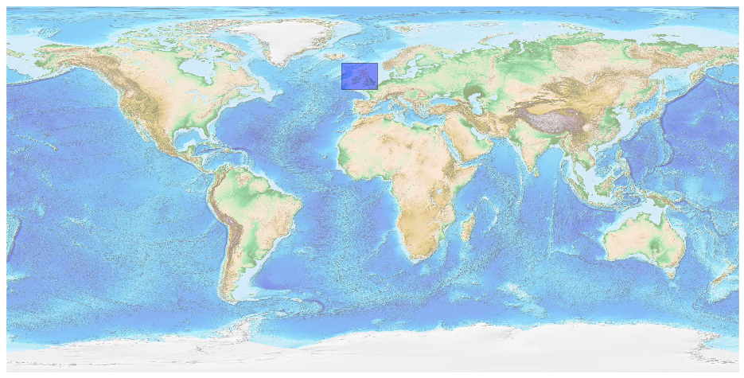
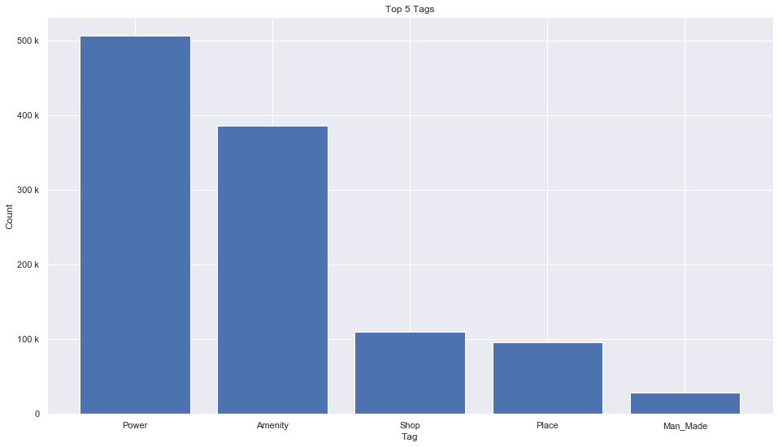
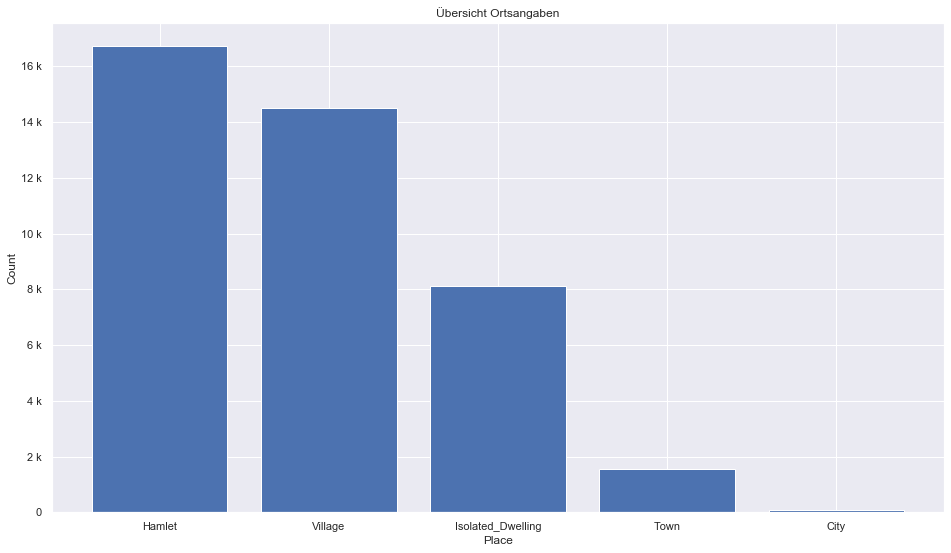
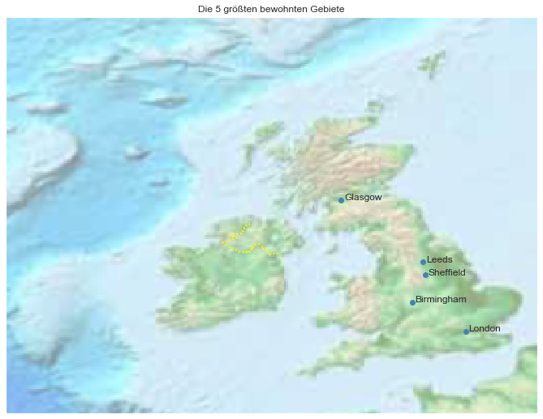

## Great Britain [&#10159;](great-britain.sqlite)

### Allgemeine Informationen

|Eigenschaft|Wert|
|-|-:|
Dateiname|[great-britain.sqlite](great-britain.sqlite)|
Zeitstempel|11.09.2019 18:25|
Dateigr&ouml;&szlig;e|56.60 Mb|
|||
Gesamtanzahl Nodes|1160182|
|MinLat|48.79409|
|MaxLat|61.92858|
|MinLon|-15.336777|
|MaxLon|2.25|

### Top 5 Tags

|Tag|Count|
|-|-:|
|Power|505697|
|Amenity|386022|
|Shop|110275|
|Place|95980|
|Man_Made|28966|

### &Uuml;bersicht Ortsangaben

|Place|Count|
|-|-:|
|Hamlet|16720|
|Village|14513|
|Isolated_Dwelling|8101|
|Town|1556|
|City|65|

### Die 5 gr&ouml;&szlig;ten bewohnte Gebiete

|Name|Lat|Lon|Type|Population|
|----|--:|--:|:--:|---------:|
|London|51.5073219|-0.1276474|City|8416535|
|Birmingham|52.4796992|-1.9026911|City|1036878|
|Leeds|53.7974185|-1.5437941|City|766399|
|Glasgow|55.8611389|-4.2501672|City|606340|
|Sheffield|53.3806626|-1.4702278|City|547000|
