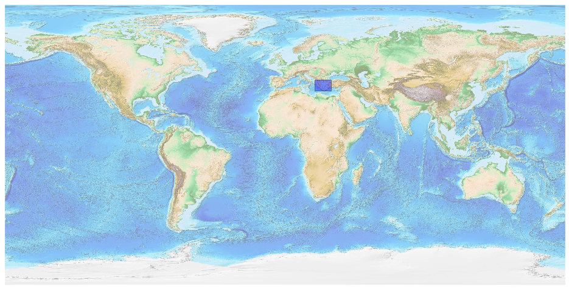
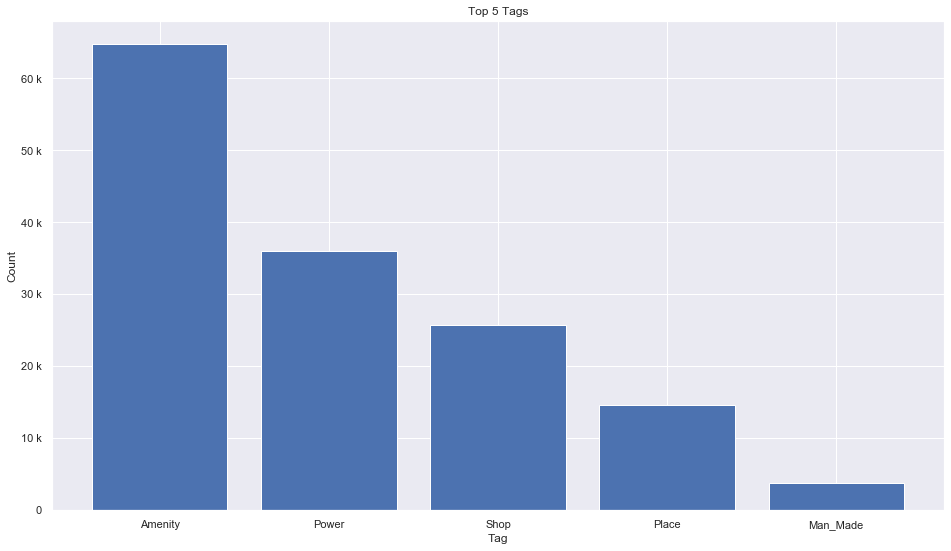
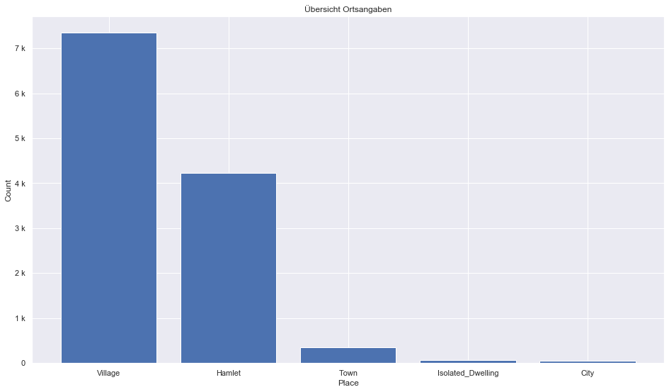

## Greece [&#10159;](greece.sqlite)

### Allgemeine Informationen

|Eigenschaft|Wert|
|-|-:|
Dateiname|[greece.sqlite](greece.sqlite)|
Zeitstempel|11.09.2019 18:28|
Dateigr&ouml;&szlig;e|8.01 Mb|
|||
Gesamtanzahl Nodes|149476|
|MinLat|34.59111|
|MaxLat|41.74954|
|MinLon|19.15881|
|MaxLon|29.65683|

### Top 5 Tags

|Tag|Count|
|-|-:|
|Amenity|64728|
|Power|36019|
|Shop|25799|
|Place|14672|
|Man_Made|3844|

### &Uuml;bersicht Ortsangaben

|Place|Count|
|-|-:|
|Village|7343|
|Hamlet|4231|
|Town|355|
|Isolated_Dwelling|64|
|City|52|

### Die 5 gr&ouml;&szlig;ten bewohnte Gebiete

|Name|Lat|Lon|Type|Population|
|----|--:|--:|:--:|---------:|
|Αθήνα|37.9841493|23.7279843|City|3090508|
|Θεσσαλονίκη|40.6403167|22.9352716|City|790824|
|Πάτρα|38.246242|21.7350847|City|300000|
|Πειραιάς|37.9440078|23.6483599|City|163688|
|Λάρισα|39.6383092|22.4160706|City|144651|
