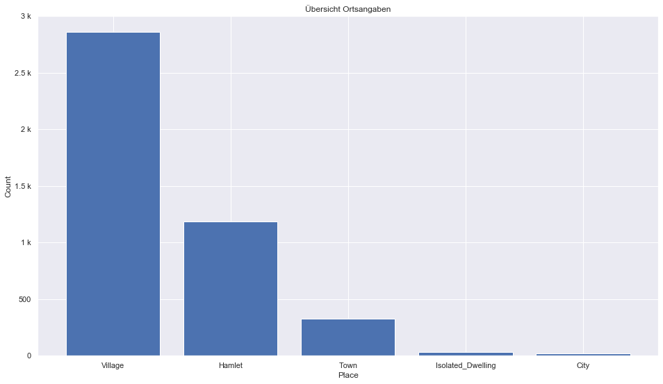
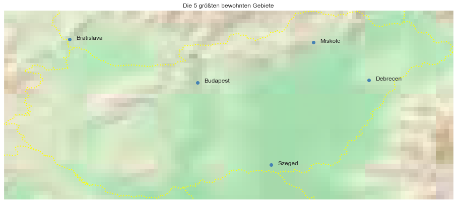

## Hungary [&#10159;](hungary.sqlite)

### Allgemeine Informationen

|Eigenschaft|Wert|
|-|-:|
Dateiname|[hungary.sqlite](hungary.sqlite)|
Zeitstempel|11.09.2019 18:30|
Dateigr&ouml;&szlig;e|17.56 Mb|
|||
Gesamtanzahl Nodes|368751|
|MinLat|45.73218|
|MaxLat|48.58766|
|MinLon|16.11262|
|MaxLon|22.90201|

### Top 5 Tags

|Tag|Count|
|-|-:|
|Power|205424|
|Amenity|86508|
|Shop|26344|
|Place|16038|
|Man_Made|14742|

### &Uuml;bersicht Ortsangaben

|Place|Count|
|-|-:|
|Village|2858|
|Hamlet|1185|
|Town|328|
|Isolated_Dwelling|33|
|City|19|

### Die 5 gr&ouml;&szlig;ten bewohnte Gebiete

|Name|Lat|Lon|Type|Population|
|----|--:|--:|:--:|---------:|
|Budapest|47.4983815|19.0404707|City|1759407|
|Bratislava|48.1516988|17.1093063|City|432801|
|Debrecen|47.531399|21.6259782|City|203059|
|Szeged|46.2546312|20.1486016|City|162621|
|Miskolc|48.1031503|20.7901985|City|158101|
