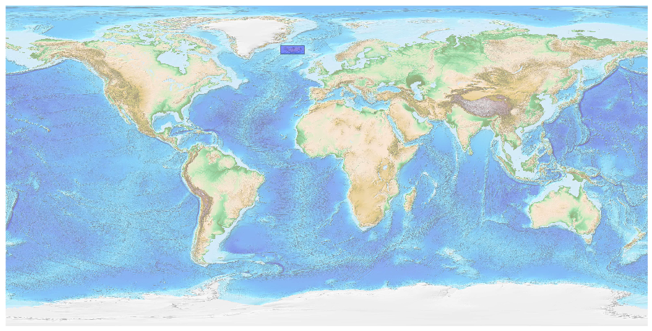
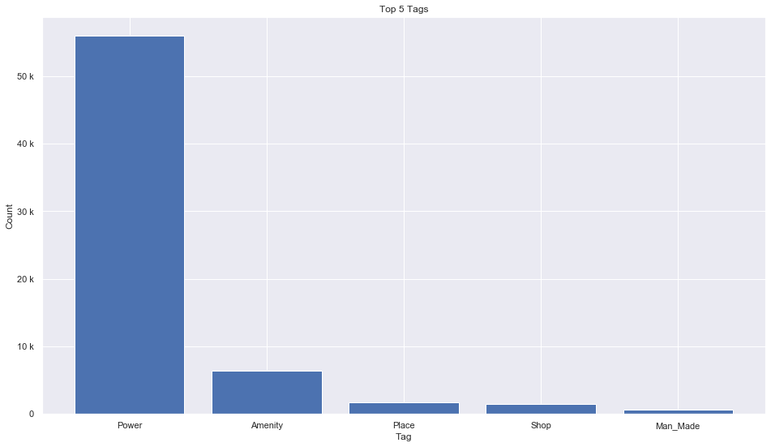
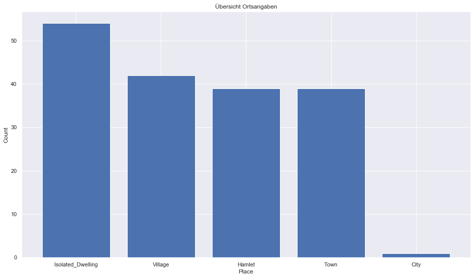
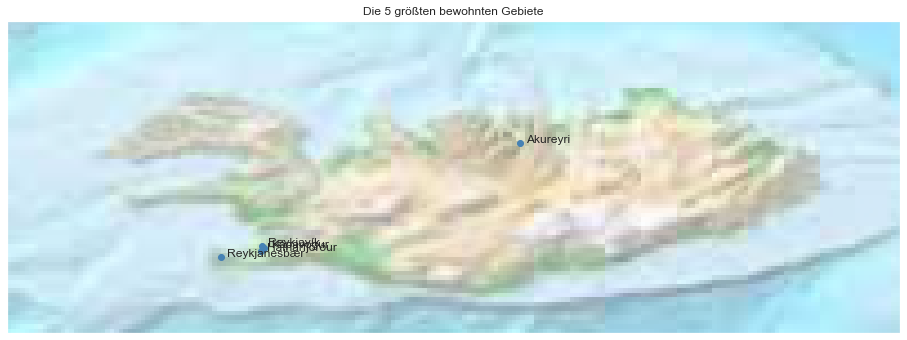

## Iceland [&#10159;](iceland.sqlite)

### Allgemeine Informationen

|Eigenschaft|Wert|
|-|-:|
Dateiname|[iceland.sqlite](iceland.sqlite)|
Zeitstempel|04.09.2019 21:45|
Dateigr&ouml;&szlig;e|2.77 Mb|
|||
Gesamtanzahl Nodes|66739|
|MinLat|62.84553|
|MaxLat|67.50085|
|MinLon|-25.74085|
|MaxLon|-12.41708|

### Top 5 Tags

|Tag|Count|
|-|-:|
|Power|55943|
|Amenity|6348|
|Place|1753|
|Shop|1422|
|Man_Made|608|

### &Uuml;bersicht Ortsangaben

|Place|Count|
|-|-:|
|Isolated_Dwelling|54|
|Village|42|
|Hamlet|39|
|Town|39|
|City|1|

### Die 5 gr&ouml;&szlig;ten bewohnte Gebiete

|Name|Lat|Lon|Type|Population|
|----|--:|--:|:--:|---------:|
|Reykjavík|64.145981|-21.9422367|City|127333|
|Kópavogur|64.1113504|-21.9048106|Town|36940|
|Hafnarfjörður|64.0695354|-21.9575664|Town|29796|
|Reykjanesbær|63.9832697|-22.5561494|Town|18629|
|Akureyri|65.6826364|-18.0912993|Town|18606|
