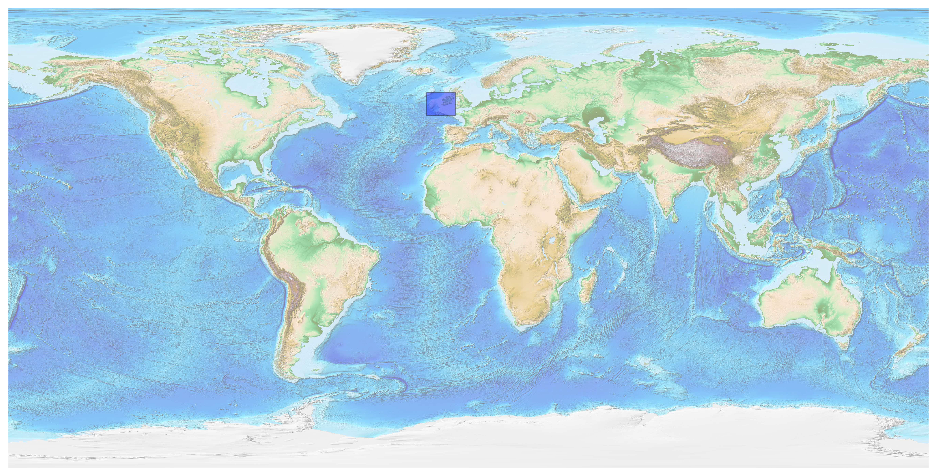
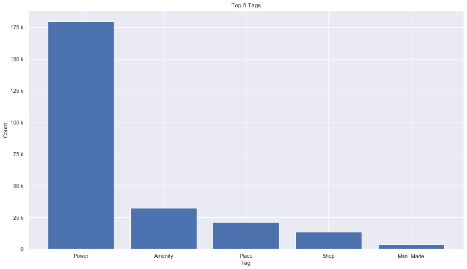
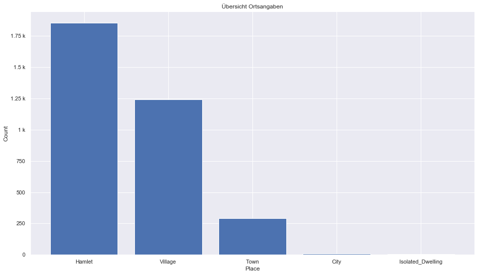
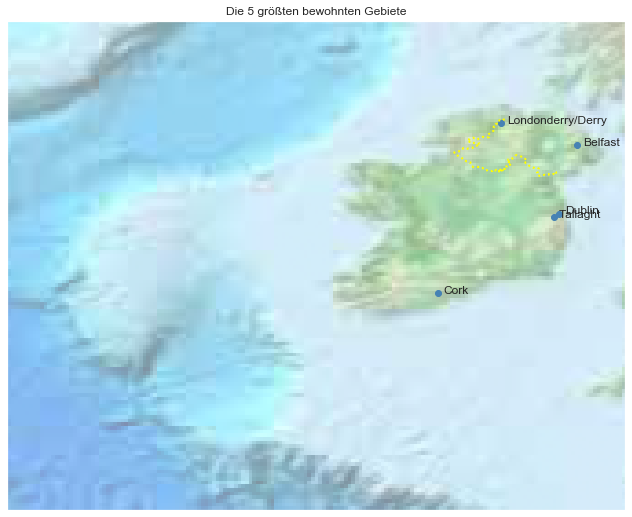

## Ireland And Northern Ireland [&#10159;](ireland-and-northern-ireland.sqlite)

### Allgemeine Informationen

|Eigenschaft|Wert|
|-|-:|
Dateiname|[ireland-and-northern-ireland.sqlite](ireland-and-northern-ireland.sqlite)|
Zeitstempel|11.09.2019 18:32|
Dateigr&ouml;&szlig;e|11.78 Mb|
|||
Gesamtanzahl Nodes|254320|
|MinLat|47.96052|
|MaxLat|56.86553|
|MinLon|-16.30824|
|MaxLon|-5.059265|

### Top 5 Tags

|Tag|Count|
|-|-:|
|Power|179430|
|Amenity|32549|
|Place|21421|
|Shop|13419|
|Man_Made|3430|

### &Uuml;bersicht Ortsangaben

|Place|Count|
|-|-:|
|Hamlet|1853|
|Village|1242|
|Town|293|
|City|10|
|Isolated_Dwelling|5|

### Die 5 gr&ouml;&szlig;ten bewohnte Gebiete

|Name|Lat|Lon|Type|Population|
|----|--:|--:|:--:|---------:|
|Dublin|53.3497645|-6.2602732|City|553165|
|Belfast|54.5964411|-5.9302761|City|333000|
|Cork|51.8979282|-8.4705806|City|125622|
|Tallaght|53.2878314|-6.3622774|Town|101055|
|Londonderry/Derry|54.9919421|-7.316801|City|85016|
