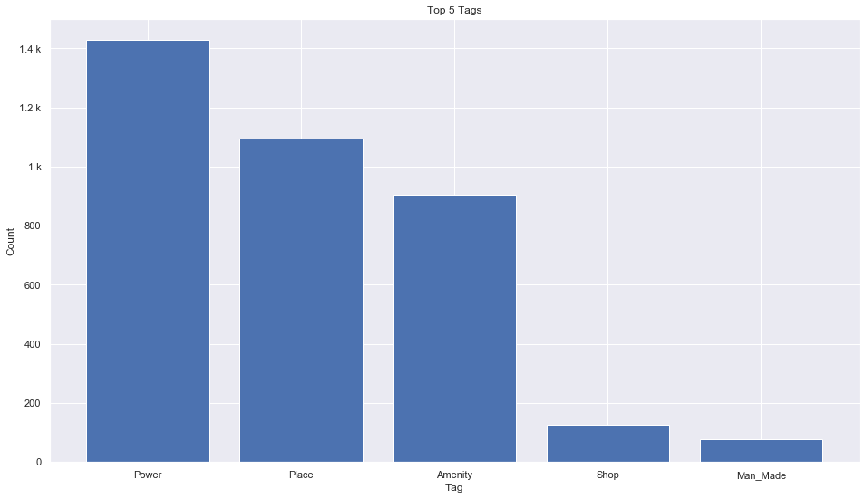

## Isle Of Man [&#10159;](isle-of-man.sqlite)

### Allgemeine Informationen

|Eigenschaft|Wert|
|-|-:|
Dateiname|[isle-of-man.sqlite](isle-of-man.sqlite)|
Zeitstempel|11.09.2019 18:32|
Dateigr&ouml;&szlig;e|200.00 Kb|
|||
Gesamtanzahl Nodes|3728|
|MinLat|53.73236|
|MaxLat|54.6706|
|MinLon|-5.434554|
|MaxLon|-3.688718|

### Top 5 Tags

|Tag|Count|
|-|-:|
|Power|1428|
|Place|1094|
|Amenity|906|
|Shop|125|
|Man_Made|76|

### &Uuml;bersicht Ortsangaben

|Place|Count|
|-|-:|
|Hamlet|56|
|Village|21|
|Town|4|
|Isolated_Dwelling|1|

### Die 5 gr&ouml;&szlig;ten bewohnte Gebiete

|Name|Lat|Lon|Type|Population|
|----|--:|--:|:--:|---------:|
|Douglas|54.149774|-4.4779021|Town|27938|
|Peel|54.2229326|-4.6957105|Town|5093|
|Castletown|54.0735192|-4.6538304|Town|3097|
|Andreas|54.3670794|-4.4443798|Village|1428|
