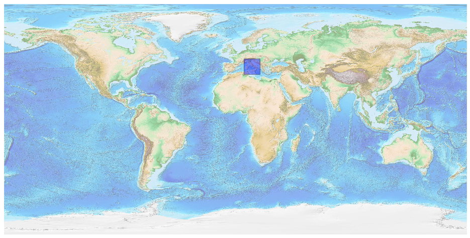
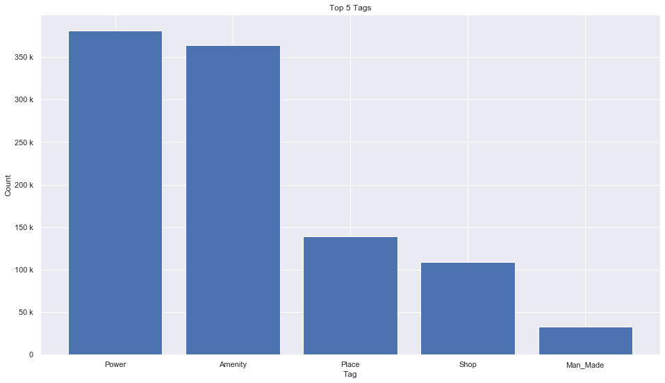
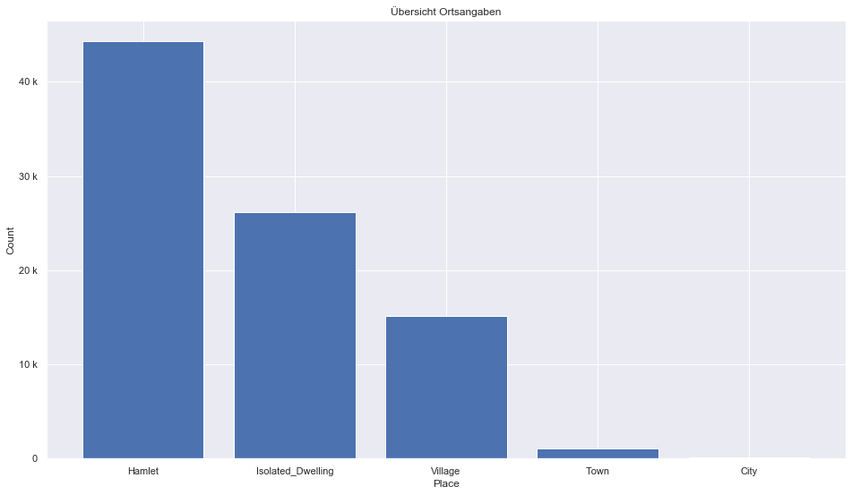
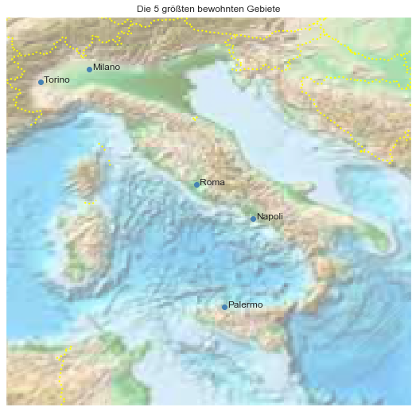

## Italy [&#10159;](italy.sqlite)

### Allgemeine Informationen

|Eigenschaft|Wert|
|-|-:|
Dateiname|[italy.sqlite](italy.sqlite)|
Zeitstempel|04.09.2019 23:11|
Dateigr&ouml;&szlig;e|51.15 Mb|
|||
Gesamtanzahl Nodes|1082603|
|MinLat|35.07638|
|MaxLat|47.10169|
|MinLon|6.602696|
|MaxLon|19.12499|

### Top 5 Tags

|Tag|Count|
|-|-:|
|Power|380872|
|Amenity|363987|
|Place|138761|
|Shop|109313|
|Man_Made|32881|

### &Uuml;bersicht Ortsangaben

|Place|Count|
|-|-:|
|Hamlet|44275|
|Isolated_Dwelling|26180|
|Village|15143|
|Town|1114|
|City|99|

### Die 5 gr&ouml;&szlig;ten bewohnte Gebiete

|Name|Lat|Lon|Type|Population|
|----|--:|--:|:--:|---------:|
|Roma|41.894812|12.4853491|City|2864731|
|Milano|45.4667971|9.1904984|City|1350487|
|Napoli|40.8359336|14.2487826|City|972212|
|Torino|45.0677551|7.6824892|City|902000|
|Palermo|38.1112268|13.3524434|City|665566|
