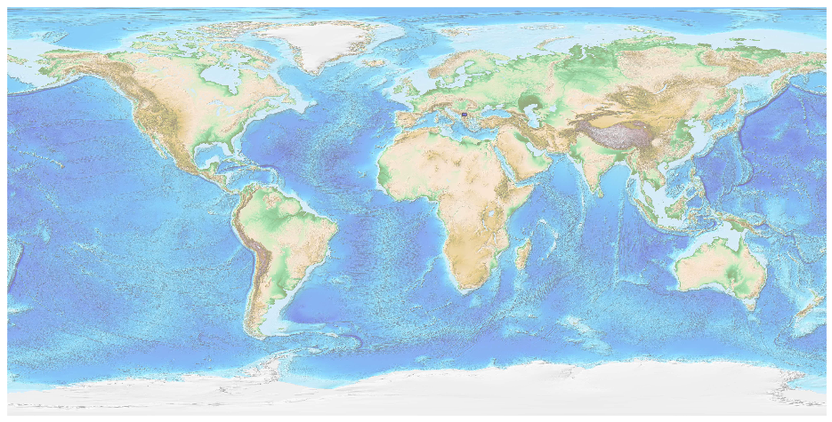
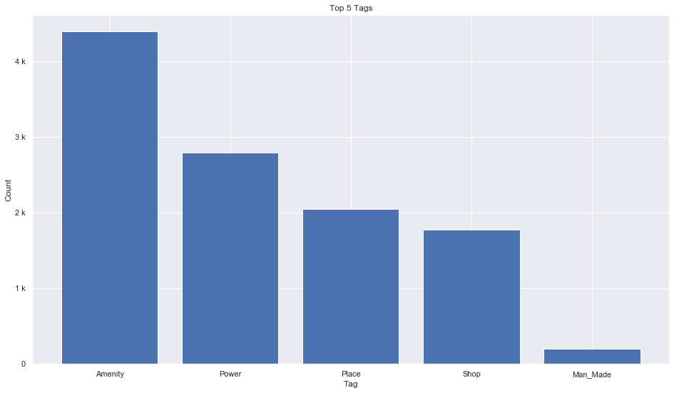
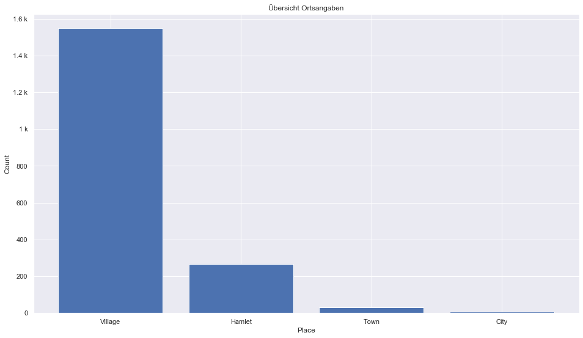
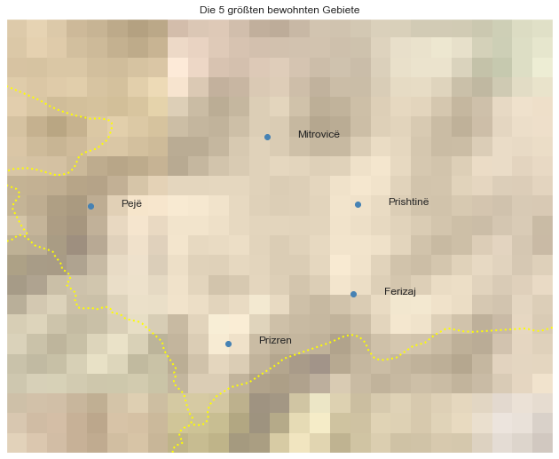

## Kosovo [&#10159;](kosovo.sqlite)

### Allgemeine Informationen

|Eigenschaft|Wert|
|-|-:|
Dateiname|[kosovo.sqlite](kosovo.sqlite)|
Zeitstempel|04.09.2019 22:10|
Dateigr&ouml;&szlig;e|568.00 Kb|
|||
Gesamtanzahl Nodes|11430|
|MinLat|41.85101|
|MaxLat|43.27416|
|MinLon|20.01357|
|MaxLon|21.80449|

### Top 5 Tags

|Tag|Count|
|-|-:|
|Amenity|4396|
|Power|2798|
|Place|2049|
|Shop|1775|
|Man_Made|196|

### &Uuml;bersicht Ortsangaben

|Place|Count|
|-|-:|
|Village|1548|
|Hamlet|265|
|Town|31|
|City|7|

### Die 5 gr&ouml;&szlig;ten bewohnte Gebiete

|Name|Lat|Lon|Type|Population|
|----|--:|--:|:--:|---------:|
|Prishtinë|42.6638771|21.1640849|City|465186|
|Prizren|42.2089656|20.7404242|City|177781|
|Ferizaj|42.3705175|21.1518203|City|108610|
|Mitrovicë|42.885298|20.8673427|City|107000|
|Pejë|42.6594354|20.288468|City|97776|
