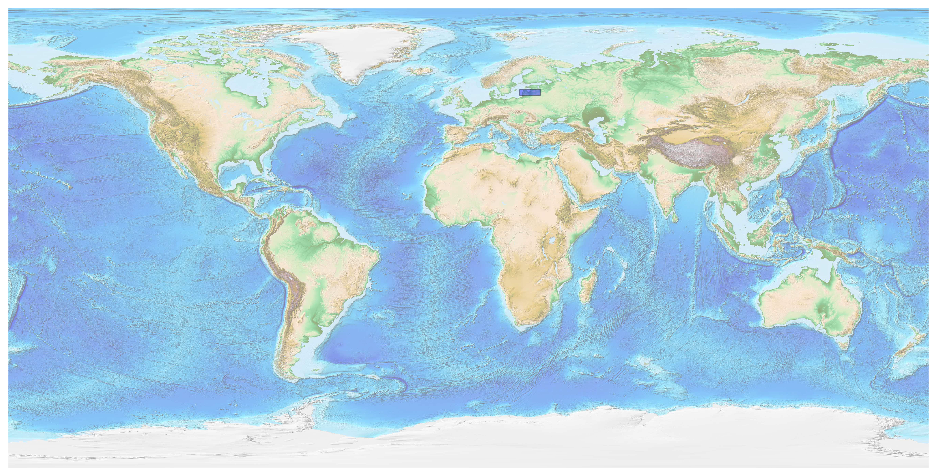
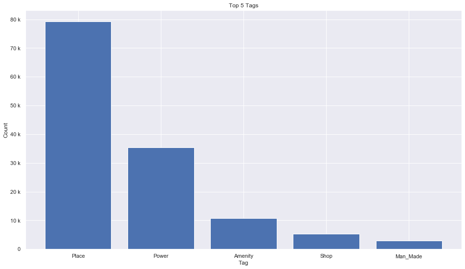
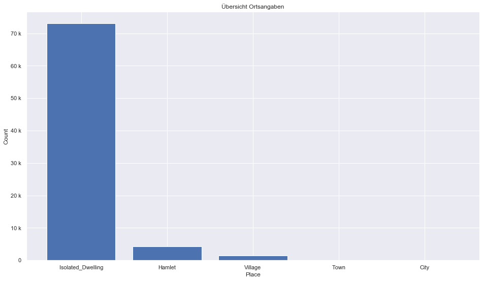
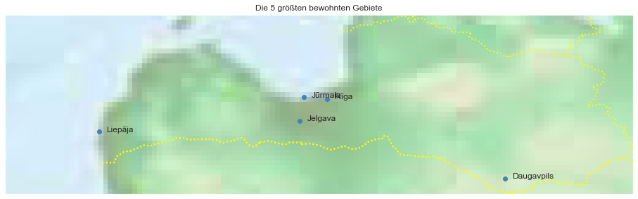

## Latvia [&#10159;](latvia.sqlite)

### Allgemeine Informationen

|Eigenschaft|Wert|
|-|-:|
Dateiname|[latvia.sqlite](latvia.sqlite)|
Zeitstempel|04.09.2019 22:16|
Dateigr&ouml;&szlig;e|7.18 Mb|
|||
Gesamtanzahl Nodes|136239|
|MinLat|55.66109|
|MaxLat|58.0947|
|MinLon|19.73348|
|MaxLon|28.25501|

### Top 5 Tags

|Tag|Count|
|-|-:|
|Place|79183|
|Power|35311|
|Amenity|10818|
|Shop|5376|
|Man_Made|3007|

### &Uuml;bersicht Ortsangaben

|Place|Count|
|-|-:|
|Isolated_Dwelling|73024|
|Hamlet|4318|
|Village|1442|
|Town|73|
|City|9|

### Die 5 gr&ouml;&szlig;ten bewohnte Gebiete

|Name|Lat|Lon|Type|Population|
|----|--:|--:|:--:|---------:|
|Rīga|56.9493977|24.1051846|City|698529|
|Daugavpils|55.8712267|26.5159337|City|101057|
|Liepāja|56.5048435|21.0070903|City|78787|
|Jelgava|56.6514394|23.7339143|City|63534|
|Jūrmala|56.9727164|23.7886979|City|57671|
