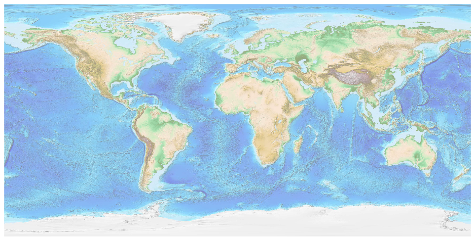
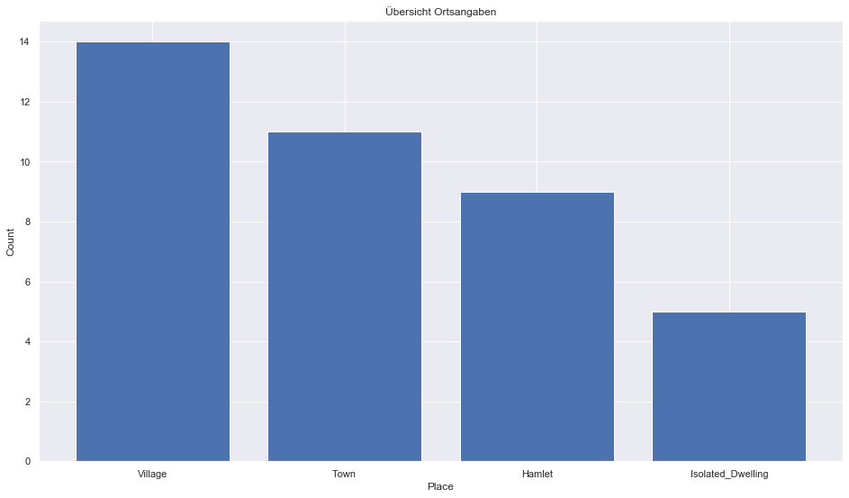

## Liechtenstein [&#10159;](liechtenstein.sqlite)

### Allgemeine Informationen

|Eigenschaft|Wert|
|-|-:|
Dateiname|[liechtenstein.sqlite](liechtenstein.sqlite)|
Zeitstempel|11.09.2019 18:52|
Dateigr&ouml;&szlig;e|68.00 Kb|
|||
Gesamtanzahl Nodes|1064|
|MinLat|47.04774|
|MaxLat|47.27128|
|MinLon|9.471078|
|MaxLon|9.636217|

### Top 5 Tags

|Tag|Count|
|-|-:|
|Amenity|514|
|Power|188|
|Shop|133|
|Place|81|
|Leisure|63|

### &Uuml;bersicht Ortsangaben

|Place|Count|
|-|-:|
|Village|14|
|Town|11|
|Hamlet|9|
|Isolated_Dwelling|5|

### Die 5 gr&ouml;&szlig;ten bewohnte Gebiete

|Name|Lat|Lon|Type|Population|
|----|--:|--:|:--:|---------:|
|Schaan|47.1663397|9.510312|Town|6002|
|Vaduz|47.1392862|9.5227962|Town|5229|
|Triesen|47.106994|9.5274876|Town|5050|
|Balzers|47.0671067|9.5002584|Town|4608|
|Eschen|47.2126274|9.5233202|Town|4407|
