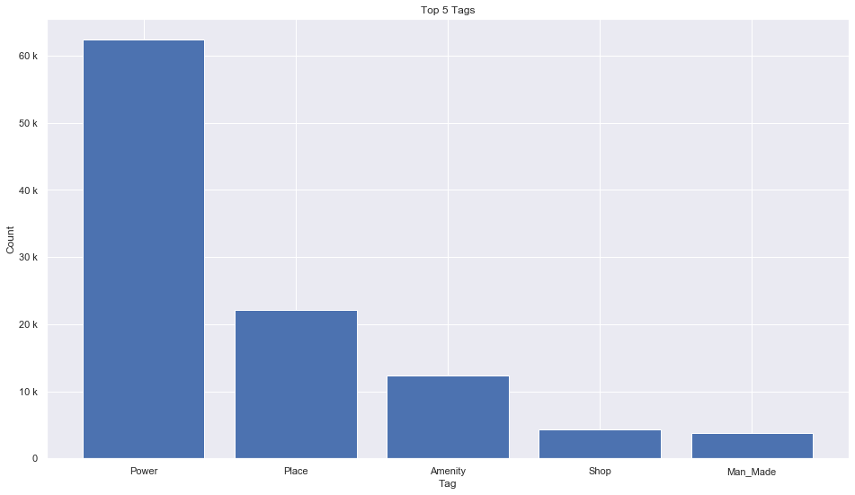
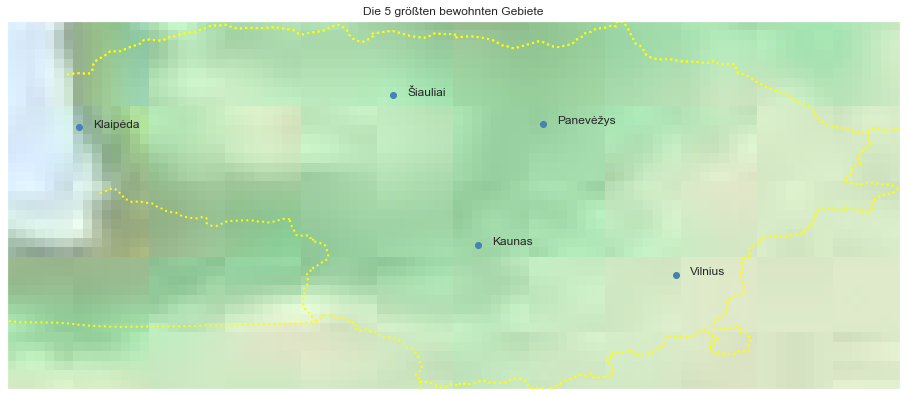

## Lithuania [&#10159;](lithuania.sqlite)

### Allgemeine Informationen

|Eigenschaft|Wert|
|-|-:|
Dateiname|[lithuania.sqlite](lithuania.sqlite)|
Zeitstempel|04.09.2019 22:22|
Dateigr&ouml;&szlig;e|4.79 Mb|
|||
Gesamtanzahl Nodes|106629|
|MinLat|53.89605|
|MaxLat|56.45106|
|MinLon|20.63822|
|MaxLon|26.83873|

### Top 5 Tags

|Tag|Count|
|-|-:|
|Power|62371|
|Place|22175|
|Amenity|12319|
|Shop|4343|
|Man_Made|3732|

### &Uuml;bersicht Ortsangaben

|Place|Count|
|-|-:|
|Village|18882|
|Hamlet|1710|
|Isolated_Dwelling|401|
|Town|371|
|City|5|

### Die 5 gr&ouml;&szlig;ten bewohnte Gebiete

|Name|Lat|Lon|Type|Population|
|----|--:|--:|:--:|---------:|
|Vilnius|54.6870458|25.2829111|City|526356|
|Kaunas|54.8982139|23.9044817|City|315993|
|Klaipėda|55.7127529|21.1350469|City|162360|
|Šiauliai|55.9340823|23.3157775|City|109328|
|Panevėžys|55.7344985|24.3578055|City|99690|
