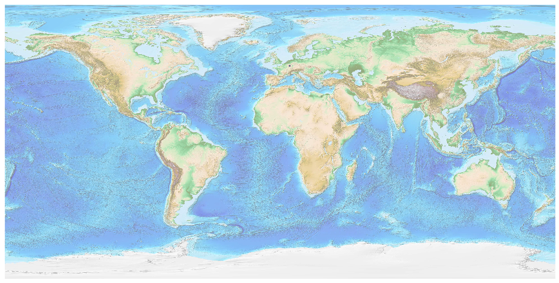
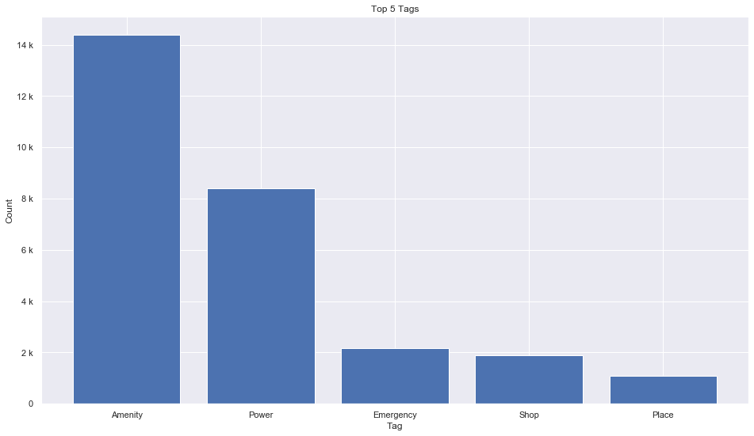
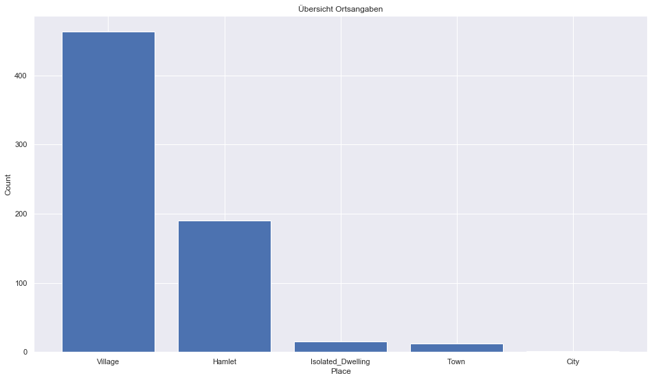

## Luxembourg [&#10159;](luxembourg.sqlite)

### Allgemeine Informationen

|Eigenschaft|Wert|
|-|-:|
Dateiname|[luxembourg.sqlite](luxembourg.sqlite)|
Zeitstempel|11.09.2019 18:53|
Dateigr&ouml;&szlig;e|1.48 Mb|
|||
Gesamtanzahl Nodes|29743|
|MinLat|49.44553|
|MaxLat|50.18496|
|MinLon|5.733033|
|MaxLon|6.532249|

### Top 5 Tags

|Tag|Count|
|-|-:|
|Amenity|14378|
|Power|8408|
|Emergency|2166|
|Shop|1905|
|Place|1100|

### &Uuml;bersicht Ortsangaben

|Place|Count|
|-|-:|
|Village|463|
|Hamlet|190|
|Isolated_Dwelling|15|
|Town|12|
|City|1|

### Die 5 gr&ouml;&szlig;ten bewohnte Gebiete

|Name|Lat|Lon|Type|Population|
|----|--:|--:|:--:|---------:|
|Luxembourg|49.6112768|6.129799|City|103641|
|Esch-sur-Alzette|49.4959628|5.9850306|Town|33286|
|Dudelange|49.4786477|6.0847792|Town|20000|
|Differdange|49.5208469|5.889242|Town|19000|
|Schifflange|49.5062732|6.0118175|Town|10379|
