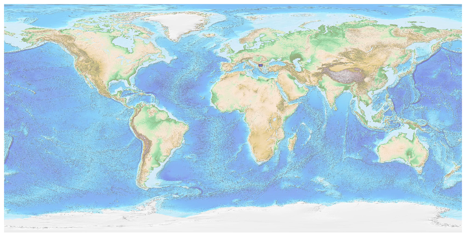
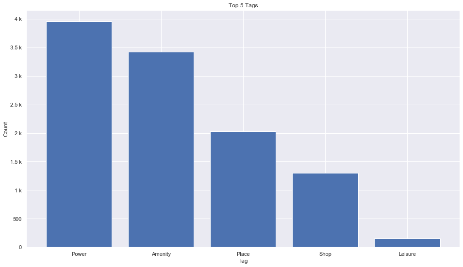
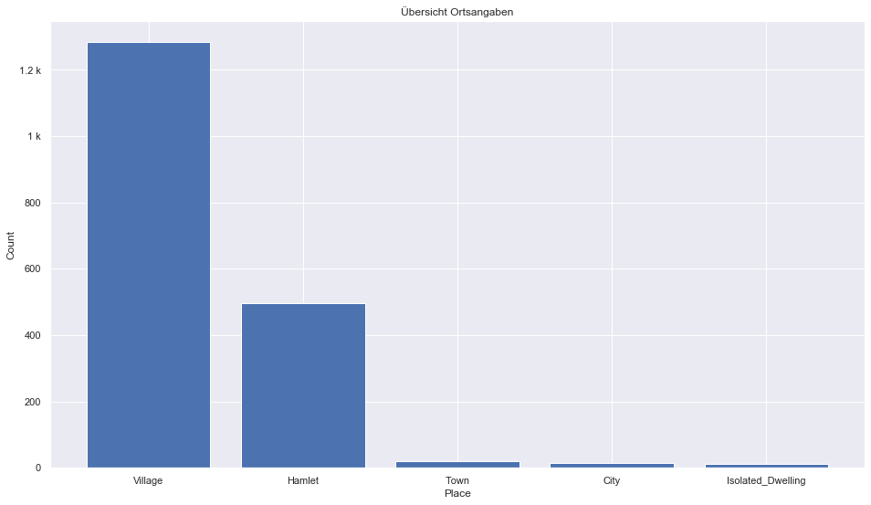
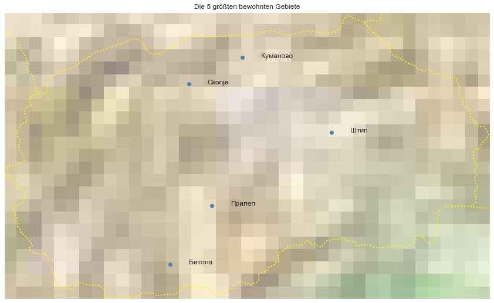

## Macedonia [&#10159;](macedonia.sqlite)

### Allgemeine Informationen

|Eigenschaft|Wert|
|-|-:|
Dateiname|[macedonia.sqlite](macedonia.sqlite)|
Zeitstempel|04.09.2019 22:24|
Dateigr&ouml;&szlig;e|564.00 Kb|
|||
Gesamtanzahl Nodes|11045|
|MinLat|40.84759|
|MaxLat|42.37969|
|MinLon|20.44671|
|MaxLon|23.04012|

### Top 5 Tags

|Tag|Count|
|-|-:|
|Power|3953|
|Amenity|3424|
|Place|2032|
|Shop|1301|
|Leisure|152|

### &Uuml;bersicht Ortsangaben

|Place|Count|
|-|-:|
|Village|1283|
|Hamlet|497|
|Town|19|
|City|14|
|Isolated_Dwelling|13|

### Die 5 gr&ouml;&szlig;ten bewohnte Gebiete

|Name|Lat|Lon|Type|Population|
|----|--:|--:|:--:|---------:|
|Скопје|41.9960924|21.4316495|City|668500|
|Куманово|42.1359459|21.7177635|City|105000|
|Битола|41.0327325|21.3315306|City|74550|
|Прилеп|41.3455945|21.5538227|City|66246|
|Штип|41.7374724|22.1935856|City|65000|
