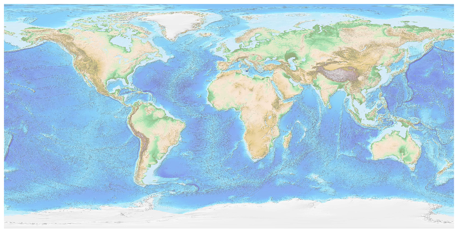
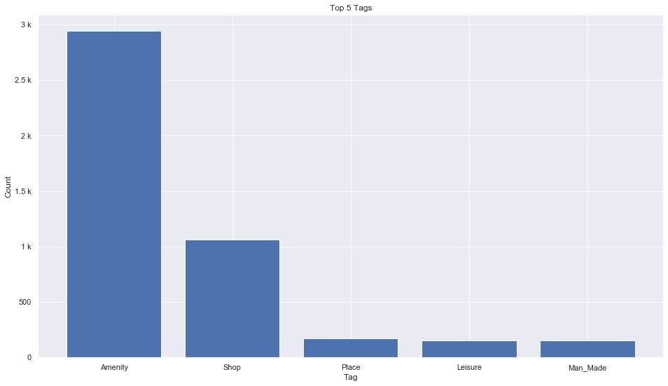
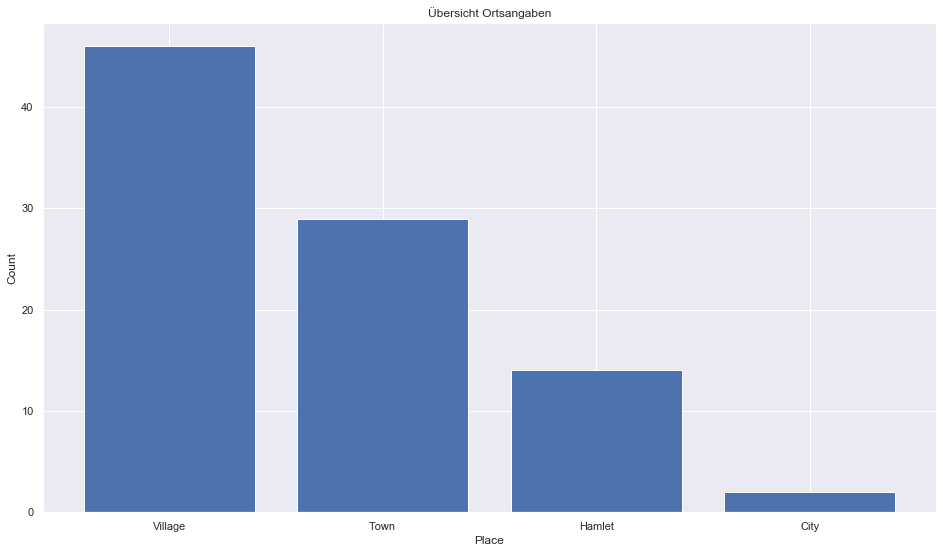
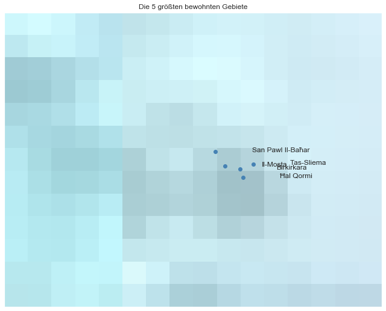

## Malta [&#10159;](malta.sqlite)

### Allgemeine Informationen

|Eigenschaft|Wert|
|-|-:|
Dateiname|[malta.sqlite](malta.sqlite)|
Zeitstempel|04.09.2019 22:25|
Dateigr&ouml;&szlig;e|252.00 Kb|
|||
Gesamtanzahl Nodes|4715|
|MinLat|35.51985|
|MaxLat|36.332958|
|MinLon|13.815377|
|MaxLon|14.856099|

### Top 5 Tags

|Tag|Count|
|-|-:|
|Amenity|2941|
|Shop|1064|
|Place|169|
|Leisure|151|
|Man_Made|151|

### &Uuml;bersicht Ortsangaben

|Place|Count|
|-|-:|
|Village|46|
|Town|29|
|Hamlet|14|
|City|2|

### Die 5 gr&ouml;&szlig;ten bewohnte Gebiete

|Name|Lat|Lon|Type|Population|
|----|--:|--:|:--:|---------:|
|Birkirkara|35.8994547|14.4649578|Town|22247|
|San Pawl Il-Baħar|35.9480742|14.3973929|Town|21046|
|Il-Mosta|35.9079178|14.4241508|Town|20241|
|Tas-Sliema|35.9127609|14.5020708|Town|16854|
|Ħal Qormi|35.877464|14.4739598|Town|16779|
