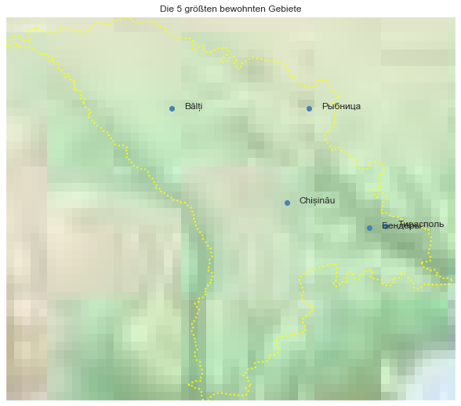

## Moldova [&#10159;](moldova.sqlite)

### Allgemeine Informationen

|Eigenschaft|Wert|
|-|-:|
Dateiname|[moldova.sqlite](moldova.sqlite)|
Zeitstempel|04.09.2019 22:30|
Dateigr&ouml;&szlig;e|4.96 Mb|
|||
Gesamtanzahl Nodes|119760|
|MinLat|45.4689|
|MaxLat|48.49017|
|MinLon|26.61889|
|MaxLon|30.16374|

### Top 5 Tags

|Tag|Count|
|-|-:|
|Power|101825|
|Amenity|7894|
|Shop|6575|
|Place|1809|
|Man_Made|1047|

### &Uuml;bersicht Ortsangaben

|Place|Count|
|-|-:|
|Village|1570|
|Town|54|
|Hamlet|18|
|City|14|

### Die 5 gr&ouml;&szlig;ten bewohnte Gebiete

|Name|Lat|Lon|Type|Population|
|----|--:|--:|:--:|---------:|
|Chișinău|47.0244707|28.8322534|City|750000|
|Bălți|47.7620065|27.9286221|City|144800|
|Тирасполь|46.8379988|29.6109543|City|135700|
|Бендеры|46.8233664|29.4803622|City|97027|
|Рыбница|47.7658526|29.0078097|City|50086|
