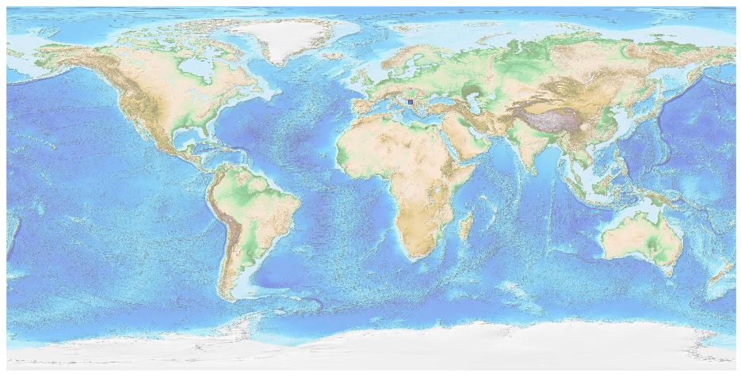
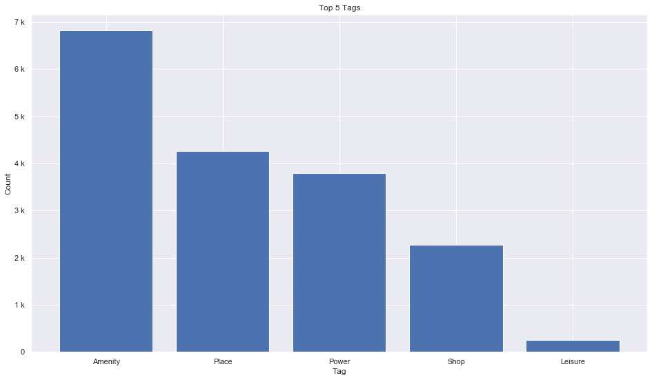
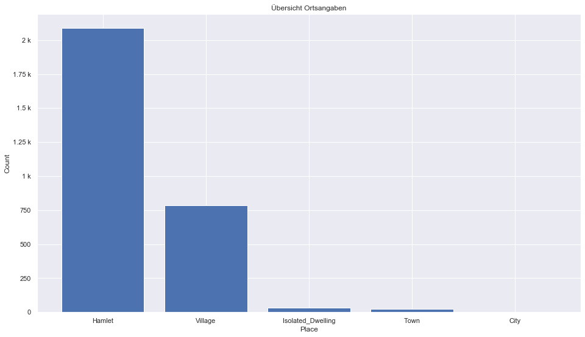
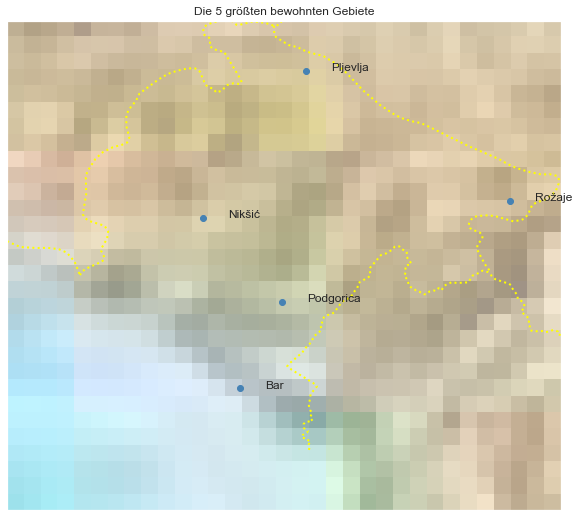

## Montenegro [&#10159;](montenegro.sqlite)

### Allgemeine Informationen

|Eigenschaft|Wert|
|-|-:|
Dateiname|[montenegro.sqlite](montenegro.sqlite)|
Zeitstempel|04.09.2019 22:31|
Dateigr&ouml;&szlig;e|872.00 Kb|
|||
Gesamtanzahl Nodes|17595|
|MinLat|41.61621|
|MaxLat|43.55504|
|MinLon|18.17282|
|MaxLon|20.36638|

### Top 5 Tags

|Tag|Count|
|-|-:|
|Amenity|6816|
|Place|4260|
|Power|3793|
|Shop|2270|
|Leisure|249|

### &Uuml;bersicht Ortsangaben

|Place|Count|
|-|-:|
|Hamlet|2087|
|Village|783|
|Isolated_Dwelling|31|
|Town|25|
|City|1|

### Die 5 gr&ouml;&szlig;ten bewohnte Gebiete

|Name|Lat|Lon|Type|Population|
|----|--:|--:|:--:|---------:|
|Podgorica|42.4415238|19.2621081|City|150799|
|Nikšić|42.7739559|18.9488746|Town|58212|
|Pljevlja|43.3565611|19.3584715|Town|27000|
|Rožaje|42.8416663|20.1659665|Town|22693|
|Bar|42.0979745|19.0954528|Town|17727|
