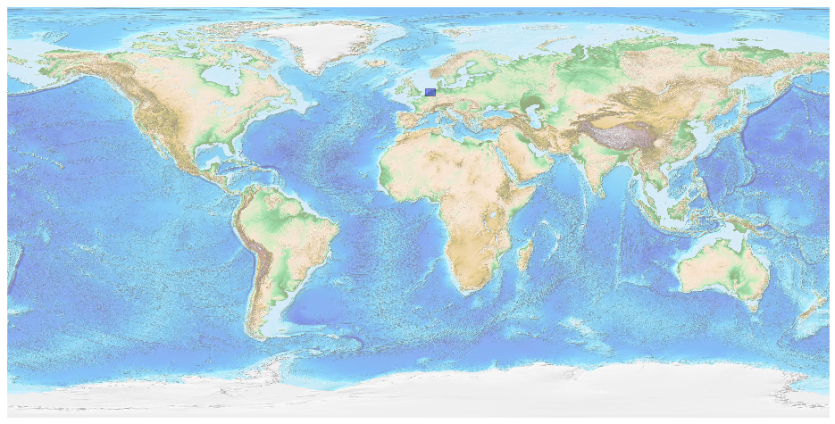
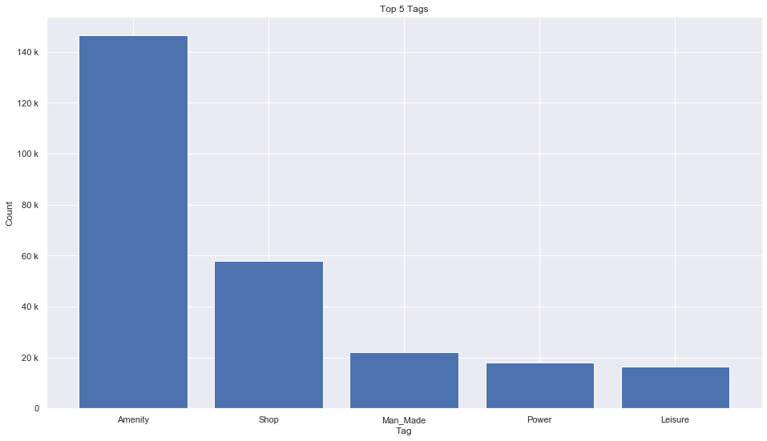
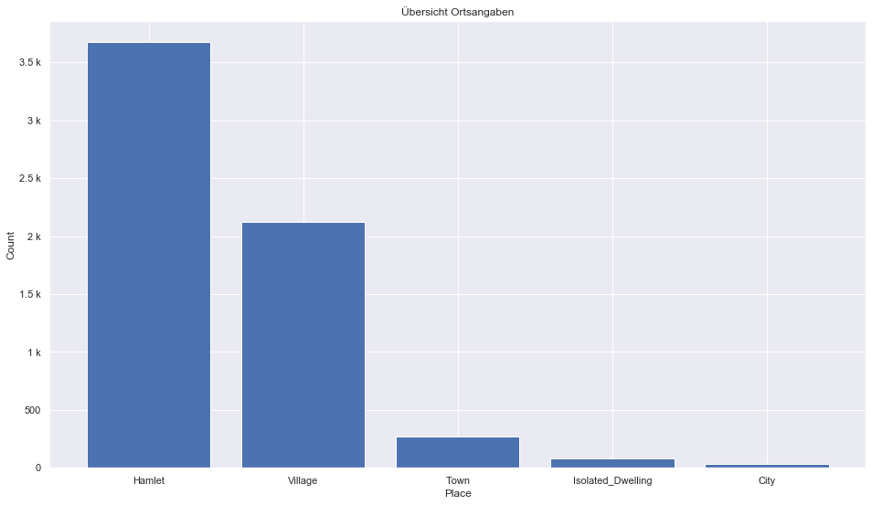
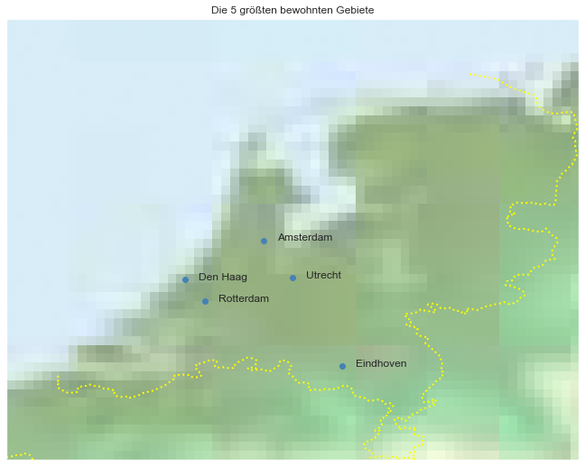

## Netherlands [&#10159;](netherlands.sqlite)

### Allgemeine Informationen

|Eigenschaft|Wert|
|-|-:|
Dateiname|[netherlands.sqlite](netherlands.sqlite)|
Zeitstempel|04.09.2019 23:01|
Dateigr&ouml;&szlig;e|13.57 Mb|
|||
Gesamtanzahl Nodes|278686|
|MinLat|50.74753|
|MaxLat|54.01786|
|MinLon|2.992192|
|MaxLon|7.230455|

### Top 5 Tags

|Tag|Count|
|-|-:|
|Amenity|146437|
|Shop|57840|
|Man_Made|22145|
|Power|17875|
|Leisure|16270|

### &Uuml;bersicht Ortsangaben

|Place|Count|
|-|-:|
|Hamlet|3674|
|Village|2125|
|Town|271|
|Isolated_Dwelling|78|
|City|33|

### Die 5 gr&ouml;&szlig;ten bewohnte Gebiete

|Name|Lat|Lon|Type|Population|
|----|--:|--:|:--:|---------:|
|Amsterdam|52.3727598|4.8936041|City|841282|
|Rotterdam|51.9228958|4.4631727|City|572392|
|Den Haag|52.0799838|4.3113461|City|525745|
|Utrecht|52.0949753|5.109708|City|295591|
|Eindhoven|51.4392648|5.478633|City|226921|
