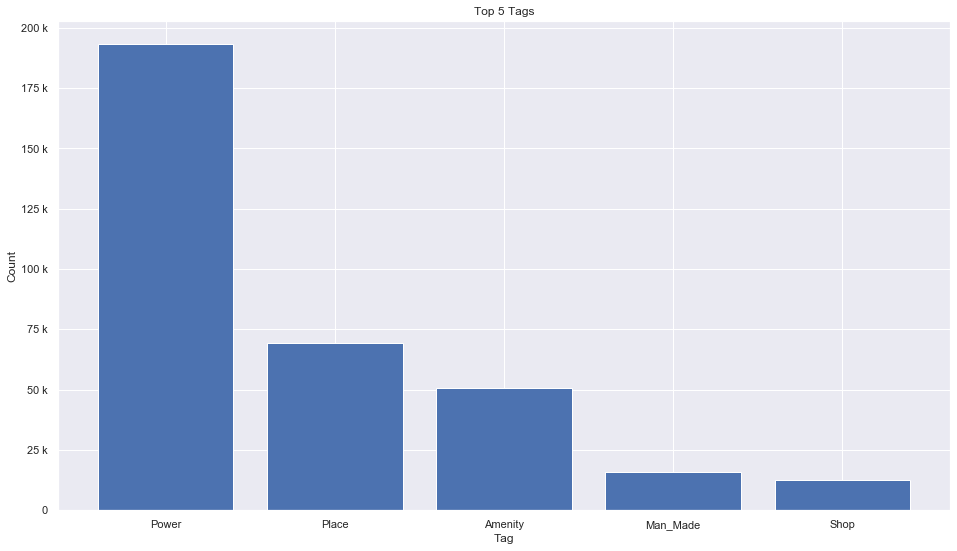
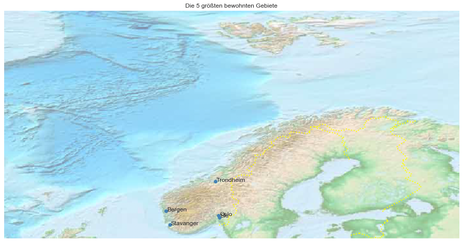

## Norway [&#10159;](norway.sqlite)

### Allgemeine Informationen

|Eigenschaft|Wert|
|-|-:|
Dateiname|[norway.sqlite](norway.sqlite)|
Zeitstempel|05.09.2019 11:21|
Dateigr&ouml;&szlig;e|15.71 Mb|
|||
Gesamtanzahl Nodes|353270|
|MinLat|57.55323|
|MaxLat|81.05195|
|MinLon|-11.36801|
|MaxLon|35.52711|

### Top 5 Tags

|Tag|Count|
|-|-:|
|Power|193124|
|Place|69268|
|Amenity|50510|
|Man_Made|15669|
|Shop|12571|

### &Uuml;bersicht Ortsangaben

|Place|Count|
|-|-:|
|Isolated_Dwelling|6295|
|Hamlet|5464|
|Village|1637|
|Town|120|
|City|9|

### Die 5 gr&ouml;&szlig;ten bewohnte Gebiete

|Name|Lat|Lon|Type|Population|
|----|--:|--:|:--:|---------:|
|Oslo|59.9133301|10.7389701|City|616754|
|Bergen|60.3943034|5.3258117|City|250420|
|Ski|59.719758|10.8381993|Town|195357|
|Trondheim|63.4305658|10.3951929|City|180000|
|Stavanger|58.9680427|5.7324722|City|129300|
