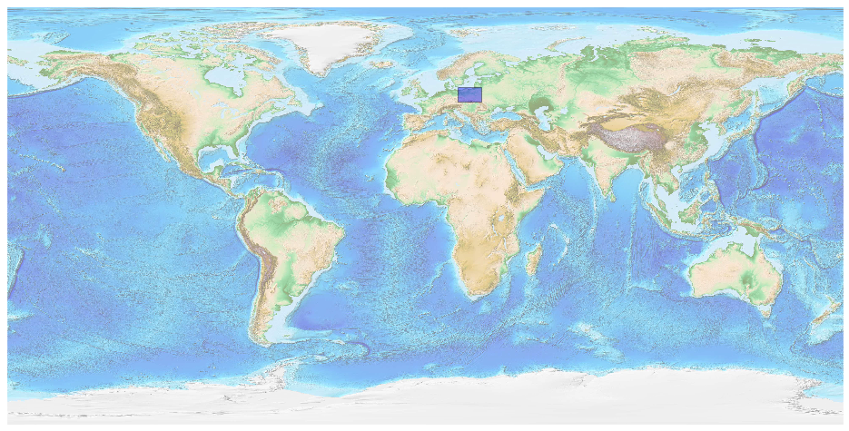
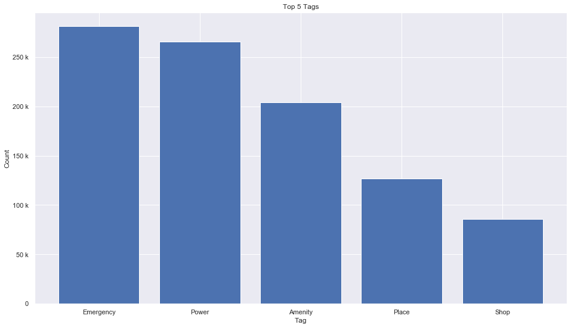
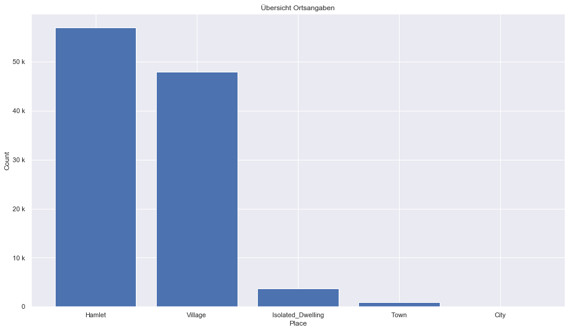
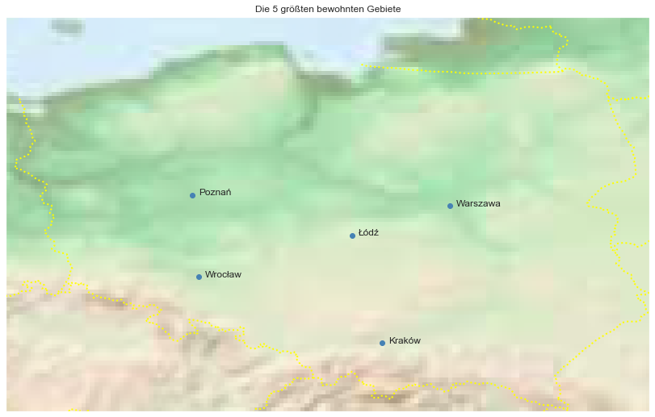

## Poland [&#10159;](poland.sqlite)

### Allgemeine Informationen

|Eigenschaft|Wert|
|-|-:|
Dateiname|[poland.sqlite](poland.sqlite)|
Zeitstempel|05.09.2019 11:46|
Dateigr&ouml;&szlig;e|47.95 Mb|
|||
Gesamtanzahl Nodes|1002587|
|MinLat|48.986421|
|MaxLat|55.228256|
|MinLon|13.990216|
|MaxLon|24.161023|

### Top 5 Tags

|Tag|Count|
|-|-:|
|Emergency|281095|
|Power|265651|
|Amenity|204220|
|Place|126687|
|Shop|85747|

### &Uuml;bersicht Ortsangaben

|Place|Count|
|-|-:|
|Hamlet|56948|
|Village|47965|
|Isolated_Dwelling|3751|
|Town|893|
|City|66|

### Die 5 gr&ouml;&szlig;ten bewohnte Gebiete

|Name|Lat|Lon|Type|Population|
|----|--:|--:|:--:|---------:|
|Warszawa|52.2319581|21.0067249|City|1744351|
|Kraków|50.0619474|19.9368564|City|762508|
|Łódź|51.7687323|19.4569911|City|711332|
|Wrocław|51.1089776|17.0326689|City|634487|
|Poznań|52.4082663|16.9335199|City|548028|
