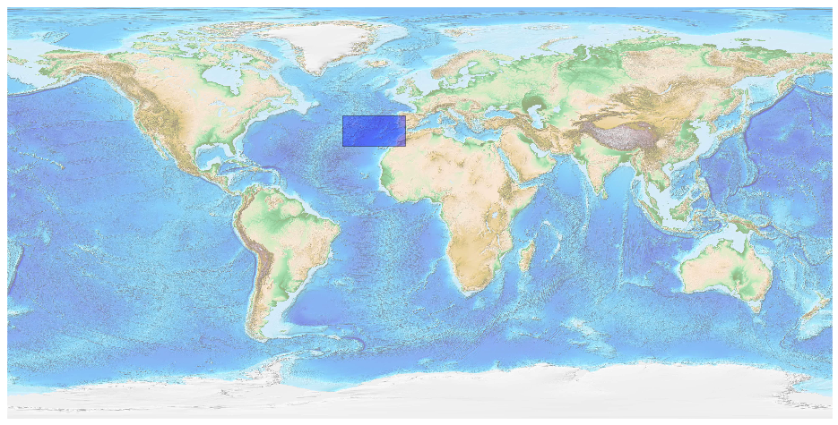
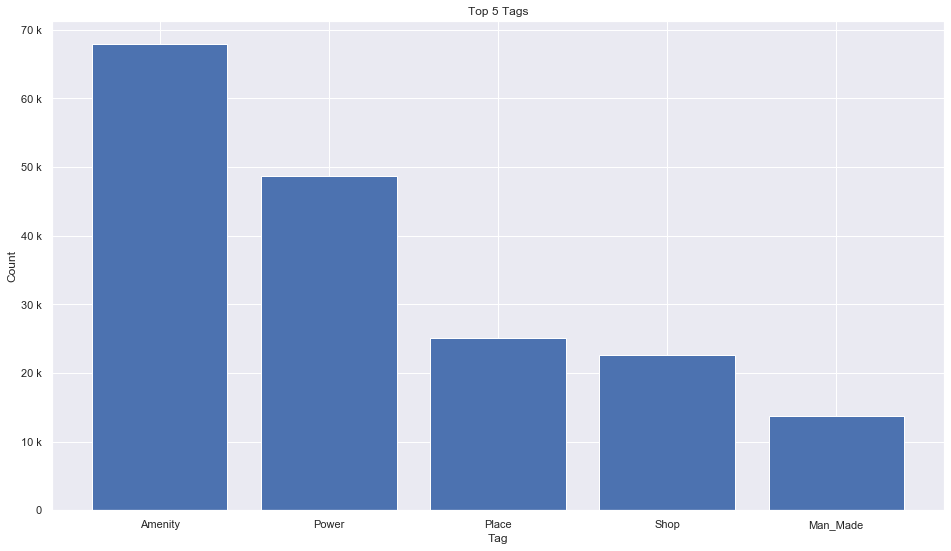

## Portugal [&#10159;](portugal.sqlite)

### Allgemeine Informationen

|Eigenschaft|Wert|
|-|-:|
Dateiname|[portugal.sqlite](portugal.sqlite)|
Zeitstempel|05.09.2019 11:26|
Dateigr&ouml;&szlig;e|9.05 Mb|
|||
Gesamtanzahl Nodes|187178|
|MinLat|29.251448|
|MaxLat|42.1639|
|MinLon|-33.616492|
|MaxLon|-6.179513|

### Top 5 Tags

|Tag|Count|
|-|-:|
|Amenity|67894|
|Power|48711|
|Place|25132|
|Shop|22633|
|Man_Made|13766|

### &Uuml;bersicht Ortsangaben

|Place|Count|
|-|-:|
|Hamlet|9308|
|Village|3915|
|Isolated_Dwelling|663|
|Town|358|
|City|24|

### Die 5 gr&ouml;&szlig;ten bewohnte Gebiete

|Name|Lat|Lon|Type|Population|
|----|--:|--:|:--:|---------:|
|Lisboa|38.7077507|-9.1365919|City|552700|
|Porto|41.1494512|-8.6107884|City|237591|
|Vila Nova de Gaia|41.1300103|-8.6058415|Town|186502|
|Amadora|38.758959|-9.2365233|Town|175136|
|Braga|41.5510583|-8.4280045|City|136885|
