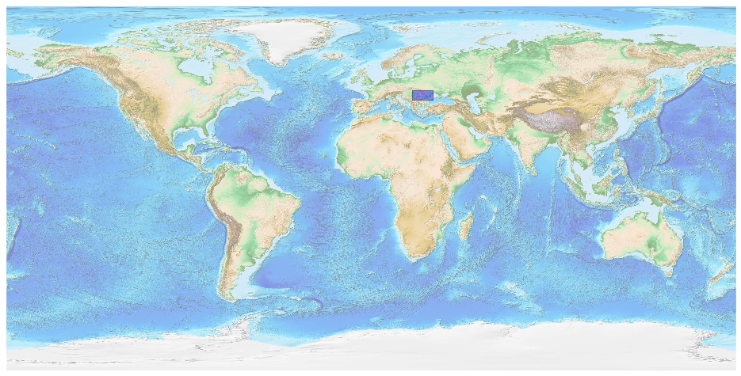
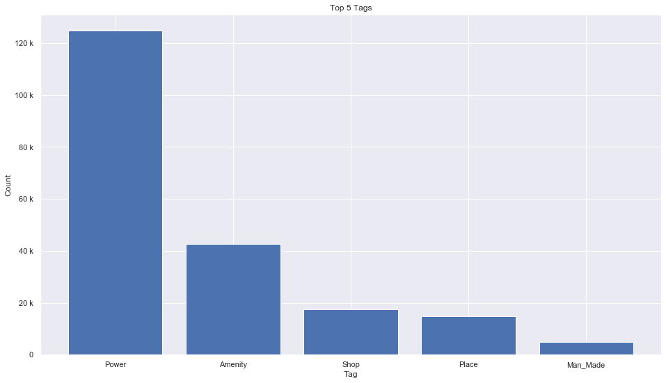

## Romania [&#10159;](romania.sqlite)

### Allgemeine Informationen

|Eigenschaft|Wert|
|-|-:|
Dateiname|[romania.sqlite](romania.sqlite)|
Zeitstempel|11.09.2019 19:36|
Dateigr&ouml;&szlig;e|10.00 Mb|
|||
Gesamtanzahl Nodes|207266|
|MinLat|43.59703|
|MaxLat|48.28633|
|MinLon|20.24181|
|MaxLon|30.27896|

### Top 5 Tags

|Tag|Count|
|-|-:|
|Power|124703|
|Amenity|42497|
|Shop|17518|
|Place|14835|
|Man_Made|4770|

### &Uuml;bersicht Ortsangaben

|Place|Count|
|-|-:|
|Village|12004|
|Hamlet|1734|
|Town|302|
|City|44|
|Isolated_Dwelling|3|

### Die 5 gr&ouml;&szlig;ten bewohnte Gebiete

|Name|Lat|Lon|Type|Population|
|----|--:|--:|:--:|---------:|
|București|44.4361414|26.1027202|City|1883425|
|Cluj-Napoca|46.769379|23.5899542|City|324576|
|Timișoara|45.7538355|21.2257474|City|319279|
|Iași|47.161494|27.5840504|City|290422|
|Constanța|44.1717856|28.6319765|City|283872|
