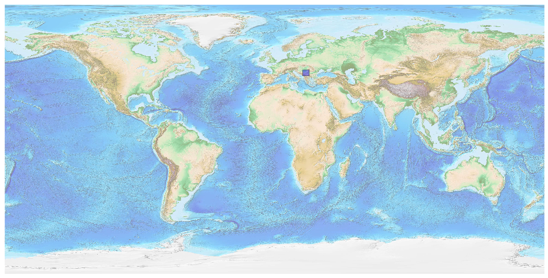
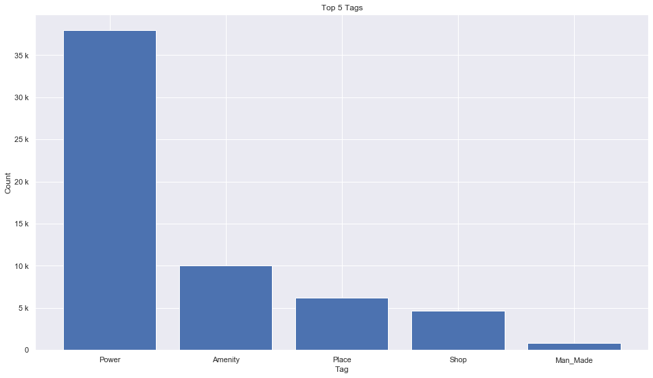
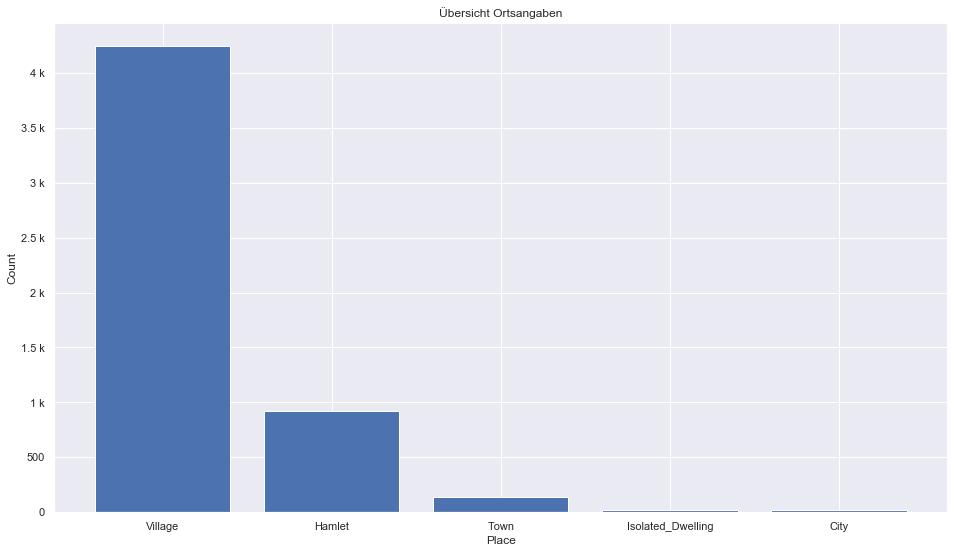
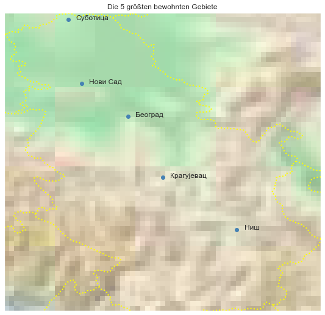

## Serbia [&#10159;](serbia.sqlite)

### Allgemeine Informationen

|Eigenschaft|Wert|
|-|-:|
Dateiname|[serbia.sqlite](serbia.sqlite)|
Zeitstempel|11.09.2019 19:37|
Dateigr&ouml;&szlig;e|2.98 Mb|
|||
Gesamtanzahl Nodes|60514|
|MinLat|42.24909|
|MaxLat|46.19125|
|MinLon|18.82347|
|MaxLon|23.00617|

### Top 5 Tags

|Tag|Count|
|-|-:|
|Power|37944|
|Amenity|9998|
|Place|6177|
|Shop|4702|
|Man_Made|840|

### &Uuml;bersicht Ortsangaben

|Place|Count|
|-|-:|
|Village|4242|
|Hamlet|919|
|Town|142|
|Isolated_Dwelling|20|
|City|19|

### Die 5 gr&ouml;&szlig;ten bewohnte Gebiete

|Name|Lat|Lon|Type|Population|
|----|--:|--:|:--:|---------:|
|Београд|44.8178131|20.4568974|City|1346930|
|Нови Сад|45.2551338|19.8451756|City|250439|
|Ниш|43.321504|21.8957301|City|202208|
|Крагујевац|44.010103|20.9171723|City|190000|
|Суботица|46.1000129|19.6640974|City|148000|
