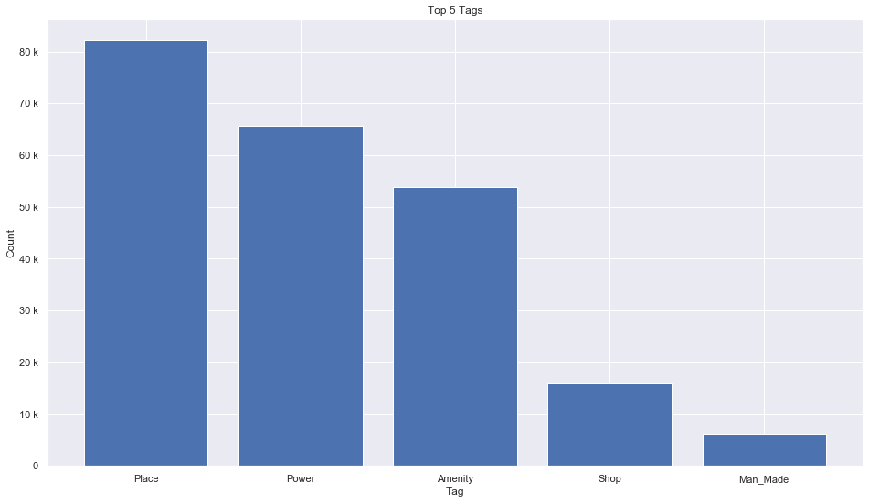

## Slovakia [&#10159;](slovakia.sqlite)

### Allgemeine Informationen

|Eigenschaft|Wert|
|-|-:|
Dateiname|[slovakia.sqlite](slovakia.sqlite)|
Zeitstempel|05.09.2019 11:37|
Dateigr&ouml;&szlig;e|11.04 Mb|
|||
Gesamtanzahl Nodes|229511|
|MinLat|47.72646|
|MaxLat|49.6186|
|MinLon|16.8283999|
|MaxLon|22.57051|

### Top 5 Tags

|Tag|Count|
|-|-:|
|Place|82160|
|Power|65720|
|Amenity|53907|
|Shop|15903|
|Man_Made|6188|

### &Uuml;bersicht Ortsangaben

|Place|Count|
|-|-:|
|Village|2663|
|Hamlet|1383|
|Town|147|
|Isolated_Dwelling|68|
|City|8|

### Die 5 gr&ouml;&szlig;ten bewohnte Gebiete

|Name|Lat|Lon|Type|Population|
|----|--:|--:|:--:|---------:|
|Bratislava|48.1516988|17.1093063|City|432801|
|Košice|48.7172272|21.2496774|City|238757|
|Petržalka|48.110972|17.1112897|Town|113443|
|Prešov|48.997631|21.2401873|City|91498|
|Žilina|49.2234674|18.7393139|City|85558|
