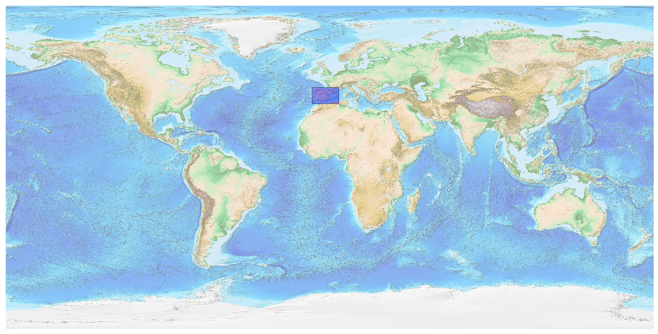
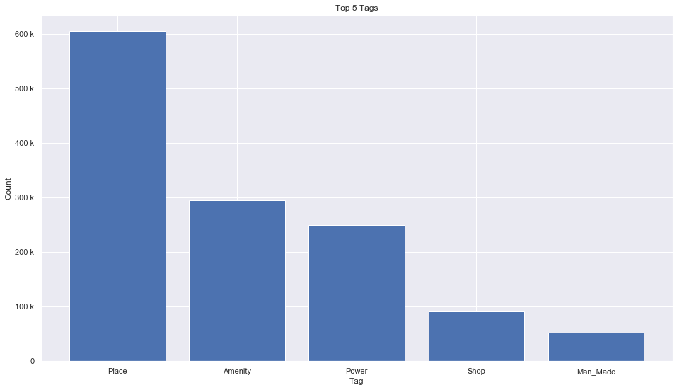
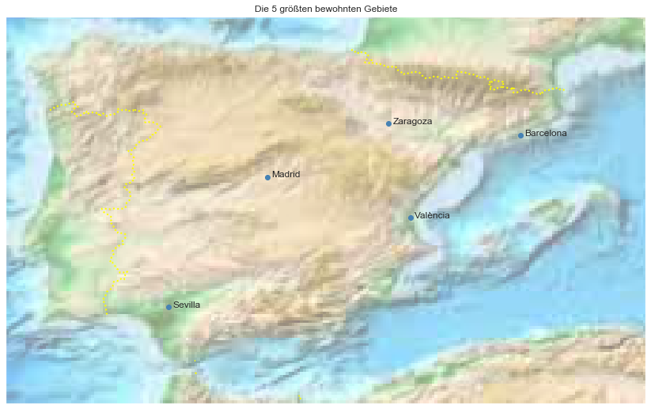

## Spain [&#10159;](spain.sqlite)

### Allgemeine Informationen

|Eigenschaft|Wert|
|-|-:|
Dateiname|[spain.sqlite](spain.sqlite)|
Zeitstempel|11.09.2019 19:52|
Dateigr&ouml;&szlig;e|72.33 Mb|
|||
Gesamtanzahl Nodes|1346857|
|MinLat|35.154153|
|MaxLat|44.14855|
|MinLon|-9.779014|
|MaxLon|5.098525|

### Top 5 Tags

|Tag|Count|
|-|-:|
|Place|604595|
|Amenity|294597|
|Power|249433|
|Shop|90895|
|Man_Made|52612|

### &Uuml;bersicht Ortsangaben

|Place|Count|
|-|-:|
|Hamlet|41641|
|Village|9987|
|Isolated_Dwelling|8056|
|Town|904|
|City|78|

### Die 5 gr&ouml;&szlig;ten bewohnte Gebiete

|Name|Lat|Lon|Type|Population|
|----|--:|--:|:--:|---------:|
|Madrid|40.4167047|-3.7035825|City|3233527|
|Barcelona|41.3828939|2.1774322|City|1615908|
|València|39.4699014|-0.3759513|City|797654|
|Sevilla|37.3886303|-5.9953403|City|703206|
|Zaragoza|41.6521342|-0.8809428|City|654390|
