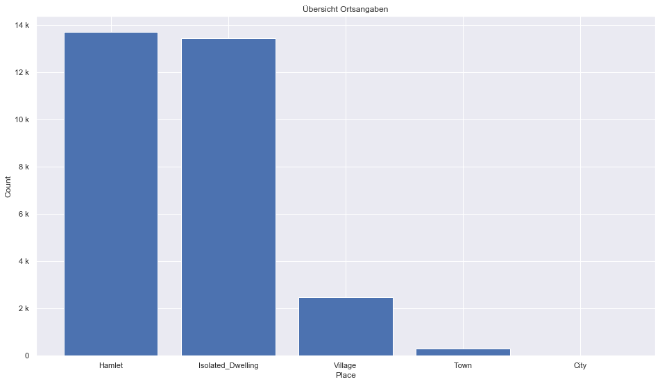
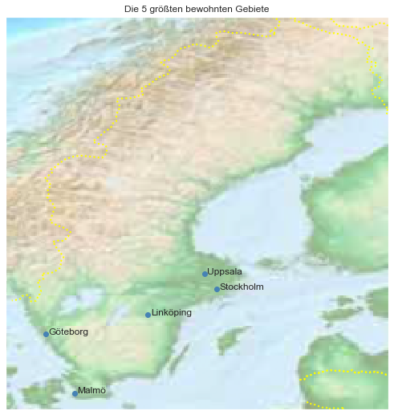

## Sweden [&#10159;](sweden.sqlite)

### Allgemeine Informationen

|Eigenschaft|Wert|
|-|-:|
Dateiname|[sweden.sqlite](sweden.sqlite)|
Zeitstempel|05.09.2019 11:55|
Dateigr&ouml;&szlig;e|12.51 Mb|
|||
Gesamtanzahl Nodes|269144|
|MinLat|55.02652|
|MaxLat|69.06643|
|MinLon|10.54138|
|MaxLon|24.22472|

### Top 5 Tags

|Tag|Count|
|-|-:|
|Power|107714|
|Amenity|74608|
|Place|47687|
|Shop|18441|
|Leisure|11160|

### &Uuml;bersicht Ortsangaben

|Place|Count|
|-|-:|
|Hamlet|13701|
|Isolated_Dwelling|13436|
|Village|2468|
|Town|300|
|City|21|

### Die 5 gr&ouml;&szlig;ten bewohnte Gebiete

|Name|Lat|Lon|Type|Population|
|----|--:|--:|:--:|---------:|
|Stockholm|59.3251172|18.0710935|City|829417|
|Göteborg|57.7072326|11.9670171|City|522259|
|Malmö|55.6052931|13.0001566|City|316588|
|Uppsala|59.8586126|17.6387436|City|128400|
|Linköping|58.4098135|15.6245252|City|111267|
