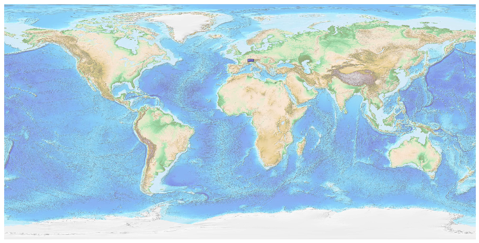
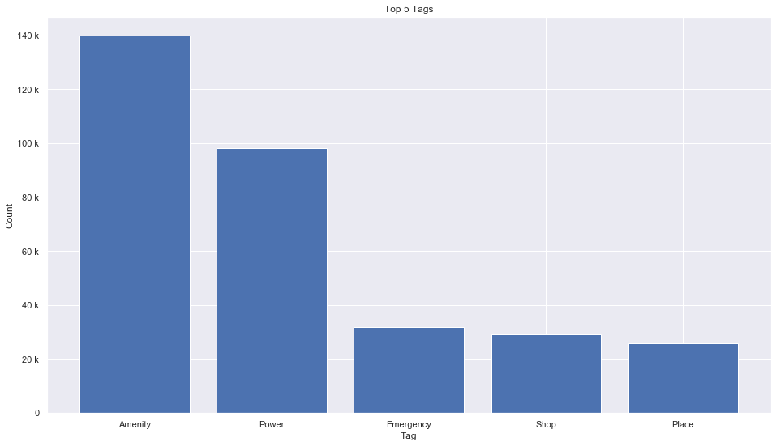
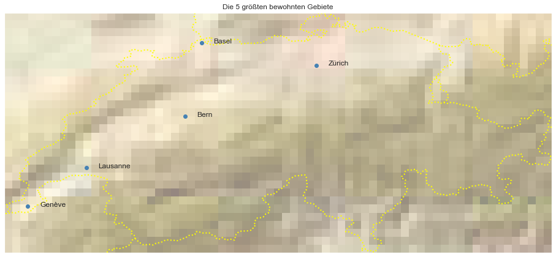

## Switzerland [&#10159;](switzerland.sqlite)

### Allgemeine Informationen

|Eigenschaft|Wert|
|-|-:|
Dateiname|[switzerland.sqlite](switzerland.sqlite)|
Zeitstempel|05.09.2019 12:03|
Dateigr&ouml;&szlig;e|16.11 Mb|
|||
Gesamtanzahl Nodes|344023|
|MinLat|45.81617|
|MaxLat|47.81126|
|MinLon|5.952882|
|MaxLon|10.49584|

### Top 5 Tags

|Tag|Count|
|-|-:|
|Amenity|139833|
|Power|98337|
|Emergency|31901|
|Shop|29042|
|Place|25992|

### &Uuml;bersicht Ortsangaben

|Place|Count|
|-|-:|
|Hamlet|5644|
|Village|3548|
|Isolated_Dwelling|2929|
|Town|161|
|City|6|

### Die 5 gr&ouml;&szlig;ten bewohnte Gebiete

|Name|Lat|Lon|Type|Population|
|----|--:|--:|:--:|---------:|
|Zürich|47.3723941|8.5423328|City|396027|
|Genève|46.2017559|6.1466014|City|191557|
|Basel|47.5581077|7.5878261|City|174491|
|Lausanne|46.5218269|6.6327025|City|133521|
|Bern|46.9482713|7.4514512|City|128848|
