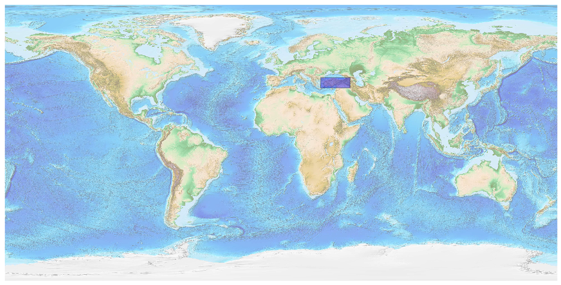
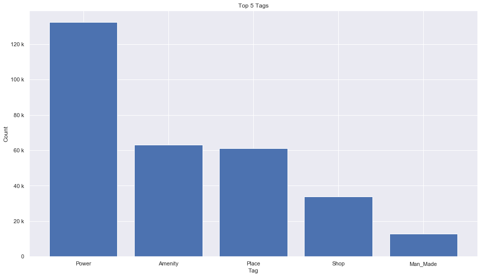
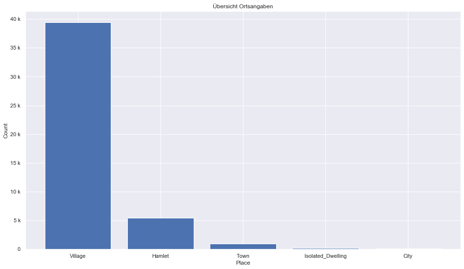
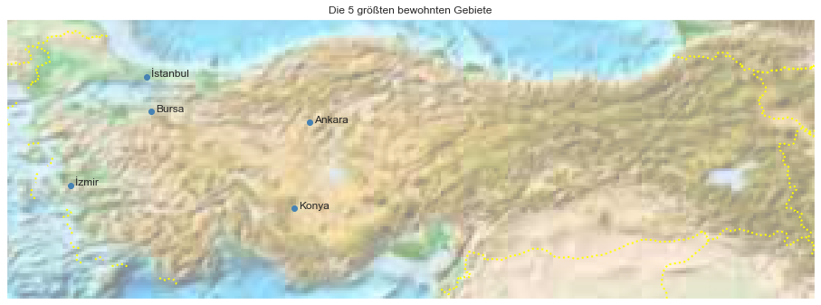

## Turkey [&#10159;](turkey.sqlite)

### Allgemeine Informationen

|Eigenschaft|Wert|
|-|-:|
Dateiname|[turkey.sqlite](turkey.sqlite)|
Zeitstempel|05.09.2019 12:09|
Dateigr&ouml;&szlig;e|14.27 Mb|
|||
Gesamtanzahl Nodes|308469|
|MinLat|35.717|
|MaxLat|42.397|
|MinLon|25.6071|
|MaxLon|44.91345|

### Top 5 Tags

|Tag|Count|
|-|-:|
|Power|132331|
|Amenity|63225|
|Place|61099|
|Shop|33958|
|Man_Made|12951|

### &Uuml;bersicht Ortsangaben

|Place|Count|
|-|-:|
|Village|39398|
|Hamlet|5466|
|Town|960|
|Isolated_Dwelling|215|
|City|82|

### Die 5 gr&ouml;&szlig;ten bewohnte Gebiete

|Name|Lat|Lon|Type|Population|
|----|--:|--:|:--:|---------:|
|İstanbul|41.0096334|28.9651646|City|14804116|
|Ankara|39.9207774|32.854067|City|4338620|
|İzmir|38.4153421|27.144474|City|4223545|
|Bursa|40.1827347|29.0678382|City|2901396|
|Konya|37.8719963|32.4844015|City|2161303|
