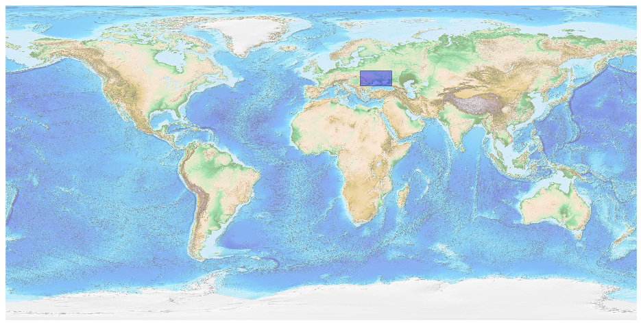
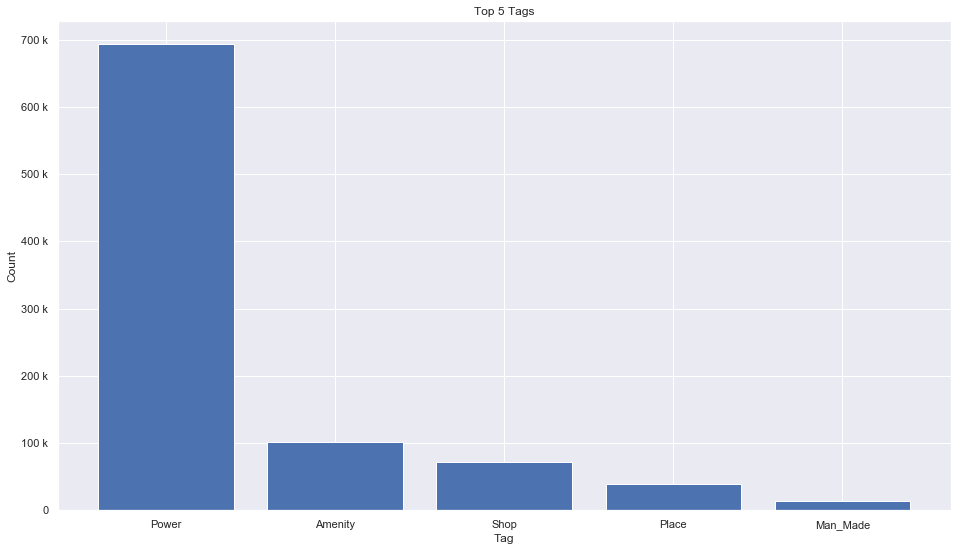
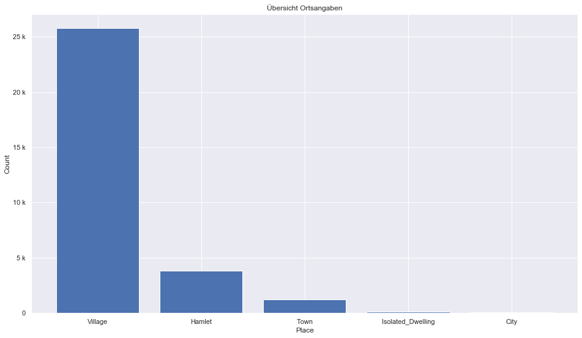
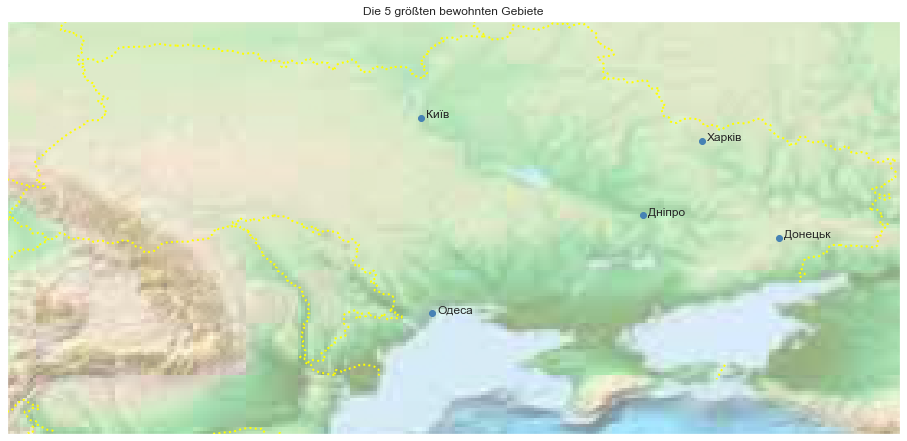

## Ukraine [&#10159;](ukraine.sqlite)

### Allgemeine Informationen

|Eigenschaft|Wert|
|-|-:|
Dateiname|[ukraine.sqlite](ukraine.sqlite)|
Zeitstempel|05.09.2019 12:13|
Dateigr&ouml;&szlig;e|40.82 Mb|
|||
Gesamtanzahl Nodes|934400|
|MinLat|44.027381|
|MaxLat|52.423256|
|MinLon|22.101655|
|MaxLon|40.258417|

### Top 5 Tags

|Tag|Count|
|-|-:|
|Power|692924|
|Amenity|101451|
|Shop|71125|
|Place|39056|
|Man_Made|14253|

### &Uuml;bersicht Ortsangaben

|Place|Count|
|-|-:|
|Village|25761|
|Hamlet|3839|
|Town|1203|
|Isolated_Dwelling|146|
|City|47|

### Die 5 gr&ouml;&szlig;ten bewohnte Gebiete

|Name|Lat|Lon|Type|Population|
|----|--:|--:|:--:|---------:|
|Київ|50.4500336|30.5241361|City|2909697|
|Харків|49.9902794|36.2303893|City|1447652|
|Одеса|46.4852419|30.7433894|City|1008852|
|Дніпро|48.4680221|35.0417711|City|983836|
|Донецьк|48.0158753|37.8013407|City|929063|
